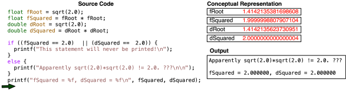

# 2 Variables

## 2.1 Hardware & Software

### Hardware

1. CPU: do math very fast, memory in MBs
2. Memory:
   - units: bits, bytes, …
   - RAM: where the data is stored. temporary, fast, GBs
     - when running programs, you are using RAM
   - SSD/ HDD: permanent storage, TBs

### Software

- Operating system
- programs
  - **compiler**: a program which transfer programs into CPU understandable instructions
  - programming language:
    - high level: C++, Java, Python
    - low level: assembly
    - lowest: machine code (used to control CPU)
  - programs consist:
    - data - variables
    - code - algorithms

## 2.2 Datatypes

### Basic types / built-in types

| type   | size (typical)    | example                                 |
| ------ | ----------------- | --------------------------------------- |
| char   | 1 byte (8 bits)   | 'f'                                     |
| int    | 4 bytes (32 bits) | 42                                      |
| float  | 4 bytes (32 bits) | 3.141592 (~ 7 digits precision)         |
| double | 8 bytes (64 bits) | 3.141592653589793(~16 digits precision) |
| bool   | 1 byte (8 bits)   | true / false                            |

#### int

int has various **qualifier**s, e.g., `signed`, `unsigned`, `short`, `long`.（qualifier：限定词，即int前面的词）

- unsigned int: nonnegative integers in the range [0, 2<sup>32</sup>]
- signed int: integers in the range [-2<sup>32</sup>, +2<sup>31</sup>]. If `int` has no qualifier, then it is signed by default.
- short int (int can be omitted): 16 bits (2 bytes)
- long int (int can be omitted): long int has greater than or equal to as many bits as an int

reference: https://en.cppreference.com/w/cpp/language/types

### Combinations

- arrays: lists of onely one type of data
- Structs/objects: groupings of many data types into a single variable

## 2.3 Type conversion & Casting

What to do if operands in an expression have different types? -- Convert them to the same type.

Note, the types of constants can be modified by adding a letter suffix if needed: U for unsigned, L for long, f for float. 

#### Type conversion

In type conversion, a data type is automatically converted to another type by the **compiler** at the compiler time. In this way, the bit representation of the original type will be changed to that of the new type. It should be noted that the destination data type cannot be smaller than the source data type, that's why it is also called *type promotion*.

  There are four common ways to change the bit representation during the type promotion:

  1. smaller signed int -> larger signed int: **sign extended** (the sign must be copied an appropriate times to fill in the additional bits.)

  2. smaller unsigned int -> larger unsigned int: zero extended

  3. longer int -> shorter int: the most significant bits will be thrown away. See the example below:

     ```c
     short int s;
     int x = 99999;
     s = x;
     print('%d\n', s) // -31073
     ```

     In this code, the resulted `s` is -31073. Why?

     - The binary representation of 99999 is 11000011010011111
     - Since the `short int` has only 16 bits, when the compiler convert `int` to `short`, it will throw away the bits other than the 16 least significant bits, resulting in 1000011010011111.
     - In two's compliment, '1000011010011111' is '0111100101100001', which is 31073 in decimal.
     - The most significant bit is the sign bit, which means this number is negative. Therefore, the resulted `s` is -31073.

  4. fully calculate what the representation of the value is in the new type. eg., int -> float

#### **Type casting**

In type casting, a data type is converted to another type by the **programmer** by using the casting operator during the program design. The destination data type may be smaller than the source type.

The syntax is as following:

```c
destination_datatype variable2 = (target_datatype) variable;
```

Note, the casting has very high **operating precedence**.

# 3 Control Flow

## 3.1 Conditional Statements

1. If statement
1. switch statement (not mentioned in class)

## 3.2 Loops
1. for loop

     use for loop when we know how many times we want the computer to repeat

     ```c++
     // print from 1 to 10
     for (int i = 1; i < 11; i++) {
       std::cout << i << " ";
     }
     
     // print from 10 to 1
     for (int i = 10; i > 0; i--) {
       std::cout << i << " ";
     }
     ```

2. while loop

     use while loop when we don't know how many times something will happen

     ```c++
     // string analyzer
     string s;
     cin >> s;
     while (s != "done") {
       // analyze s;
       std::cin >> s;
     }
     ```

3. do-while loop : a do-while loop is guaranteed to execute the body at lease once because it executes the body before checking the condition. (I recommend while loop than do-while loop. )

     ```c++
     i = 10;
     do {
       std::cout << i;
       i--;
     } while (i > 0)
     ```
# 4 Strings

A string is an array of chars. Its **capacity** is the size of the array. Its **size** is the number of chars in the string.

```c++
#include <string>
using namespace std;

string name = "Sonia";
string myString('a', 10); // create a string of length 10 filled with 'a'
```

Basic operations on a string:

- \<stringName\>.length()
- Compare two strings: <, >, ==, !=
- +: concatenates two strings
- \<stringName\>.find(substr, pos): finds the location of a substra starting from `pos`
- \<stringName\>.substr(pos, length)

# 5 Functions

## Scope

Scope is where the variable can be used.

```c++
// test 1 - statement scope
for (int i = 0; i < 5; i++) {
  
}
cout << i << endl; // what's the value of i?

int i = 0;
for (; i < 5; i++) {
  
}
cout << i << endl;

// test 2 - local scope
char firstLetter( string sentence ) { //sentence is function scope
  char c = sentence.front(); 
	return c; 
}
char theName = firstLetter("Amy");
cout << c << endl; // what's the value of c?
```

Read more: https://docs.microsoft.com/en-us/cpp/cpp/scope-visual-cpp?view=msvc-170

# 6 Vectors

## Compilation & Linking

### Header files - declaration files

- header files only contain function **signatures** (function name, parameter types, return types)

- header files can be included in .cpp files: 

  ```c++
  #include "<filename>.hpp"
  ```

  - `\#include “”` vs `#include <>`: `""` is for local files, `<>` is for system files

- **Include Guards**: to avoid include a header file twice. 

  ```c++
  #ifndef _MYFUNCSH_
  #define _MYFUNCSH_
  // functions declared here
  #ENDIF
  ```

​		Now, the new way to do it is  `#pragma once`. (`#` invokes the preprocessor)

### cpp files - Implementation files

.h and .cpp file come in pairs, excepted for main file and standard library files

### Commands

```bash
# compile all .cpp files to .o files
clang++ -std=c++11 -c *.cpp  
# link all .o files to a program named myProgram
clang++ -o myProgram *.o
```

## Vecotr

1. Create a vector:

   ```c++
   #include <vector>
   using namespace std;
   
   vector<float> grades; // create an empty vector
   vector<string> names(5); // a vector of 5 strings (with default values of "")
   vector<int> nums = {1, 2, 3, 4};
   ```

2. methods to use:

   - `.size()`
   - `.push_back()`
   - `.pop_back()`: remove the last element
   - `.front()`: return the first element
   - `.back()`

3. for-each loop

# 7 Structs

A struct can hold multiple datatypes. A struct instance is an object.

1. declare a struct in .hpp files

2. two ways to initialize a struct

   ```c++
   struct Student {
     string name;
     unsigned short age;
   }
   
   // option 1: dot notation
   Student ben;
   ben.name = "Ben";
   ben.age = 12;
   
   // option 2: curly braces
   Student ben {"Ben", 12};
   ```

# 8 References

- passed by value: the value of the parameter is copied into the function. Changing the parameter inside the function doesn't effect the original variable.
- passed by reference (use `&`): the parameter refers to the variable that was passed into the function. If the parameter's value is changed inside the function, the original variable will be changed too.
  - `const int& para1`: pass the integer `para1` into the function by reference, but the function cannot change its value

# 9 File I/O

Read and write data from files. Library to use: `fstream`

### Input stream

1. open a file: 

   ```c++
   #include <fstream>
   #include <cstdlib> // for exit() function
   
   using namespace std;
   
   string filename = "test.txt";
   ifstream fin(filename);
   if (fin.fail()) {
     cout << "Failed to open file: " << filename << endl;
     exit(1);
   }
   ```

2. read a file word by word

   ```c++
   vector<string> words;
   while (fin >> word) {
     words.push_back(word);
   }
   ```

3. read a file line by line

   ```c++
   string sentence;
   vector<string> sentences;
   while (getline(fin, sentence, '\n')) {
     sentences.push_back(sentence);
   }
   ```

4. reset file pointers:

   ```c++
   fin.clear(); // Clear any fail / EoF bits
   fin.seekg(0, ios::beg); // move file pointer to the beginning of the file
   fin.seekg(6, ios::beg); // move pointer to the 6th position from the beginning of the file
   ```

### Output Stream

1. create an output stream

   ```c++
   // if "test.txt" already exsits, it will be erased and overwritten
   ofstream fout("test.txt");
   // just append to the file
   ofstream fout("test.txt", ios_base::app);
   // write something to the file
   fout << "something";
   // force the buffer to be written into the file
   fout.flush();
   // .close() make sure all your data will be written into the file
   fout.close();
   ```

# 10 Pointers

## Array

Array is fixed-sized, and has no member functinos, e.g., .size(). 

1. create an array: `type arrayName[size]`

2. If your data is fixed size, use `std::array<type, size>` is better. This works just like a fix-sized vector.

   ```c++
   #include <array>
   using namespace std;
   
   array<int, 5> = {1, 2, 3, 4, 5};
   ```

## Pointers

   1. Arrays are **pointers**, which means it will be passed by reference into a function.

      - a pointer is a variable that holds the address of another value
      - pointer is a data type, not an integer
      - *pointer and reference are the same. pointer is an old C concept, reference is a C++ concept

      ```c++
      void myFunction( int array[3] ) { 
        array[0] = 0;
      	array[1] = 1;
      	array[2] = 2; 
      }
      
      int main() {
      	int a[3] = { 5, 5, 5 };
      	myFunction( a );
      	cout << a[0] << a[1] << a[2]; // 012
      }
      ```

2. use `->` to access a pointer of a struct's field:

   ```c++
   struct Point {
     int x, y;
   }
   
   Point point {1, 2};
   Point* pPoint = &point;
   cout << pPoint -> x ; // 1
   ```

3. Syntax:

   ```c++
   int* ptr;
   int x = 5;
   ptr = &x; // use & to get the address of x
   int y = *ptr; // *ptr is dereference. This line assign the value of x to y
   *ptr = 8; // change the value of x to 8
   ```

4. an array can be written as a pointer. For example, `int a[]` can be wrriten like `int*`, and this pointer points to the first elements of the array

   ```c++
   // The following 2 functions are the same
   void getSum(int* nums, int size);
   void getSum(int nums[], int size);
   ```

5. write swap() by using pointers

   ```c++
   void swap(int* a, int* b) {
     int temp = *a;
     *a = *b;
     *b = temp;
   }
   ```

6. print array

   ```c++
   void printArray(int* arr, int size) {
     for (int i = 0; i < size; i++) {
       cout << *(arr + i) << " ";
       // cout << *(arr + i * sizeof(int)) << " "; // only use this when the type is a struct
     }
   }
   ```

## Commandline Arguments

for `int main( int argc, char* argv[] ) `

- argc: argument count, which is the number of arguments
- argv: argument vector, which is a 2D array (each argument is an array of chars)
  - `char** argv`is the same as `char* argv[]` . so `argv` is a pointer to a 2D array
  - `argv[0]` is current path

# 11 Number Systems

## Base 2 (Binary)

1. numbers to know in binary

   - One: 1
   - Three: 11
   - Seven: 111
   - Fifteen: 1111

2. How many numbers can 8 bits store?

   - store 2<sup>8</sup> = 256 numbers
   - for `uint8_t` (unsigned int with 8 bits): 0 ~ 255
   - for `int8_t` (signed int with 8 bits): -128 ~ 127

3. Tell if a binary number is odd or even: if one's digit is 0 - even, else odd

   ```c++
   bool isOdd(int num) {
     if ((num & 1) == 1) {
       return true;
     }
     return false;
   }
   ```

## Base 16 (Hexadecimal)

4 bits for one hex digit

| hex digit | binary |
| --------- | ------ |
| 0         | 0000   |
| 1         | 0001   |
| 2         | 0010   |
| 3         | 0011   |
| 4         | 0100   |
| 5         | 0101   |
| 6         | 0110   |
| 7         | 0111   |
| 8         | 1000   |
| 9         | 1001   |
| A         | 1010   |
| B         | 1011   |
| C         | 1100   |
| D         | 1101   |
| E         | 1110   |
| F         | 1111   |

## Converting Between Bases

1. 10 in different number systems -- represents the base

   - in decimal: 10 = 10

   - in binary: 0b10 = 2

     - Note: 0 in front of the leftmost non-0 digit can be ignored. e.g., 

       - 0b0000000000000**1**0 = 0b10 = 0 *  2<sup>0</sup> + 1 * 2<sup>1</sup> + 0 + 0 +... = 3

       - 0b00100 = 0 *  2<sup>0</sup> + 0 * 2<sup>1</sup> + 1 * 2<sup>2</sup> + 0 + 0 = 4

   - in hexadecimal: 0x10 = 0 * 16<sup>0</sup> + 1 * 16 <sup>1</sup> = 16

2. Hex -> Binary

   Replace each hex digit with 4 binary digits. e.g. 0x1A = 0001 1010

3. Binary -> Hex

   Group the binary into groups of 4, then convert it to hex. e.g. 0001 1110 = 0x1E

4. Decimal -> Binary / Hex

   Divide the number by 2 (or 16) repeatedly, then keep track of remainders in reverse order. e.g., 

   

# 12 Number Representations

sign and magnitude representation

## One's complement

1. In one's complement, negative number starts with `1` and flip other bits of corresponding positive number

   For example, how to represent -2:

   - write down 2 in binary using 4 bits: 0010

   - flip all bits: 1101. This is treated as -2
   
   How do we know 1101 is -2?

    - Step 1: the **most significant bit (MSB)** is 1, so this number is negative.
    - Step 2: flip all bits, it's 0010, it's 2.
    - Combine the result of step 1 and step 2, the result is -2.
   
1. 3 bits in one's compliment

   | binary | Decimal |
   | ------ | ------- |
   | 000    | 0       |
   | 001    | 1       |
   | 010    |         |
   |        |         |
   |        |         |
   |        |         |
   |        |         |
   |        |         |

	From above table, we can see that in 1's compliment, negative number + positive number = 1111, which is -0 in decimal. This is weird, since 0 should not have a sign! In addition, we already have 0000 for 0. Using 1111 to represent -0 waste a number!

## Two's Complement

1. Signed: if a number has 3 bits, the first digit is singed digit, 1 - negative, 0 - positive
   - how many numbers can a signed 3 bits represent? 2 ** 3 = 8
   - for a n-digit binary number (no matter signed or **unsigned**), it can represent 2 ** n numbers

1. All modern machines use 2's complement. By using two's complement, we can have an extra negative number. (1111 for -1)

   For example, the range of signed 3 bits:

   | binary | Decimal |
   | ------ | ------- |
   | 000    | 0       |
   | 001    | 1       |
   | 010    | 2       |
   | 011    | 3       |
   | 100    | -4      |
   | 101    | -3      |
   | 110    | -2      |
   | 111    | -1      |

	From above table, we know:

	- 3bits represent 8 numbers: non-negative: [0, 3]; negative: [-4, -1]

	- how to convert a signed binary number to a decimal number: 101= -1 *2<sup>2</sup>+ 0 * 2<sup>1</sup> + 1 * 2<sup>0</sup> =-3

	- in two's complement, positive number + negative number = 001 + 111 = 0b000 = 0

2. How to represent -2 in 2's complement

   - 2: 010

   - flip bits: 101

   - add one: 110
3. How do we know 0b111 is -1?
   - Method1: 0b111 = -1 * 2<sup>2</sup> + 1 * 2<sup>1</sup>  + 1 * 2<sup>0</sup>  = -4 + 2 + 1 = -1
   - Method2: 
     - MSB is 1 -> negative number
     - 0b111 - 1 = 0b110
     - Flip all bits: 0b001 = 1
     - Result: -1

4. How to convert negative number to positive number:

   For example, -2 : 0b110 

   - Step 1: flip all bits -> 0b001（相当于-1）

   - Step 2: add 1 -> 0b110 

	Note, the **most negative number** cannot be negated in 2's complement. This can cause all sorts of errors if you're not careful!!! (Why???)

** Floats are always signed.

## Floating Point Numbers

### Binary Scientific Notation

In computers, floating point numbers are stored in the format of **binary scientific notation**:
$$
(-1)^s\times m\times2^e
$$
, in which s is **sign bit** (When s = 1, the number is negative. When s = 0, the number is positive.), m is the **mantissa** (/mæn'tɪsə/) (i.e. significand), and e is the exponent. 

| type   | size                                                   | precision        |
| ------ | ------------------------------------------------------ | ---------------- |
| float  | 32 bits (1 for sign, 8 for exponent, 23 for mantissa)  | single precision |
| double | 64 bits (1 for sign, 11 for exponent, 52 for mantissa) | double precision |

(In **normalized** binary scientific notation, the firtst position of mantissa is always 1, so we don't need to store it.

The picture below can help you better understand the concept "precision":



Note, the default print setting for floats and doubles is to **print up to six decimal places**.

### Special Floating Point Numbers

- NaN: not a number
- +inf, -inf
- Floating numbers are approximated. Many numbers cannot be represented in binary, e.g., 0.1 (???) // TODO
- use `abs(A-B) < tolerance` to check if two floating numbers are equal

# 13 Bitwise Operations

If you are working with bits, it's better to use types like `int8_t`（signed int with 8 bits), `uint16_t` (unsigned int with 16 bits), etc., and unsigned types are preferred. (for more types, refer to [\<cstdint>](https://en.cppreference.com/w/cpp/header/cstdint))

## Bitwise operators

| Symbol | Function                   | Description                                                  |
| ------ | -------------------------- | ------------------------------------------------------------ |
| &      | Bitwise and                | only when both operands are 1, the result is 1               |
| \|     | Bitwise or                 | if either of operands is 1, the result is 1.<br>  0 ^ 0 = 0<br>  0 ^ 1 = 1<br>  1 ^ 0 = 1 <br>  1 ^ 1 = 0 |
| ~      | Bitwise not/ complement    | Flip all bits                                                |
| ^      | Bitwise exclusive or (Xor) | if the operands are different, the results is 1              |
| >>     | Right shift (divided by 2) | shift bits to the right and fill in 0s to the left<br>e.g., (int8_t) 0110 10<u>10</u> >> 2 = <u>00</u>01 1010 |
| <<     | Left shift (multiply by 2) | shift bits to the left and fill in 0s to the right<br>e.g., (int8_t) <u>01</u>10 1010 << 2 = 1010 1000 = -88 (The number becomes **negative** because the MSB is 1) |

## Bit Manipulation

1. Boolean identifiers (x is a single bit)

   - `x | 1 == 1`
   - `x | 0 == x`
   - `x & 1 == x`
   - `x & 0 == 0`
   - `x ^ 1 == x`
   - `x ^ 0 == 0`
   
2. **Masking**

   We can use `x ^ 1 == x` and `x ^ 0 == 0` to design a mask, which is used to remove the bits we don't need and remain the bits we want. For the bits you want to use, set the values as 1, otherwise 0. For example: 

   ```c++
   uint32_t x = 0xDEADBEEF;
   // how to remove everything but DE?
   uint32_t mask = 0xFF000000;
   x &= mask; // x = 0xDE000000
   // how to get just DE?
   x >> 24; 
   ```

3. **Sign extension**

   When you assign a smaller signed number to a larger signed number, the new bits will copy the signed bit of the smaller value. For example,

   ```c++
   int8_t b = -1; // in binary, it's 1111 1111
   int16_t x = b; 
   ```

   what is x in binary? x is (<u>1111 1111</u> 1111 1111), because the first digit of b is 1. The underlined digits is the extended signs.

   Sign extension also happens in right shifting:

   ```c++
   int4_t b = 0b1100; // -4 in decimal
   b >= 1; // b = 0b1110 (-2 in decimal)
   ```

   Note, 0xF000 >> 4 = 0x0F00, because <u>hex constants are treated as unsigned</u>. But if you first assign `0x0F00` to a signed int then shift it, you'll get 0x`FF00`.

4. In two's compliment, how to negative a number: flip all bits then add one

   ```c++
   uint32_t x = 0x00FE;
   x = ~x; // x = 0xFF01
   x += 1; // x= 0xFF02
   ```

5. Endianness

   Endianness referes to the order of the bytes as stored in memory.

   - Big-endian (BE): stores the most significant byte at the smallest address and the lease significant byte at the largest address
   - Little-endian (LE): stores the least significant byte at the smallest address
     - MAC is little endianness

# 14 Stack And Heap Memory

## Stack Memory

Stack Memory is also called Call Stack Memory. When a function is called, memory is allocated on the **stack** to store all the variables used by that function.

|      | stack    | Heap                   |
| ---- | -------- | ---------------------- |
| Type | pointers | actual data of vectors |
|      |          |                        |
|      |          |                        |

## Heap Memory

1. The heap is used for:

   - large chunks of memory

   - variables that must survive longer than a function call

​		(we can only use pointers to access the memory on the heap)

2. `new` keyword

   ```c++
   int* pInt = new int; // create a new integer on the heap and give me the address
   double* myArray = new double[10]; // create an array of size 10 and return the adress of the 1st double
   ```

   memory leak: 

   ```c++
   double* myArray = new double[10];
   myArray = &somethingElse; 
   ```

   in Java, double[10] will be deleted, but in C++ won'tt. This is called "memory leak" in C++.

3. `delete` keyword

   This keyword will not delete the data. It tells the system that our program is not going to use the memory anymore, then the system will reallocate it to something else. (This memory is available for other programs)

   ```c++
   delete pInt;
   delete [] array; // need []!!!
   ```

4. memory leak & memory corruption

   - **memory leak**: if you use `new` to get memory on the heap but never use `delete`  to get rid of it, you'll meet the error of memory leak. (You can never use this memory later. This is a big problem for your computer!!)
   - **memory corruption**: If you already delete a `pointer` that points to a memory on the heap, but assign a value to the memory later, you'll meet an error of memory corruption. That's why wee should assign `nullptr` to the pointer after deleting it. (This is my own understanding. I am not sure if it's correct.)

   ```c++
   delete [] data; // avoid memory leak
   data = nullptr; // avoid memory corruption
   ```

5. Note: an array can be stored in stack

   ```c++
   double d1[3]; // the actual data is stored in stack
   
   double* d2 = new double[3]; // the actual data is stored in heap
   delete[] d2; // remember to delete the array in heap!!!
   d2 = nullptr; 
   ```

## A practice

Draw the picture of memory for the following code:

```c++
void foo() {
  int y = 4;
  myVector v1;
  MyVector* v2 = new MyVector();
}

int main() {
  bool b = true;
  int x;
  int y = 3;
  foo();
  double d = 1.234;
  double* p = new double[10]; // Can I initialize a class without a parenthesis?
  p[1] = 2;
}
```


# 15 Classes and Objectes

## Classes

A class is similar to a struct but with one minor difference: everything in a `struct` is public by default, while everything in a `class` is private by default.

### Access modifiers

- `public`: everyone can see this piece of the class
- `private`: only accessible within the class that defines them
- `protected`: accessible within the class that defines them and other classes which inherit from that class

### Variables

Use trailing underscore to mark a class variable, distinguishing from local variables. e.g., `size_`, `capacity_`

### Constructor

Constructor is a "function" used to create a object. A constructor must:

- has the same name as the class
- Does not have any return type (including  `void`)

### Method (member functions)

- The functions inside a class are called methods.

- A class is declared in a .hpp file. Its methods are implemented in .cpp file.

- A method that doesn't change any data within a class should be declared `const`.

  - Note, remember to add `const` after the function_name in both .cpp and .hpp files, or you'll get a linking erorr.

  ```c++
  // defined within the class
  <return_type> <method_name>(params) const {...};
  
  // defined outside the class ("<class_name>::" is called scope notation)
  <return_type> <class_name>::<method_name>(params) const {...};
  ```

### Desctructor

Destructor is a method which is invoked whenever an object is going to be destroyed.

1. Destructor has the same name as the class but preceeded with a tilde(~) symbol. It neither requires any argument nor returns any value

   ```c++
   // defined within the class
   ~<class_name>() {...};
   
   // defined outside the class
   <class_name>::~<class_name>() {...};
   ```

2. **When is destructor called?**
   - For objects in stack memory, destructor is automatically called when the objects are out of scope, such as:
     - the function ends 
     - the program ends 
     - a block containing local variables ends 
   - For objects in heap memory (i.e., objects that are created by using `new`), destructor is only called when we use `delete` operator.

3. In destructor, objects are destroyed in the reverse of an object creation.

   ```c++
   #include<iostream>
   using namespace std;
   
   int count=0;
   class Test {
       public:
           Test() {
               count++;
               cout<<"\n No. of Object created:\t"<<count;
           }
            
           ~Test() {
               cout<<"\n No. of Object destroyed:\t"<<count;
               --count;
           }
   };
    
   main() {
       Test t,t1,t2;
       return 0;
   }
   ```

   Output:

   ```bash
   No. of Object created:    1
   No. of Object created:    2
   No. of Object created:    3
   No. of Object destroyed:    3
   No. of Object destroyed:    2
   No. of Object destroyed:    1
   ```

4. Note:

   - Destructor can never be overloaded, which means we can only have one destructor in a single class
   - When there's a pointer in the class, you must define your own destructor to avoid **memory leak**!!!

## Objects

Objects are instantiations (or instances) of classes.

## Example

1. declare a class in .hpp file

   ```c++
   #ifndef hepers_hpp
   #define hepers_hpp
   
   #include <stdio.h>
   #include <iostream>
   
   using namespace std;
   
   class MyVector {
       
   private:
       // use trailing underscore to mark class variables
       double* data_;
       size_t size_, capacity_;
       void setCapacity(size_t capacity) {
           capacity_ = capacity;
       }
        
   public:
       // constructors
       MyVector();
       MyVector(double data[], size_t size);
           
       // destructor
       ~MyVector();
       
       // If a function never change the data within the class, we can mark it as const
       size_t size() const;
       void setSize(size_t inputSize);
       double vecSum();
       void printVector();
   };
   
   
   #endif /* hepers_hpp */
   ```

2. implement methods in .cpp file

   ```c++
   #include "helpers.hpp"
   
   // constructors
   
   MyVector::MyVector() {
       size_ = 0;
       capacity_ = 0;
       data_ = nullptr;
   }
   
   MyVector::MyVector(double data[], size_t size) {
       setSize(size);
       data_ = new double[size]; // allocate spaces
       for (size_t i = 0; i < size; i++) { // copy the data
           data_[i] = data[i];
       }
   }
   
   // destructor
   MyVector::~MyVector() {
       cout << "destructor executed, the size is " << size() << endl;
       delete [] data_;
       data_ = nullptr;
       size_ = 0;
       capacity_ = 0;
   }
   
   size_t MyVector::size() const {
       return size_;
   }
   
   void MyVector::setSize(size_t inputSize) {
       if (inputSize < 0) {
           size_ = 0;
       } else {
           size_ = inputSize;
       }
   }
   
   double MyVector::vecSum() {
       double sum = 0.0;
       for (int i = 0; i < size(); i++) {
           sum += data_[i];
       }
       return sum;
   }
   
   void MyVector::printVector() {
       for (size_t i = 0; i < size_; i++) {
           cout << data_[i] << " ";
       }
       cout << endl;
   };
   ```

3. main.cpp:

   ```c++
   #include <iostream>
   #include "helpers.hpp"
   
   int main(int argc, const char * argv[]) {
       double someData[5] = {1, 2, 3, 4, 5}; //someData is stored in stack memory
       MyVector vec(someData, 5);
       vec.printVector();
   
       // use pointer to store a class object
       MyVector* p = new MyVector(someData, 5);
       p->printVector();
       delete p; //the descrutor of p will be invoked when I delete the pointer 
   		// the desctrutor of vec will be called automatically before the program ends
       return 0;
   }
   ```

   Output:

   ```bash
   1 2 3 4 5 
   6 7 8 
   destructor executed, the size is 3
   destructor executed, the size is 5
   Program ended with exit code: 0
   ```

# 16 Overloading operators

Overloading: functions with the same name but different parameters.

## +

1. `+` is an **overloaded** method. It had different functions when meeting different parameters:

     - Addition: 3 + 4 = 7


     - concanetation: "Hello" + " World" = "Hello World"


     - **unary operator** (operators that act upon a single operand to produce a new value): convert a character into a number. for example:
    
       ```c++
       cout << +'a'; // the output is 97
       ```


2. Create the `+` method 

   - Method 1: return a new object

     ```c++
     //add the value of rhs to lhs
     MyVector<T> MyVector::operator+(const MyVector& rhs) {
         // in a method, rhs can access its private variables
         MyVector res(max(size_, rhs.size_));
         for (int i = 0; i < res.capacity_; i++) {
             double val1 = 0, val2 = 0;
             if (i < size_) {
                 val1 = data_[i];
             }
             if (i < rhs.getSize()) {
                 val2 = rhs.data_[i];
             }
             res.pushBack(val1 + val2);
         }
         return res;
     }
     ```

   - Method 2: return a reference

     Must use pointer to store `res` on stack memory, or `res` will disappear after the method returns!!

     ```c++
     MyVector<T>& operator+(const MyVector& rhs) {
       // the variable on stack will disappear after the program returns
       // so we must create an array on the heap
       MyVector* res = new MyVector(std::max(size_, rhs.size_));
       for (int i = 0; i < res->capacity_; i++) {
         T val1 = 0, val2 = 0;
         if (i < size_) {
           val1 = data_[i];
         }
         if (i < rhs.getSize()) {
           val2 = rhs.data_[i];
         }
         res->pushBack(val1 + val2);
       }
       return *res;
     }
     ```

## +=

create the `+=` operand for `MyVector`:

```c++
// add the value of rhs to lhs
MyVector& MyVector::operator+=(const MyVector& rhs) {
    for (int i = 0; i < min(size_, rhs.getSize()); i++) {
        data_[i] += rhs.get(i);
    }
    return *this;
}
```

In this function, we return a reference to `MyVector`.  `this` is a pointer to the object itself, and `*this` is dereference. Therefore,  `return *this` will return this object. Since the return type is `MyVector&`, we only copy the address of this object to the new variable. However, if the return type is `MyVector`, we will create a new object and copy all values of this object.

## []

Create the `[]` operand for `MyVector`, so we can use it in this way: `int i = vec[2]`, and `vec[0] = 1`.

```c++
// & is useful when we want to do vec[0] = 1
double& MyVector::operator[](size_t index) {
    return data_[index];
}

// the first const means the return object won't be changed
// the second const means this method won't change any data
// if we set return type as const, we cannot do assignment like vec[0] = 1.
const double& MyVector::operator()(size_t index) const { 
    cout << "use const []\n";
    return data_[index];
}
```

When these two methods both exists, only the first one will be called. 

```c++
// vec3.data_ = {7, 9, 11, 4, 5}
double x = vec3[1];
cout << x << endl;

const double y = vec3[1];
cout << y << endl;
```

Output: `use const []` doesn't appear!

```bash
9
9
```

为什么优先执行非const的方法？首先，这跟方法被声明的先后顺序无关。我猜测的原因：带const的方法优先级比同名的其他方法要低？

## ()

- `Matrix mat(3, 4)` : this is a constructor
- `float d = mat(3, 4)`: mat is a method

## <<

Note, `<<` cannot be a method. We must implement `<<` as a function!!

```c++
ostream& operator<<(ostream& out, const MyVector& vec) {
    for (int i = 0; i < vec.getSize(); i++) {
        cout << vec.get(i) << " ";
    }
    cout << endl;
    return out;
}
```

Why we return out? Because we may use it to print the next vector. For example, in `cout << vec1 << vec2 << vec3`. `cout << vec1` returns a `ostream` object, then we use this object to print `vec2`. Same with `vec3`.

## Copy constructor

There are two kinds of copy:

- shallow copy: copy the **address**

- deep copy: copy the actual data and store it in a new address

Normally, when we do `MyVector v2 = v1`, we are doing shallow copy. Therefore, when v2 was destroyed (goes out of scope), the memory that `v1` still points at will be deleted.

We use a copy constructor to do deep copy. The constructor takes in an object of the same type as its parameter:

```c++
MyVector::MyVector(MyVector& rhs) {
    data_ = new double[rhs.getSize()];
    capacity_ = rhs.getSize();
    for (int i = 0; i < rhs.getSize(); i++) {
        data_[i] = rhs.get(i);
    }
    size_ = rhs.getSize();
}
```

The copy constructor is called when we create a new object, e.g.:

- `MyVector v4 = v1` : (important!!!) Normally, `=` only do shallow copy, but with a copy constructor, `=` will do deep copy. (This depends on the compiler. Somtimes the compiler will do `=` assginment by using copy constructor, an do copy by using `=`. But sometimes the compiler may do wrong things. So make sure we implement both `=` operator and copy constructor in our program!!)
- `MyVector v4 {v3}`
- `MyVector v4(v3)`

## =

```c++
MyVector& MyVector::operator=(const MyVector& rhs) {
    if (this == &rhs) return *this;
    capacity_ = rhs.getCapacity();
    size_ = rhs.getSize();
    //deep copy
    data_ = new double[capacity_];
    for (int i = 0; i < size_; i++) {
        data_[i] = rhs.get(i);
    }
    return *this;
}
```

Note: while copy constructor and `=` operator are very similar, we have to implement both. (Why??)

## The rule of 3

If you have any of 3: destructor, copy constructor, and operator =. You have to implement all 3. This guarantees that each object is created and destroyed properly.

// TODO: stuffs about = and copy constructor

# 17 Template

template methods and functions should be put in .hpp files

# 18 Final Project

## SFML 

## homebrew

## Make

