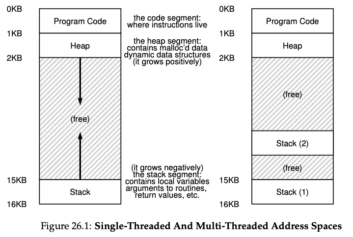
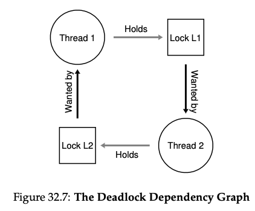

# 26 Concurrency: An Introduction

## Thread

1. Thread：

   - Share：Address Space, data
   - Own：Thread Control Block, registers, stack

   

2. Process vs. Thread:
   - the address remains the same during context switch for threads(no need to switch page table), thus switching between threads is much quicker
   
3. Why threads?
   - Parallism: transforming a single-threaded program to run on multiple CPUs. Using a thread per CPU can make the program run faster.
   - Avoid blocking program due to slow I/O

## Example 1: shared data

```c++
#include <iostream>
#include <pthread.h>

static volatile int counter = 0;

void* myThread(void* arg) {
    printf("%s: begin\n", (char*) arg);
    for (int i = 0; i < 1e7; i++) {
        counter += 1;
    }
    printf("%s: done\n", (char*) arg);
    return nullptr;
}

int main() {
    pthread_t p1, p2;
    char* s1 = "A";
    char* s2 = "B";
    printf("main: begin (counter = %d)\n", counter);
    pthread_create(&p1, NULL, myThread, s1);
    pthread_create(&p2, NULL, myThread, s2);

    pthread_join(p1, NULL);
    pthread_join(p2, NULL);
    printf("main: done with both (counter = %d)\n", counter);
    return 0;
}
```

Note, the `volatile` qualifier tells the compiler this variable may change at any time, so don't do any optimization involving this variable. ([ref](https://stackoverflow.com/questions/4437527/why-do-we-use-volatile-keyword))

If the program runs as we expect, the counter should be 2e7 in the end. However, every time we run this program, it print a counter that is smaller than 2e7, and the value is always different. We call this **indeterministic**. 

The reason lies in the code "counter += 1". Let us see its assembly code: 

```assembly
mov 0x8049a1c, %eax # src, dest
add $0x1, %eax
mov %eax, 0x8049a1c
```

Terminologies:

- **critical section**: a piece of code that accesses a shared resource, usually a variable or data structure.
- **race condition**: if multiple threads of execution enter the critical section at roughly the same time; both attempt to update the shared data structure, leading to surpring outcome, a **race condition** arises.
- **Indeterminate**: an **indeterminate** program consists of one or more race conditions
- **mutual exclusion**: to avoid inderministic output, threads should use some kind of mutual exculusion primitives, which means only one thread can enter a critical section.
- **atomic operation**: atomic means "all or nothing" . An atomic operation should either be done or not executed. It's not possible for an atomic operation to be interrupted in the middle of execution.

## Example 2: Sleep & Wait

condition vaiable is useful here. (will be introduced in next chapters)

# 27 Thread APIs

## Thread Creation

```c++
#include <pthread.h>
      int
      pthread_create(pthread_t      *thread,
               const pthread_attr_t *attr,
                     void           *(*start_routine)(void*),
                     void           *arg);
```

- `thread`: a pointer to the thread that we want to interact with
- `attr`: specify the attributes of this thread, like stack size, scheduling priority. We can pass `NULL` to use default attributes.
- `start_routine`: which function should this thread start running in? The first `void*` is return type, the second `void*` is parameter type, and `start_routine` is the function name.
- `arg`: the parameters passed to the function where the thread begins execution

## Thread Completion

Join: wait for a thread to complete

```c++
int pthread_join(pthread_t thread, void **value_ptr);
```

- `value_ptr`: a pointer to the return value. If you don't need any return value, you can pass in NULL. 
  - NEVER return a pointer to a variable on the stack because it will be deallocated automatically!

## Locks

```c++
pthread_mutex_t lock = THREAD_MUTEXT_INITIALIZER;
pthread_mutext_lock(&lock);
// critical section
pthread_mutext_unlock(&lock);
```

Note:

- Remember to check the return value of these functions, or your code will fail silently and multiple threads might enter the critical section!
- `pthread_mutext_destroy(&lock);` : call this function after finishing using the lock

## Condition Variable

Condition variables are useful when some kind of signaling take place between threads.

- `int pthread_cond_wait(pthread_cond_t *cond, pthread_mutex_t *mutex);`: sleep and wait for a thread to signal it
- `int pthread_cond_signal(pthread_cond_t *cond);`: wake up a thread

1. wait for a thread:

   ```c++
   pthread_mutex_t lock = PTHREAD_MUTEX_INITIALIZER;
   pthread_cond_t  cond = PTHREAD_COND_INITIALIZER;
   Pthread_mutex_lock(&lock);
   while (ready == 0)
       Pthread_cond_wait(&cond, &lock);
   Pthread_mutex_unlock(&lock);

2. wake up a thread:

   ```c++
   Pthread_mutex_lock(&lock);
   ready = 1;
   Pthread_cond_signal(&cond);
   Pthread_mutex_unlock(&lock);
   ```

## Suggestions

1. Mimize thread interation
2. Check return codes
3. Never pass a reference to a varaible on a stack
4. Initialize locks and condition variables
5. Always use condition variable to signal between threads

# 32 Common Concurrency Problems

## Non-Deadlock Bugs

1. Atomicity Violation
   - Solution: lock
2. Order Violation: the desired order between two memory accesses is flipped, i.e., A should always be executed before B, but the order is not enforced during execution.
   - Solution: condition variables

## Deadlock bugs

### Why do deadlocks occur?

- In large systems, complex dependencies arise between components. We must be very careful to avoid **circular dependencies**.

- Encapsulation: For example, Java's `Vector` is thread-safe. For `v1.addAll(v2`), it acquires locks in arbitrary order for v1 and v2. However, if `v2.addAll(v1)` is called in the same time, a deadlock might happen.

### Conditions for Deadlock

1. Mutual exclusion: Resources cannot be shared

2. Hold-and-wait: A thread is holding some resources but still waiting for some other resources

3. No preemption（非抢占，即不能被抢）: Once a thread gets a resource, it cannot be taken away. 

4. Circular wait: There is a cycle in the threads' dependency graph, e.g., 



If any of the above conditions is not satisfied, the deadlock won't happen.

### Prevention

#### Circular Wait

- total ordering
- partial ordering
- Tip: If a function need to acquire multiple locks, we can always acquire the lock with the higher/lower address first to avoid deadlocks.

#### Hold-and-wait

Acquire all locks at once (atomatically). For example:

```c++
lock(prevention);
lock(L1);
lock(L2);
...
unlock(prevention);
```

Even other thread tries to first aquire L2 then L1, the deadlock won't happen.

This technique has following disadvantages:

- Must know which locks to acquire in advance. So this is not suitable for encapsulation.
- May decrease concurrency since we will have a big lock

#### No Preemption

If a thread can't get what it wants, release what it holds. For example,

```c++
top:
	lock(A);
	if (trylock(B) == -1) {
    unlock(A);
    goto top;
  }
```

This might cause **livelock**. Two threads keep attempting this sequence but repeatedly failing to acquire both locks.

Solution: Exponential backoff.

#### Mutual Exclusion

Use lock-free algorithm. For example, when adding with a lock:

```c++
void add(int* val, int amt) {
  mutext_lock(&m);
  *val += amt;
  mutext_unlock(&m);
}
```

We can make it lock-free by using `CompareAndSwap()`, which is an **atomic instruction** provided by CPU.

```c++
void add(int* val, int amt) {
  do {
    int old = *val;
  } while (CompareAndSwap(val, old, old + amt) == 0);
}
```

#### Deadlock Avoidance via Scheduling

Run threads acquiring the same locks on the same CPU, so they won't run concurrently.

#### Detect and Recover

Allow deadlock occurs occasionally (like once a year) and take some action once such a deadlock has been detected.
