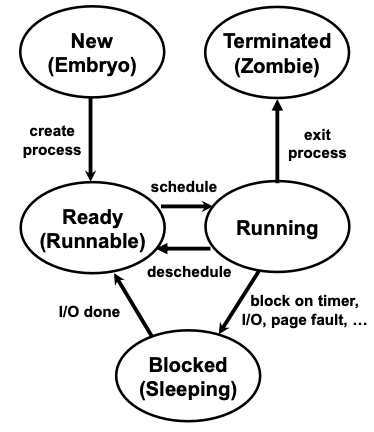

# 1 Intro

1. Operating System: an interface between users and hardware. "The operating system is just another program."
2. What we will learn in this course:
   - Concurrency & concurrent proramming
   - Resource management
   - Performance engineering
   - Security policy design & enforcement
   - Enduring ideas
   - Interface design

# 2 CPU Architecture

## Microprocessor

1. Microprocessor: microprocessor is the heart of every CPU. It is a circuit of transistors and other electrical components on a chip that can process programs, remember information, of calculate things

2. Design Objectives:

   - maximize performance
     - minimize latency: complete individual instructions in small number of **clock cycle**
       - clock cycle: the amount of time between two pulses of an oscillator
       - clock speed: the number of pulses per second. The clock speed is measured in Hz, typically either MHz or GHz. Generally speacking, the higher the clock speed, the computer processor will be able to process information.
     - maximize **throughput**: increase instructions per second (IPS) 
   - maximize productivity: interface provided might be easy to program for
   - Optimize power usage

3. Design Constraints

   - power consumed
   - Cost
   - area occupied

   - **Backward compatibility**
   - Fast design & production time
   - security, scalability, reliability

4. Important factors for different microprocessor markets

   - Desktop: cost, backward compatibility
   - Server: throuput
   - Embedded: cost, power consumption

## Von Neumann Architecture


### Components

#### CPU

1. **Arithmetic/Logic Unit (ALU)**: allows arithmetic (add, subtract, etc. ) and logic (AND, OR, NOT, etc.) operations to be carried out

2. :star:**Control Unit**: controls the operations like ALU, memory, and input/output devices

   - How does Control Unit work?

     a. fetch: ask the RAM for the instruction whose address is stored in IP

     b. execute: execute the instruction

     c. Repeat: add 1 to the address stored in IP, then go back to step a

   

   - example: c <- a + b. instructions in this program:
     - IR: load `a` into register `r1` (load r1, c). IP:2005
     - IR: load `b` into register `r3` (load r3, b). IP: 2006
     - IR: r2 <- r1 + r3 (add r2, r1, r3). IP: 2007
     - IR: store `r2` into `c` (store c, r2). IP: 2008

3. **Registers**: high-speed **storage** areas in the CPU. The data processed by the CPU are fetched from the registers.

   - instruction register: hold the current instruction during processing
   - **instruction pointer** (IP): holds the address of the current instrution in RAM

#### Buses

A bus is like a highway of information, which is a simplified way for many devices to communicate to each other.

> [Buses](https://www.computerscience.gcse.guru/glossary/bus) are the means by which data is transmitted from one part of a computer to another, connecting all major internal components to the CPU and memory.

#### Memory Unit

Memory units are used to store data, instructions, and information. There are two major types of memoty units:

- **RAM** (Random Access Memory): RAM is used for temporaty storage of program data. Its data is lost when power is turned off.
- **ROM** (Read-Only Memory): ROM is read-only. It is used for permanent storage of data.

## Exercise

1. What is a microprocessor?
2. Draw the diagram of the von Neumann architecture, and explain the usage of each component.
3. Explain how does the CPU execute this simple program: `c <- a + b`

# 3 ISA & Assembly

specifying a program and its instructions
- highest level - High-level programming language, e.g., Python, Java, C++. Each statement can be translated into many instructions, e.g., c <- a + b
- middle level - Assembly language: specify each machine instruction in mnemonic form, e.g., load r1, A
- lowest level - machine language: specify each machine instruction in bits, e.g., 1101101000001110011

## ISA

Instruction Set Architecture (ISA) is a part of the processor that defined how the CPU is controled by the software. ISA acts as an interface between software and hardware. ISA provides the only way through which a user is able to interact with the hardware.

A device that executes the instructions defined by ISA, like a CPU, is called an implementation

1. There are two types of ISA in complexity, both of which are in vogue today: 
   - **Complex Instruction Set Computer** (CISC)
     - variable instruction sizes in RAM: instructions can have variable sizes, e.g., add can use 2 or 3 registers
     - semantically more useful
     - modern x86 architectures (such as Intel and AMD) use CISC ISA
   - **Reduced Instruction Set Computer** (RISC)
     - semantically more basic
     - simpler, faster, easier to design CPU
     - Intel CPU are RISC implementations

1. decoder: bridge the gap between CISC ISA and RISC implementation
   - decoder takes CISC instructions and reduce them down to RISC instructions

1. priviledge rings / CPU protection rings

   - Computer operating systems provide different layers of access to resources. Each of these layers have different priviledges. We use "**protection rings**" term while mentioning this system. The rings are arranged in a hierachy from the most privileged (most trusted) to the least privileged (least trusted) layer. Protection rings are one of the key solutions for sharing resources and hardware.
   - Most OS only use two of these: Kernel Mode (ring 0), Usere Mode (ring 3). Ring 1 and ring 2 are rarely used. Switching from user mode to kernel mode can cost 1000 - 1500 CPU cycles.
   - Hypervisor (Ring -1) allows guest operating system to run Ring 0 operations. (a host OS runs on hardware, a guest OS runs on Virtual Machine)
   
   


## Assembly

### Instruction format

- Intel: `operation dest_operand, src_operand` (we use this)
- AMD: `operation src, dest`

### Operation

- load: load a value from RAM into a register
- load direct: put a fixed value directly into a specific register
- store: copy value from a specific register to RAM
  - `mov eax, ebx`
- Compare: if the value in the first register is larger than the value in the second register, put 0 in a special register `r0`
  - `cmp eax, 9`
- Jump: if the value in `r0` is 0, change instruction pointer to the value in a specific register
  - `jmp labelName`
- Branch: if the value in a specific regsiter is larger than that in another register, change instruction pointer to a specific value
- arithmetic: 
  - `add`: add the contents of two registers and put the result in a third register
    - add is a variable-sized instructions
  -  `sub`, `imul`, `inc`, `dec`, ...
- Logic:`and`, `or`,  `xor`, `not`, `shl`, `shr` (???)
  - `xor eax, eax`: zero out `eax`, much faster than moving 0 to `eax`

### Operands

1. Registers
   - general registers (in 16 bits); ax, bx, cx, dx
     - add a prefix if we want to look at more than 16 bits:
       - 64 bits: `r`. `rax`, `rbx`, ...
       - 32 bits: `e`
       - lower 8 bits: l
       - higher 8 bits: h
   
   - xmm0, xmm1, ... : floating point parameters
     
   - bp (base pointer / frame pointer): the start of the stack frame
   
   - sp (stack pointer): the top of the stack frame
   
   - si (source index), di (destination index)
   
2. memory access - `[]`

   - `mov eax, DWORD PTR [rcx+8]`: read 32 bits from the address in the square bracket, and store its value in the register eax
     - `DWORD PTR` is called "size directive" which defines how much to read. "DWORD" stands for "double word" and a WORD is 16 bits.

3. immediate values

   - an immediate value is a constant number embedded in an instruction, e.g., `mov cx, 16` in which 16 is an immediate value. (immediate value is not a memory location or register)

## Exercise

Write the following C++ program in ASM instructions:

```c++
int sum = 0;
for(int i = 0; i < 10; ++i){
	sum += i; 
}
```

instructions:

```assembly
xor eax, eax; // sum = 0
xor ebx, ebx; // i = 0
J1:
cmp ebx, 9;
jg J2;
add eax, ebx;
add ebx, 1;
jmp J1;
J2:
```

# 4 ASM Function Calls

x86 Assembly guide: https://www.cs.virginia.edu/~evans/cs216/guides/x86.html

## Application Binary Interface (ABI)

An ABI is the **calling convention** which determines how data is provided as input to, or read as output from, computational routines. Examples of this are the x86 calling conventions.

registers hold addresses in RAM

- first 6 int or pointer parameters must be placed in: `rdi`, `rsi`, `rdx`, `rcx`, `r8`, `r9`
- floating point parameters: xmm0, ..., xmm7
- int return value: `rax`
- callee-saved registers (preserved): register value remains the same after the function call,  `rbx`, `rbp`, r12-r15 (Q: not change after return?)
- caller-saved registers (temproraries): `r10`, `rsi`

## Managing the Stack

one prpogram has only one stack. Different programs have different memory space in computer.

1. Prologue - set up the stack
   - save `rbp` to the stack: `rbp` stores the address of the bottom of the stack, its value never changes
     - Backup `rbp` values: push the value into some register?
   - `rsp`: if we push something, `rsp` will decrease; pop, `rsp` increase
2. Epilogue - clean up the stack
3. push & pop
   - "push" stores a constant or 64-bit register out onto the stack. So "push \<stuff>" is equivalent to a "sub rsp, 8" and then "mov QWORD[rsp], \<stuff>".
   - "pop" retrieves the last value pushed from the stack. Everything you push, you MUST pop again afterwards, or your code will crash almost immediately!

# 5 ASM System Calls

1. system calls
   - In computing, a **system call** is the programatic way in whch a computer program requests a service (like I/O, reating new process, checking the time, etc.) from the operating system. (use API)
   - When a system call is made, the CPU switch to kernal mode to perform the task, then back to the user mode when it returns. Therefore, a system call can slow down your program.
2. Wake up system calls
   - traps
   - exceptions
   - Interrupts: usually relate to I/O 
     - OS uses the interrupt vector to store pointers to each interrupt handler. When an interrupt occurs, the CPU is switched into kernel mode and jumps to the appropriate interrupt handler code.
3. Anatomy of a system call
   - put syscall parameters in registers
   - put syscall numbers in registers
   - `syscall` ASM instruction
4. Example:
   - the assembly of `printf("%d", 1)`, the last line is `mov eax, 0`. because the number of this syscall is 0.

# 6 Process

## Typical OS Structure

1. User-level: applications

   - many common OS functions:

     - `malloc()`: C version of `new`

     - `sbrk()`: change the space allocated for the calling process

2. Kernel-level: Kernel is a core component of OS and generally has control over everything in the system

3. Hardwre-level

   - device make: make APIs
   - device driver: 
   - interrupts
   - DMA?

## Process

1. process: execution context of a running program

   - a process is not equal to a program. Many copies of a program can be running at the same time
   - everything happens either in a kernel or a process (OS is not a process)

2. A process includes the following things. All are tracked in PCB

   - state
     - memory state: code, data, heap, stack
     - Processor state: registers, IP (instruction register)
     - kernel state: 
       - process: ready, running, ...
       - resources: open files/sockets, etc.
       - scheduling: **priority**, CPU time
   - Address space
     - code: instructions that can be read by CPU, like ASM and binary code
       - the copies of the same program will have different addresses of stack and heap
     - static data: data and BSS (block starting symbol) ???
       - [BSS](https://en.wikipedia.org/wiki/.bss#:~:text=Historically%2C%20BSS%20(from%20Block%20Started,others%20at%20United%20Aircraft%20Corporation.) (block starting symbol): the portion of code that contains statically allocated variables that has been declared but has not been assigned a value 
     - dynamic data: data stored in heap and stack
   - Special pointers: each process has its own call stack and heap. Stack grows downwards, heap goes upwards
     - `brk`: the front of heap (explicitly moved)
     - `sp`: top of stack (implicitly moved)

3. Process Control Block (PCB)

   - Each process has its own PCB, which is allocated in kernel memory
   - Tracks states of a process, including:
     - PID: process identifier, usually 2 bytes
     - process states: running, waiting, ...
     - machine state: IP, SP, registers
     - memory management info: 
     - open file table (open socket table)
     - Queue pointers: waiting queue, I/O, sibling list, parent, ...
     - sheduling info: priority, time used so far, ...

   - CPU needs to switch from process to process, so each process's PCB need to backup values in the registers to RAM.

   Q: process vs. thread?

   - A process can have multiple threads, switching between threads are faster than processes
   - A PCB can control multiple threads

4. process state machine

   - new (embryo)
   - ready: in ready queue
   - running: executing instructions on CPU
   - blocked (sleeping): stalled for some event, e.g., I/O
   - Terminated (zombie): process is dead or dying

   

5. process state queues

   - ready processes are on the ready queue
   - each I/O device has a wait queue
   -  A process is either running, or on the ready queue, or on a single wait queue
   - processes are linked to parents and siblings -- support using `wait()`

6. xv6 PCB

## Practical Process Management

### Process API

#### fork() system call

1. Synopsis:

   ```c
   #include <unistd.h>
   pid_t fork();
   ```

2. Description:

   `fork()` creates a new process (**child process**) from duplicating the calling process (parent process). The child process runs concurrently with its parent process. They share the same program counter (pc), same registers, and same open files (**really???**). But they reside in different addresses and have different PIDs

3. Return values

   - on success: 0 in the child process, child's PID in the parent process
   - on failure: -1is returned in the parent, no child process is created

4. Example:

   ```c
   #include <stdio.h>
   #include <stdlib.h>
   #include <unistd.h>
   
   int main() {
       printf("Hello, World! (pid: %d)\n", (int) getpid());
       int rc = fork();
       if (rc < 0) { // fork failed
           fprintf(stderr, "fork failed\n");
           exit(1);
       } else if (rc == 0) { // child
           printf("Hello, I am child! (pid: %d)\n", (int) getpid());
       } else { // parent
           printf("Hello, I am parent of %d! (pid: %d)\n", rc, (int) getpid());
       }
       return 0;
   }
   ```

   The child process will not start running at main(); it will execute the next instruction after `fork()`.  And since the child the parent are running concurrently, we don't know the CPU **scheduler** will first give control to which process. So there are 2 possible outputs:

   ```c
   1. 
   Hello, World! (pid: 47517)
   Hello, I am parent of 47519! (pid: 47517)
   Hello, I am child! (pid: 47519)
     					(or)
   2. 
   Hello, World! (pid: 47517)
   Hello, I am child! (pid: 47519)
   Hello, I am parent of 47519! (pid: 47517)
   ```

#### wait() system call

The parent process calls `wait()` to delay its execution until the child finishes executing. On success, it returns the PID of the terminated child, else -1.

`wait()` makes the output of the above program to be deterministic:

```c
int main() {
    printf("Hello, World! (pid: %d)\n", (int) getpid());
    int rc = fork();
    if (rc < 0) { // fork failed
        fprintf(stderr, "fork failed\n");
        exit(1);
    } else if (rc == 0) { // child
        printf("Hello, I am child! (pid: %d)\n", (int) getpid());
    } else { // parent
        int rc_wait = wait(NULL);
        printf("Hello, I am parent of %d! (rc_wait: %d) (pid: %d)\n", rc, rc_wait, (int) getpid());
    }
    return 0;
}
```

output:

```bash
Hello, World! (pid: 47587)
Hello, I am child! (pid: 47591)
Hello, I am parent of 47591! (rc_wait: 47591) (pid: 47587)
```

#### exec() system call

1. Description:

   - The `exec()` family of functions load a new program into the current process. The code, data, and memory will all be replced.
   - `exec` only returns to the caller if it fails

2. `exec` has 6 variants:

   - `int execvp(const char *file, char *const argv[]);`: 
     - file: the filename of the executable
     - argv: an array of pointers to null-terminated strings that represent the argument list for the new program
       -  the pointers must be terminated with by a null pointer
   - `execl`
   - ...

3. example: 

   ```c
   int main() {
       printf("Hello, World! (pid: %d)\n", (int) getpid());
       int rc = fork();
       if (rc < 0) { // fork failed
           fprintf(stderr, "fork failed\n");
           exit(1);
       } else if (rc == 0) { // child
           printf("Hello, I am child! (pid: %d)\n", (int) getpid());
           char* myArgs[3];
           myArgs[0] = strdup("wc"); // program: wc - word count
           myArgs[1] = strdup("../main.c"); // argument: file to count
           myArgs[2] = NULL; // marks end of array
           execvp(myArgs[0], myArgs);
           printf("This shouldn't print out\n");
       } else { // parent
           int rc_wait = wait(NULL);
           printf("Hello, I am parent of %d! (rc_wait: %d) (pid: %d)\n", rc, rc_wait, (int) getpid());
       }
       return 0;
   }
   ```

   Output:

   ```c
   Hello, World! (pid: 48997)
   Hello, I am child! (pid: 49000)
         26     112     849 ../main.c
   Hello, I am parent of 49000! (rc_wait: 49000) (pid: 48997)
   ```

   In this example, the child process calls `wc` (the word counting program), and the `wc` program replaces the child process. Note, `execvp` doesn't create a new process, it just loads code from `wc` and overwrite the current code segment; the stack, heap, and other parts of memory space are also re-initialized.

#### Termination

1. `int kill(pid_t pid, int sig);`: kill other process
   - sig: SIGKILL (9), SIGSTOP(19), SIGCONT(18)
2. `exit`: kill the current process

#### Summary

The seperation of `fork()` and `exec()` is essential in building a Unix shell. When you type a command, the shell will call `fork()` to create a new process, then it calls `exec()` to run the command in the child process, then calls `wait()` to wait for the command to complete. When the child completes, the shell returns from `wait()` and prints out a new prompt again, ready for a new command.

### Linux Commands

- `ps`: display all process statuses that have controling terminals
- `top`: display the information of the top running jobs
- `kill <PID>`: kill a specific process
- Unix pipe - `|`: e.g., `grep -o <word> <file> | wc -l`

  - `grep`: file pattern searcher

    - `-o`: print the only matching part of the line

  - `wc`: displays a file's line, word, and byte count
    - `-l`: the number of lines
- `./prog &`: run prog in background

## Zombies & Orphans & Daemon

1. zombie: exited process with uncollected statuses
2. orphans: if a parent process exits before the child terminates, the child becomes an orphan 
3. daemon （守护进程）: computer programs that run as a background process
   - The first process `init` is a daemon that keeps running as the computer is on. And `init` will adopt orphaned processes.

# 7 Limited Direct Execution

1. Virtualization: share the CPU among many processes
2. Isolation:
   - processes must be isolated with each other
   - kernel must be isolated with processes
   - hardware must be isolated with processes
3. Limited Direct Execution: run code on CPU with constraints
   - restrict access to sensitie state (anything that need to be protected), like the memory (addresses in RAM), addresses (registers), interrupts
   - prevent **denial-of-service** (what's this???)
4. Problem #1: Sensitive Table
   - hide **control registers** (convert virtual addresses to physical addresses) from applications
     - `%CR3`
     - `HLT`: hault instruction - halt the entire system
     - `LIDT`: load interrupt descriptor table register
     - `MOV %CRn`: ???
     - `CLI`: clear interrupts
     - `STI`: set interrupt flag
     - `%IDTR`: interrupt descriptor table register
   - Priviledged instructions are only available in Ring 0
5. Virtual addressing: isolating memory
   - **Page table** holds the virtual addresses and corresponsing physical addresses
   - `%cr3`: page directory base register
   - CPU will translate virtual address to physical address 
   - what is **kstack**???
   
6. Virtual Address Space
7. Exceptioinal Control Flow: switch from user mode to kernel mode
   - "exception" here is not a bag thing. It means interrupt the process of CPU fetching instructions from IP
   - Types of exceptions:
     - **interrupt**: asynchronous, **resume** afterward
       - e.g., mouse moved, key pressed, network packet arrived
     - **trap**: synchronous, intentional, resume afterward
       - e.g., syscall, breakpoint, overflow
     - **fault**: syncrhonous, unintentional, **retry** or **abort**
     - **abort**: unintentional, abort
       - machine check exception, **double fault** (?)
     
     Q: syncrhonous & asynchronous? we can think asynchronous things happen unexpectedly. 
     
   - resume & retry & abort
     
     - Resume: restart on instruction after exception
     - Retry: 
     - Abort: terminate

8. Example: debugger
   - When you add a breakpoint, the debugger adds code to the assembly:
     - remembers the data stored at the address
     - replaces the first byte with the **int 3** instruction (int - interrupt)
   - run the process: when hit a int 3, cause a trap in OS and process halts
     - int 3 -> original instruction
     - roll IP back by one (this can only be done in Ring 0, because IP is priveliged register)
     - Interact with the halted process
   - if the user want to keep running, the debugger will put the breakpoint back

9. Interrupt Descriptor Table (trap table)

# 8 Scheduling

## Recall

1. policy & mechanism

   - Policy: choose what to run in a consistent way. e.g., process scheduler
   - Mechanism: low-level code that implements the decision. e.g., dispatcher, context switch 

2. Dispatch mechanism

   ```bash
   while (1) { // infinit loop
   	run process A for some time slices
   	
   	stop process A and save its context \
   	                               context switched
   	load context of process B           /
   }
   ```

3. cooperative vs. preemptive multitasking

   - **cooperative multitasking**: not used in modern operating system
     - OS trusts that processes to behave reasonably -- they will relinquish CPU to OS through traps (e.g., making system calls, page fault, errors).
     - such system often have a explicit **yield()** system call, which transfers control to the OS so it can run other processes.
     - disadvange: if an unfriendly process avoids all the traps and performs no I/O, it will take over the entire machine!
   - **preemptive multitasking**: the OS takes control
     - **timer interrupt**: the timer raises a interrupt every so many milliseconds. When the interrupt is raised, the OS will regain control, then it will stop the current process and start a different one.

4. context switch: 

   > A context switch is conceptually simple: all the OS has to do is save a few register values for the currently-executing process (onto its kernel stack, for example) and restore a few for the soon-to-be-executing process (from its kernel stack). By doing so, the OS thus ensures that when the return-from-trap instruction is finally executed, instead of returning to the process that was running, the system resumes execution of another process.

5. Diagram: how OS switches from process A to process B (important!!! If I can draw the diagram by myself, I have understood the context switch)

## Scheduling Performance Metrics

1. turnaround time = completion time - arrival time
2. response time = first run time - arrival time
3. Fairness: all jobs get the same CPU time over some time interval

## Schedulers

1. Non-preemptive algorithms:
   - **FIFO (first in first out)**: turnaround time suffers when short jobs are behind the long job (**convoy effect**)
   - **SJF (shortest job first)**: can minimize turnaround time. But this algorithm is impractical since we don't know each job's running time
2. Preemptive schedulers:
   - **STCF (shortest time-to-complete first)**: based on SJF, but jobs can have different arrival time
     - for time sharing system, when a job completes is not very important. We care more about the response time
   - **Round-Robin(RR)**: runs a process in a fixed time slice, then switches to another process
     - have good average response time, but might have bad average turnaround time with equal job lengths
     - The size of time slice is important. The smaller the size, the response time is better, but the costs of context swithces will be larger. So there's a tradeoff.

# 9 Scheduling + IPC

## Multi-level Feedback Queue (MLFQ)

Multiple queues, different priorities. The higher-priority queue runs its jobs first.

5 rules:

1. if priority(A) > priority(B), A runs
2. if priority(A) == priority(B), use RR to run A and B
3. processes starts at the top priority, 
4. Once a process uses the allotment at a given level, it moves down a queue. -- prevent gaming
5. after some time period, move all jobs to the top priority queue. -- prevent starvation

### Lottery Scheduling

random algorithm, simple to implement

Approach: 

1. give processes lottery tickets
2. whoever wins runs
3. more tickets means higher priority

### Interprocess Communication


1. Pipes: half duplex (data flows in only one direction)
