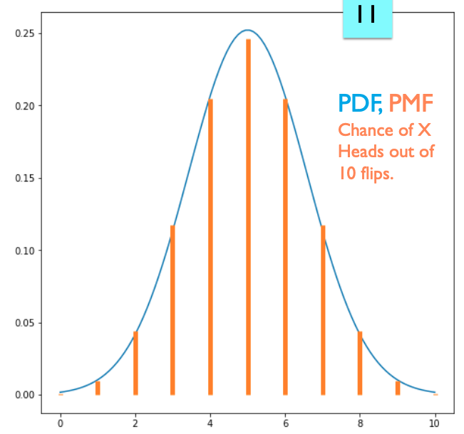

# Intro

## Python

1. Scripting Language: one line at a time being processed

   - C++: we need to first compile the entire file

2. difference: 

   - `/usr/bin/`
   - `opt/homebrew/bin`

3. Array & list: python has only list

   - the data in the array are the same type, but a list can have any types of data (but DON't DO THIS!!!)
   - list comprehension: `new_nums = [x * x for x in nums if x > 0]` (one-liner version is faster than the corresponding for-loop version! [ref](https://python.plainenglish.io/do-python-one-liners-really-make-your-code-faster-fd5f17a25b0a))

4. tuples: like a list, but immutable

5. `main()` in python:

   ```python3
   if __name__ == "__main__":
     # code to run
   ```

6. To run a python file by using `./test.py` (make sure the permission of this file has `x` first), we should add `#! /opt/homebrew/bin/python3` to the beginning of the file

7. deep copy & shallow copy:

8. Set: no duplicates, no order. implementation is hash table

   - `s = set()`: create an empty set

9. dictionary

   - d = {"Python": "A snake", "C++", "A programming language"}
   - `d.keys()`: get all the keys
   - `d.values()`: get all the values
   - `d.items()`: get all keys and values 

10. `.1 + .1 +.1 == .3` get false

Q: 

- Deep copy & shallow copy
- what's 

## Pandas

1. series: a serie is a column. The data in a serie are the same type.
   - index: id of a row
2. slicing:
   - `iloc` is using the position, and the same as `[]`. loc is using index. index is included, but location is non-included

## NumPy

1. `np.eye(4)`: create a 4 * 4 identity matrix

2. ```python
   x = (3 * 4) # int
   x = (3 * 4, ) # tuple
   ```

3. i

# Intro to Statistics

## Variables

1. Random Variable
   - Pdf: probability density function. pdf gives insight into the likelihood of something occurring
     - integral of pdf: 1
   - Sampling
2. Discrete & Continuous Values
3. Categorical Variables
4. Ordinal Variable
5. Interval Variable (?)

## Inferential Statistics

1. pdf
   - probability distribution: mean, variance

## Probability Distrubition

1. Bernoulli Distribution: coin flip 
   $$
   f(k) = \begin{cases} p & k=1 \\ 1-p & k = 0 \end{cases}
   $$

   - mean = p
   - Variance<sup>2</sup> = p * (1 - p)

2. Binomial Distribution 二项式分布： flip a coin for N times
   $$
   f(k) = \binom{n}{k} p^k (1-p)^{n-k}.
   $$
   

   - mean = N * p
   - variance = N * p * (1 - p)

3. Normal Distribution

   - Mean = 0
   - variance = 1

4. Poisson Distribution
5. Correlation?

## Combinations

0! = 1

# 4 Visualization

Q: what is insight?

linear regression: fit a line to your data

parabola/quadratic

ordinal data: ordered but not mathmetically data, e.g. elementary school, junor high, high school, university

## Matplotlib

`figsize`

`plt.style.use('ggplot')`: a R-style

value_counts()

sort_values()


PDF vs. PMF

- pdf: continuous
- pmf: discrete

plt.fill_between

df.replace({key: value}, inplace=True)


T-test!!!

# 5 Hypothesis Testing

## Strategy

1. Develop a **null hypothesis (H<sub>0</sub>)** (something that you want to disprove)
   - **alternative hypothesis** (H<sub>a</sub>): the hypothesis that researchers want to test again the null hypothesis
2. Decide the **test statistic** (?): the method and value which will be used to assist in determining the truth value of the null hypothesis.
3. calculate **p-value**: the probability that a test statistic is at least as significant as the one observed assuming that the null hypothesis was true.
4. choose **significance**: how much ‘confidence’ is placed in the results
5. get the result: if p-value < significance, the null hypothesis is false

## A/B Testing

1. A/B Testing

2. Methodology

3. PMF (Probability Mass Function) vs. PDF (Probability Density Function)

   | PMF (Probability Mass Function)                    | PDF (Probability Density Function)            |
   | -------------------------------------------------- | --------------------------------------------- |
   | Discrete random variable                           | Continuous random variable                    |
   | eg., chance of someone get a temprature of 98 ~ 99 | eg., chance of get 4 heads up out of 10 flips |

   

5. Cumulative Distribution Function (CDF)

   if f(x) is PDF of a continuous random variable, then the probability of x in the interval [a, b] is 
   $$
   \textrm{Prob}(X\in[a,b]) = 
   \int_a^b f(x) dx.
   $$
   Define CDF as:
   $$
   F(x) = \int_{-\infty}^x f(x) dx.
   $$
   Then
   $$
   \int_a^b f(x) dx =
   \int_{-\infty}^b f(x) dx  - \int_{-\infty}^a f(x) dx =
   F(b) - F(a).
   $$
   

## Central Limited Therom

# 7 Least Squares

# 9 Logistic Regression

predict categorical variables

> The parameters we fit are still the slope + intercept of a line, but the logistic function turns the output of the line into something that can be understood as a probability

# 10 K-Nearest Neighbors (KNN)

# 11 Spatial Partitioning

- KNN query: give me the K closest points (no guarantee of how close these points will be)
- range query: give all points in the circle around a point (don't know how many points there would be)

## Bucketing

1. Divide the space into uniformly distributed buckets
2. `rangeQuery(p, r)`: 
   - find all buckets in the circle
   - find all points in these buckets that have a distance to `p` shorter than `r`
3. `knnQuery(p, r)`: do `rangeQuery` and increase the search radius `r` until we find enough points

4. Issues:
   - it's tricky to deside the number of buckets in each dimension
   - curse of dimensionality -- need to store a lot of data when dimension increases!
   - not suitable for non-uniform data

## Quad Tree

1. Each node stores:

   - AABB (axis aligned bounding box)

   - a list of nodes (leaf node) or 4 child nodes (NW, NE, SW, SE)

2. Construction

   ```java
   Node Node(points, aabb) {
   	if len(points) < threshold {
       make it a leaf node
     } else {
       mid = (aabb.min + aabb.max) / 2
     	loop through points and put them in NW, NE, SW, SE lists of points
     	NW = new Node(NW_points, nw_aabb)
     	...
     }
   }
   ```

3. RangeQuery

   ```java
   RangeQuery(p, r) {
     if this is a leaf node {
       loop through each point this node contains, and find points that are within r of p
     } else {
       loop through each child node:
     		if they are within r +/- p:
     			childNode.RangeQuery(p, r)
     }
   }
   ```

   

4. KNNQuery

   ```sql
   KNNQuery(p, r, result) {
     if leaf:
     	for each point in bucket:
     		if len( result ) < K:
         	add point
     		else if distance( point, pt ) < distance( pt, worst in result ):
         	replace worst with point
     else: // internal node 
     	for each child:
     		if len(result) < K or closestPointInAABB( pt ) < distance( pt, worst in result ):
     			recurse
   }
   ```

## KDTree

K here specifies the number of dimensions.

1. Each node stores:

   - the **dimension** to split
   - Split point (the median in this dimension)
   - Left and right child

2. Construction:

   ```java
   Node(PT[] points) {
     if (points.length == 1) {
       splitPoint = points[0];
     } else {
       // find middle poit based on the split dimension
       // group smaller points and bigger points
       left = new Node(smaller points);
       right = new Node(bigger points);
     }
   }
   ```

3. RangeQuery:

   ```python
   PT[] rangeQuery(PT p, float r) {
     if (distance(node, p) < r) {
       // add this node to the list
     }
     if (p[splitDim] - r < node[splitDim]) {
       node.left.rangeQuery(p, r);
     }
     if (p[splitDim] + r > node[splitDim]) {
       node.right.rangeQuery(p, r);
     }
   }
   ```

   

4. KNNQuery:

   ```java
   check point in node
   check each child
   ```

   

Each time we go down one level, we move to the next dimension.

Height of KNN Tre: O(logN). Dimension won't affect its height!
