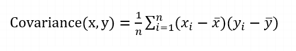
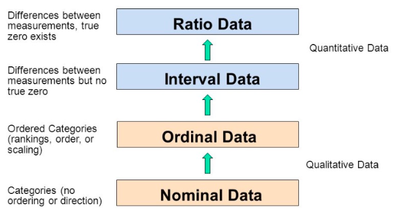
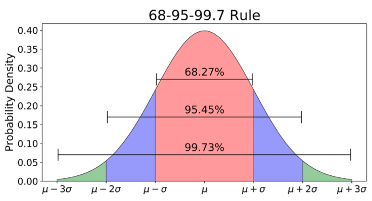
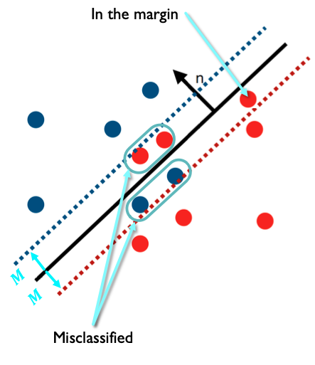
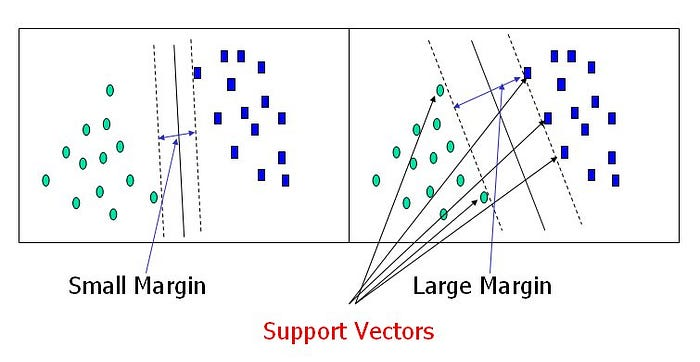
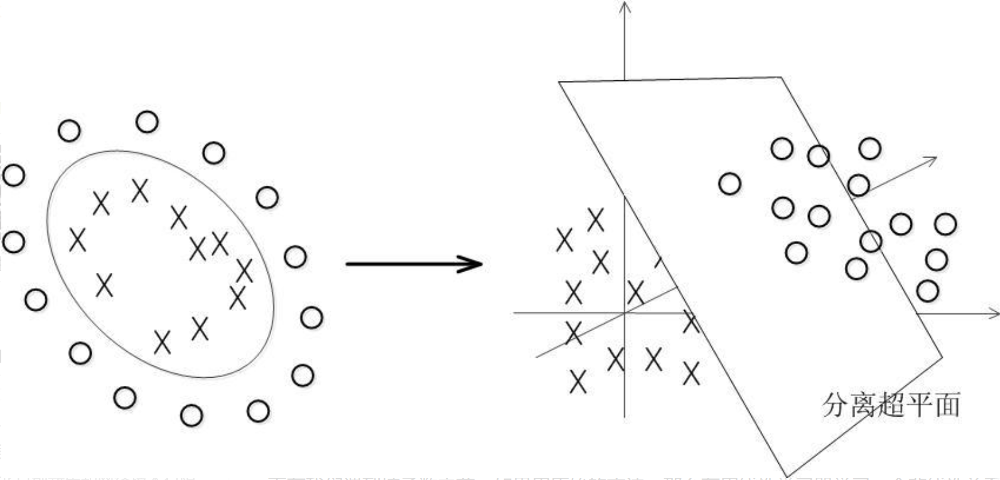
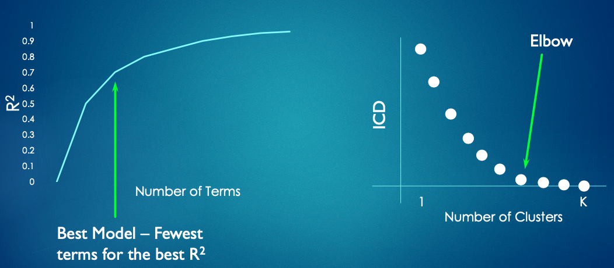
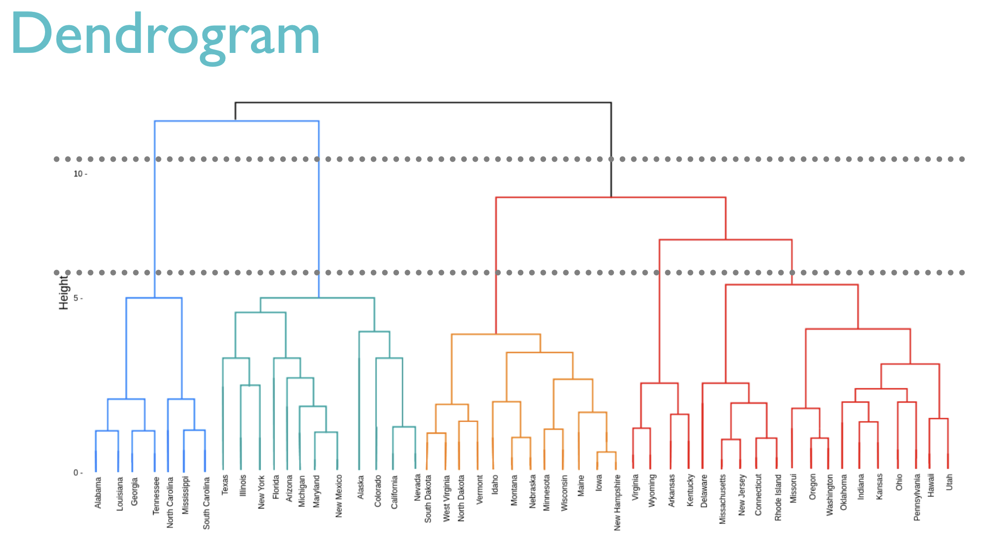
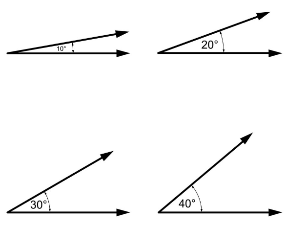

• https://utah.zoom.us/j/97754311215

- Meeting ID: 977 5431 1215
- Passcode: 169659

# 1 Intro

## Python

1. Scripting Language: one line at a time being processed

   - C++: we need to first compile the entire file

2. difference: 

   - `/usr/bin/`
   - `opt/homebrew/bin`

3. Array & list: python has only list

   - the data in the array are the same type, but a list can have any types of data (but DON't DO THIS!!!)
   - list comprehension: `new_nums = [x * x for x in nums if x > 0]` (one-liner version is faster than the corresponding for-loop version! [ref](https://python.plainenglish.io/do-python-one-liners-really-make-your-code-faster-fd5f17a25b0a))

4. tuples: like a list, but immutable

5. `main()` in python:

   ```python3
   if __name__ == "__main__":
     # code to run
   ```

6. To run a python file by using `./test.py` (make sure the permission of this file has `x` first), we should add `#! /opt/homebrew/bin/python3` to the beginning of the file

7. deep copy & shallow copy:

8. Set: no duplicates, no order. implementation is hash table

   - `s = set()`: create an empty set

9. dictionary

   - d = {"Python": "A snake", "C++", "A programming language"}
   - `d.keys()`: get all the keys
   - `d.values()`: get all the values
   - `d.items()`: get all keys and values 

10. `.1 + .1 +.1 == .3` get false

11. Deep copy & shallow copy
    - shallow copy: only copy the address
    - deep copy: copy the values

## Pandas

1. series: a serie is a column. The data in a serie are the same type.
   - index: id of a row
2. slicing:
   - `iloc` is using the position, and is the same as `[]`. `loc` is using index. index is included, but location is non-included

## NumPy

1. `np.eye(4)`: create a 4 * 4 identity matrix

2. ```python
   x = (3 * 4) # int
   x = (3 * 4, ) # tuple
   ```

# 2 Intro to Statistics

## Baisc Statistics

1. **Descriptive Statistics**: describe the characteristics of a dataset

   - e.g., min, max, avg, standard deviation

   - variance: the range of possible outcomes

   - covariance: describe the relationship between two random variables in which a change in the other reflects a change in one variable

     

   - Correlation = covaraince(x, y) / (std-x * std-y)

2. **Inferential Statistics**: a filed of statistics that using analysis tools to **draw conclusions** about a population by examining random samples.

## Variables

### Variable Types

1. Random Variable: e.g. rolling a dice, 1-6 are random
   - represented by probability density function (pdf). pdf gives insight into the likelihood of something occurring
2. Discrete & Continuous Values

### Levels of Measurement

1. Categorical/Nominal Variables
2. Ordinal Variable （定序变量）: the data is ordered and the order is important, but the different between two variables is meaningless. e.g., education level - high school, college, master
3. Interval Variable （定距变量）：the difference between two variables is meaningful and comparable but has no true zero. e.g., temperature
4. Ratio Variables （定比变量）: a ratio variable has all the properties that a interval variable has, but also has a clear definition of 0.0. And multiplication for ratio variables make sense. e.g., weight - 60kg, 60 kg * 2



| **OK to compute....**                                | **Nominal** | **Ordinal** | **Interval** | **Ratio** |
| ---------------------------------------------------- | ----------- | ----------- | ------------ | --------- |
| frequency distribution                               | **Yes**     | **Yes**     | **Yes**      | **Yes**   |
| median and percentiles                               | **No**      | **Yes**     | **Yes**      | **Yes**   |
| sum or difference                                    | **No**      | **No**      | **Yes**      | **Yes**   |
| mean, standard deviation, standard error of the mean | **No**      | **No**      | **Yes**      | **Yes**   |
| ratio, or coefficient of variation                   | **No**      | **No**      | **No**       | **Yes**   |

## Probability Distrubition

1. Bernoulli Distribution: one coin flip 
   $$
   f(k) = \begin{cases} p & k=1 \\ 1-p & k = 0 \end{cases}
   $$

   - mean = p
   - Variance = p * (1 - p)

2. Binomial Distribution 二项式分布： the probability of get k heads up when flipping a coin for N times
   $$
   f(k) = \binom{n}{k} p^k (1-p)^{n-k}.
   $$


   - mean = N * p
   - variance = N * p * (1 - p)
   - combinations: 0! = 1

3. Poisson Distribution: the probability of an event happening a certain number of times within a given interval of time or space.

   - The value is discrete.
   - not a symmetric distribution

4. Normal Distribution

   - Mean = 0
   - variance = 1

   

Note, Bernoulli, Binomial, Poisson distributions are discrete, but normal distribution is continuous.

## Tools

1. Possibility Mass Function (PMF): the probability of a given outcome
2. Possibility Density Function (PDF): the probability of a given range
3. Cumulative Distribution Function (CDF): cdf(x) -- the area from -inf to x

# 4 Visualization

1. Plot types: histogram, scatter plot, scatter matrix, line plot, heat map, box plot, ...
2. Marks: point, line, bar, 
3. Channels: position, shape, color, size, ...

# 5 Hypothesis Testing

## Strategy

1. Develop a **null hypothesis (H<sub>0</sub>)** (something that you want to disprove)
   - **alternative hypothesis** (H<sub>a</sub>): the hypothesis that researchers want to test again the null hypothesis
2. Decide the **test statistic**: the method and value which will be used to assist in determining the truth value of the null hypothesis.
3. calculate **p-value**: the probability that a test statistic is at least as significant as the one observed assuming that the null hypothesis was true.
4. choose **significance**: how much ‘confidence’ is placed in the results
5. get the result: if p-value < significance, the null hypothesis is false

## A/B Testing

1. A/B Testing: show two different things to different groups of people and calculate which one is more effective.

2. Methodology

   - form a hypothesis and pick a significance level
   - do experiments and collect data
   - compute test statistics (TS)
     - TS should come from a normal distribution. We can compute the possibility of getting that value in normal distribution
   - draw a conclusion
     - if the possibility < significance level, the hypothesis is wrong

3. PMF (Probability Mass Function) vs. PDF (Probability Density Function)

   | PMF (Probability Mass Function)                              | PDF (Probability Density Function)                           |
   | ------------------------------------------------------------ | ------------------------------------------------------------ |
   | Discrete random variable                                     | Continuous random variable                                   |
   | Can only compute the possiblity of a range, eg., chance of get 4 heads up out of 10 flips | Can compute possibility for an exact value, eg., the chance of someone getting a temprature of 98 ~ 99 |

   

4. Cumulative Distribution Function (CDF)

   if f(x) is PDF of a continuous random variable, then the probability of x in the interval [a, b] is 
   $$
   \textrm{Prob}(X\in[a,b]) = 
   \int_a^b f(x) dx.
   $$
   Define CDF as:
   $$
   F(x) = \int_{-\infty}^x f(x) dx.
   $$
   Then
   $$
   \int_a^b f(x) dx =
   \int_{-\infty}^b f(x) dx  - \int_{-\infty}^a f(x) dx =
   F(b) - F(a).
   $$

# 6 Linear Regression

1. model: y = b0 + b1 * x1 + b2 * x2 + ... 
   - Find the best fit by minimizing the squared residuals.
2. Solver: In machine learning, a solver refers to an algorithm or optimization method used to find the optimal solution for a specific problem.
3. Normalizing:Convertingunits(scale)toavaluethatiscomparableacrossalldatasets.

# 7 Least Squares

1. Least Squares: Least squares method is the procedure to find the best fit for a set of data points. This mothod works by minimizing the sum of **squared residuals**.

   - residual: the difference between predicted y and observed y. We can treat it as an error

   - **least squares**: pros
     - Positive values and negative values won't cancel out each other
     - The points with higher distance has higher weight
     - The function is smooth. Easier to optimize than absolute distance. 

2. R<sup>2</sup>: the proportion of the variance that is explained by the model. If R<sup>2</sup> is closer to 1, the model fits better to the data.

3. Underfitting & Overfitting

   |          | training accuracy | testing accuracy |
   | -------- | ----------------- | ---------------- |
   | underfit | low               | Low              |
   | Overfit  | high              | High             |
   | good fit | high              | high             |

4. How to tell overfitting?
   - Look at p-values of each variable: high p-value means this variable is not a good predictor (big p-value -> overfit)
   - Cross validation: split the dataset into training data and testing data. Use training set to train the data, then use the model to predict on the test dataset and compute the error.

# 9 Logistic Regression

1. Logistic Regression vs. Linear Regression

   - Logistic Regression predict categorical variables, Linear regression predicts continuous values
   - Logistic regression solves classification problems 
     - Classification: regression with a categorical output

2. Logistic Regression
   $$
   logistic(y) = \frac{1}{1 + e^{-y}}\\
   y = b_0 + b_1 * x_1 + b_2 * x_2 + ...
   $$

   - logistic function is also called sigmoid function, logistic(0) = 0.5
   - This is non-linear solver

3. Decision boundary: the value of x where logistic function gets 0.5 (the 50/50 probability spot)

   - compute the decision boundary: $ B_0 + B_1 * x$ -> $x = - B_0/B_1$
   - bigger $B_1$ (slope) means smaller uncertainty region -> better model

4. Logistic Regression Limits:

   - only works well in straight line deicion boundary
   - Designed for 2-class classification. Have to be creative to use it for multi-class classification.

# 10 K-Nearest Neighbors (KNN)

1. KNN: predic the class of a point by looking at its K Nearest Neighbors
2. K is the only parameter for this method:
   - K is too small -- overfit
   - K is too big -- underfit
3. Distance: another "parameter" to adjust the algorithm
   - Euclidean distance
   - weighted terms
4. Pros & Cons
   - pros: works well for non-straight line decision boundary & multi-class classifaction
   - cons: perform KNN query requires much computation -- need some data structures to make it efficient

# 11 Spatial Partitioning

1. Types of Proximity Queries:

   - KNN query: give me the K closest points (no guarantee of how close these points will be)

   - Range query: give all points in the circle around a point (don't know how many points there would be)


## Bucketing

1. Divide the space into uniformly distributed buckets
2. `rangeQuery(p, r)`: 
   - find all buckets in the circle
   - find all points in these buckets that have a distance to `p` shorter than `r`
3. `knnQuery(p, r)`: do `rangeQuery` and increase the search radius `r` until we find enough points

4. Issues:
   - it's tricky to deside the number of buckets in each dimension
   - curse of dimensionality -- need to store a lot of data when dimension increases!
   - not suitable for non-uniform data

## Quad Tree

a search tree that subdivides space at each level. (all subdivided areas are the same shape with the same area)

1. Each node stores:

   - AABB (axis aligned bounding box)

   - a list of nodes (leaf node) or 4 child nodes (NW, NE, SW, SE)

2. Pros & cons

   - pros: 
     - data-aware structure
     - has very regular structure, which is very important for some applications
   - Cons: 
     - less data-dependent than KD-tree, might have some wasted nodes
     - Used up to 3 dimensions

3. Construction

   ```java
   Node Node(points, aabb) {
   	if len(points) < threshold {
       make it a leaf node
     } else {
       mid = (aabb.min + aabb.max) / 2
     	loop through points and put them in NW, NE, SW, SE lists of points
     	NW = new Node(NW_points, nw_aabb)
     	...
     }
   }
   ```

4. RangeQuery

   ```java
   RangeQuery(p, r) {
     if this is a leaf node {
       loop through each point this node contains, and find points that are within r of p
     } else {
       loop through each child node:
     		if they are within r +/- p:
     			childNode.RangeQuery(p, r)
     }
   }
   ```

   

5. KNNQuery

   ```sql
   KNNQuery(p, r, result) {
     if leaf:
     	for each point in bucket:
     		if len( result ) < K:
         	add point
     		else if distance( point, pt ) < distance( pt, worst in result ):
         	replace worst with point
     else: // internal node 
     	for each child:
     		if len(result) < K or closestPointInAABB( pt ) < distance( pt, worst in result ):
     			recurse
   }
   ```

## KDTree

K here specifies the number of dimensions.

1. Each node stores:

   - the **dimension** to split
   - Split point (the median in this dimension)
   - Left and right child

2. Construction:

   ```java
   Node(PT[] points) {
     if (points.length == 1) {
       splitPoint = points[0];
     } else {
       // find middle poit based on the split dimension
       // group smaller points and bigger points
       left = new Node(smaller points);
       right = new Node(bigger points);
     }
   }
   ```

3. RangeQuery:

   ```python
   PT[] rangeQuery(PT p, float r) {
     if (distance(node, p) < r) {
       // add this node to the list
     }
     if (p[splitDim] - r < node[splitDim]) {
       node.left.rangeQuery(p, r);
     }
     if (p[splitDim] + r > node[splitDim]) {
       node.right.rangeQuery(p, r);
     }
   }
   ```

   

4. KNNQuery:

   ```java
   check point in node
   check each child
   ```

   

Each time we go down one level, we move to the next dimension.

Height of KNN Tre: O(logN). Dimension won't affect its height!

# 13 Decision Trees

1. Decision Tree:

   - internal nodes: decision nodes -- pick a feature to look at and make a decision
   - Leaf node: prediction nodes

   - deicison boundary: piecewise lines

1. pros & conss
   - Pros:
     - Easy to understand and interpret
     - trees can be visualized
     - little to no data preparation required
     - Can be leveraged for both regression and classification (bianry & multi-class) tasks
   - Cons:
     - prone to overfitting
     - High variance: small variance within dataset can product a very different decision tree
     - Costly to train: use greedy search algorithm to construct a decision tree, which is more expensive than other algorithms
2. Measuring node quality
   - residuals
   - GINI index
   - cross entropy
3. Heuristic: in computer science, a heuristic is a problem-solving strategy or method that is not guaranteed to find the optimal solution, but is designed to find a satisfactory solution in a reasonable amount of time.
4. Dealing with Overfitting: smoothing by averaging
   - bootstrapping
   - bagging
   - random forest

# 14 Support Vector Machines

Support Vector Machiens (SVM) is a binary classification model. Its objective is to find a hyperplane to distincly classify data points. The principle is to maximize the distance to the closest points on each side.

1. Data set is **linearly separable** if we can divide the data with a line/plane/hyperplane.

2. When the data is not linearly separable, we add a "thickness" (**margin**, we call it M) to the line. 

   - To caculate the line, we add costs to: (they might have different weight)
     - misclassified points: the cost is proportional to its distance to the boundary
     - points in the margin
   - We can determine M through adjusting the cost:
     - smaller cost -> smaller margin -> fast to train but easy to overfit
     - bigger cost -> bigger margin -> slow to train and easy to underfit

   

3. Support Vector Classifier (SVC)

   - SVC is the "thick line" that separates the data

   - support vector: a point on the decision boundary

     > Support vectors are data points that are closer to the hyperplane and influence the position and orientation of the hyperplane. Using these support vectors, we maximize the margin of the classifier. Deleting the support vectors will change the position of the hyperplane. These are the points that help us build our SVM. ([ref](https://towardsdatascience.com/support-vector-machine-introduction-to-machine-learning-algorithms-934a444fca47))

     

4. Transforming Data

   - SVM uses kernel function to transform the data so that we could classify those non-linearly separable data.

   - common kernel functions: linear, nonlinear, polynomial, Radial Basis Function (RBF)

   

5. SVM
   - the model is slow to train, but can be compact once trained
   - fast to predict
   - very flexible and can produce very high accuracy predictions 

6. K-fold Cross Validation
   - Split the data into K groups
   - Train K models, each one use 1/K of the data for testing, the rest of them for training
   - Compue the error using the maximum or average of error of all K testing sets

# 15 Feature Selection

# 16 K Means Clustering

1. Supervised Learning & Unsupervised Learning

   - supervised learning: the training set have labels (we know the correct answer)
   - unsupervised learning: the training set doesn't have labels (no right answer)

2. Clustering: unsupervised learning algorithm

   - group points that are close to each other
   - Note: clustering is not classification!!!

3. **K Means Clustering**: partition n observations into K clusters in which each observation belongs to the cluster with the nearest **mean** (cluster **centroid**)

   - How to find cluster centers: minize **intra-cluster distance** (ICD)

4. Lloyd's Relaxation (**Voronoi diagram**):

   - Steps:
     - for each cluster: set its center to be the average positioin of all the points in this cluster
     - recluster: assign each point to the cluster with the closest center
     - repeat above steps until **converged**
   - Converge: meet either one of the following conditions:
     - pick number number of iteratioins
     - The cluster centers don't move
     - No points switch to other cluster after one iteration
   - Note, points in clusters can't overlap!

5. How to choose K 

   - Method 1: **Elbow Method**

     - Plot ICD ~K, find the point of diminishing returns when adding new clusters, i.e., ICD will still go down but at a much slower rate

     

   - Method 2: **Silhouette Analysis**
     $$
     silhouette(p) = \frac{b(p) - a(p)}{max(b(p), a(p))}
     $$

     - parameters:
       - a(p): the average distance from p to all points in its cluster
       - b(p): the average distance from p to all points in the next-closest cluster
     - the meaning of s(p):
       - s(p) close to 1: p's cluster is a good fit for it
       - close to 0: p is in the middle of two clusters
       - close to -1: p ise mis-clustered
     - our goal: make s(p) of most points close to 1

6. Evaluation of Clustering Algorithm

   We can perform clustering on labeled data, then compute homogeneity and completeness (the result should be a percentage)

   - **Homogeneity**: how much of a cluster has the same label 
   - **Completeness**: how much of points of a given lable end up in the same cluster
   - v-measure score: harmonic mean between homogeneity and completeness. We can use it to measure the performance of a clustering algorithm

7. pros & cons

   - pros

     - easy to understand and implement

     - scales to large datasets
   
   - cons: 
   
     - manualy choose k
     - doesn't work well on concave points, e.g., moon dataset
     - doesn't work well for anisotropic dataset, e.g., stretchd blobs
     - choosing optimal positions for the cluster centers is intactably expensive to compute
   
     

Q: "K" in KNN, KDTree, and K Means Clustering

- KNN: the number of the nearest neighbors we want to look for
- KDTree: the number of dimensions of the data
- K Means Clustering: the number of clusters we want to create

Vocabulary:

- Normal Vector - A perpendicular vector to a line (or plane in this case)
- Data set is *linearly separable* if we can draw a line between all points.
- kernel function
  - radial basis function

# 17 Hierarchical Clustering

Hierarchical clustering can work on concave and anisotropic dataset.

One of the most difficult aspects of using K means clustering is choosing a good value for K. We can use hierarchical clustering to help us choose K for K Means Clustering.

1. Hierarchical Clustering 

   A method of cluster analysis that seeks to build a hierarchy of clusters. Strategies for hierarchical clustering generally falls into 2 categories:

   - **Agglomerative**: bottom-up. each data point starts in its own clusters, and pairs of clusters are merged as one moves up the hierarchy
   - Divisive: top-down. 

2. **Dendrogram** -- a visualization of the cluster tree

   - Contruct the tree:
     - Each data point starts as left node 
     - Merge two leaves into a new cluster (create a new internal node)
     - Repeat the above steps until there's only one root node
   - y-axis: The **height** of the horizontal line that connects two node shows the difference between these two nodes. The bigger the height, the more different these two clusters are.
   - X-axis: no meaning
   - We can choose an appropriate number of clusters by choosing the height at which to cut. For example, in the following picture, if we cut at height 5, there will be 5 clusters.

   

3. **Linkage Criteria** -- choose which nodes to combine?

   The basic strategy is that if the distance between these two nodes are smaller than the threshold, then combine them. There are some common linkage criteria:

   - Maximum / complete: the fartheset distance between points in A and B
   - minimum / single: the minimum distance between points in A and B
   - Average / centroid
   - ward: minimal intra-cluster distance

4. **Affinity / Dissimilarity Metric** -- how similar two nodes are?

   People call the distance between two points "dissimilarity metric".

   - Euclidean distance

   - Mahattan distance

   - Pairwise correlation: the angle between two points

     

# 18 Dimensionality Reduction

## Dimensionality Reduction

1. Dimensionality
   - extrinsic dimensionality: number of columns in data frame 
   - intrinsic dimensionality: how many dimensions does this data vary in? This is an internal property of the data.

2. **Dementionality Reduction** (DR): reduce the number of features of the data 
   - convert the data from its extrinsic representation to its lower dimensional intrinsic representation
   - two approaches to DR:
     - feature selection
     - feature extraction: transform the data from a high-dimensional space to a lower space. The most common method is called Principle Component Analysis (PCA).
3. Why DR?
   - Remove the redundancies and simplifies the data to make it easier to understand
   - It's easier to visualize low-dimentionial data
   - Reduce storage space for large datasets (because of less features)
   - Make model training faster (because of less computation required)
   - Reducing irrelavent or noisy features can help avoid overfitting in supervised learning tasks

## Principle Component Analysis (PCA)

PCA is the simplest DR algorithm. PCA is unsupervised learning. 

1. Strategy: rotate the axis to make it align with the data as well as possible (maximize the variance of data on this axis)
   - linearly
   - Non-linear PCA
2. How to choose which axis to throw away?
   - a point can be represented as: p = r0 * w0 + r1 * w1 + ...
   - A big $r_i^2$ means a big variance on this axis is big, which means this axis is very important. We can throw away the axises that has small enough $r_i^2$

