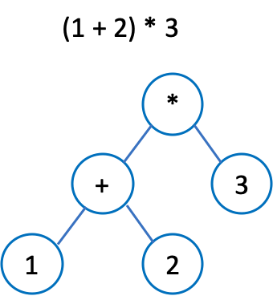

# Tree

Before all we learn are **sequence containers**, which defines "comes before + comes after" relationship between elements. This is too limiting for some types of data. Today we'll learn **tree** -- a data structure representing **hierachical data**.

Trees have no loops (if there are loops, it's a graph), which means that one child can have only one parent. 

- ordered tree: there is a certain order between siblings, e.g., DOM
- unordered tree: e.g., company organization

## Terminology

- Depth: the number of ancestors of a node. The depth of root is 0.
- Height: The number of link from the node to its descendant leaf node. The height of all leaf nodes is 0.
  - the height of a tree: the height of its root node
- Level: level = depth + 1

## Implementation

### Linked List

```java
public class Tree<T> {
    private class Node {
        T item;
        ArrayList<Node> children;

        public Node(T x) {
            item = x;
            children = new ArrayList<>();
        }
    }

    Node root;
}
```

# Binary Tree

Binary tree is a type of tree that has at most 2 children.

- Full binary tree: every node except for leaves has 2 children

- Complete binary tree: every level is full except for the lowest level, and the lowest level should be filled in from the left 

## Implementation

### Linked List

```java
public class BinaryTree<T> {
    private class Node {
        T item;
        Node left;
        Node right;
    }

    Node root;
}
```

### ArrayList

Use an arraylist to store all the nodes from left to right and from top to bottom. This is only suitable for cmoplete binary tree.

If the array is 0-based, then for Node `i`:

- Parent node: `(i - 1) / 2`
- left child: `2 * i + 1`
- right child: `2 * i + 2`

## Tree Traversal

### Pre-order

root -> left -> right

1. recursion

   ```java
   public List<T> preOrderTraversal() {
     List<T> result = new ArrayList<>();
     preOrderTraversal(root, result);
     return result;
   }
   
   private void preOrderTraversal(Node node, List<T> result) {
     if (node == null) return;
     result.add(node.value);
     preOrderTraversal(node.left, result);
     preOrderTraversal(node.right, result);
   }
   ```
   
2. Iteration

   ```java
   public List<T> preOrderTraversalIter() {
     List<T> result = new ArrayList<>();
     Stack<Node> stack = new Stack<>();
     Node p = root;
     while (!stack.isEmpty() || p != null) {
       while (p != null) {
         result.add(p.value);
         stack.add(p);
         p = p.left;
       }
       p = stack.pop().right;
     }
     return result;
   }
   ```

### Post-order

left -> right -> root

1. recursion

   ```java
   public List<T> postOrderTraversal() {
     List<T> result = new ArrayList<>();
     postOrderTraversal(root, result);
     return result;
   }
   
   private void postOrderTraversal(Node node, List<T> result) {
     if (node == null) return;
     postOrderTraversal(node.left, result);
     postOrderTraversal(node.right, result);
     result.add(node.value);
   }
   ```

2. iteration

   ```java
   public List<T> postOrderTraversalIter() {
     List<T> result = new ArrayList<>();
     Stack<Node> stack = new Stack<>();
     Node curr = root, prev = null;
     while (!stack.isEmpty() || curr != null) {
       while (curr != null) {
         stack.add(curr);
         curr = curr.left;
       }
       curr = stack.pop();
       if (curr.right == null || prev == curr.right) {
         result.add(curr.value);
         prev = curr;
         curr = null;
       } else {
         stack.add(curr);
         curr = curr.right;
       }
     }
     return result;
   }
   ```

#### Applications

1. compute the depth of a tree:

   ```java
   public static int depth(Node root) {
     if (root == null) {
       return 0;
     }
     return Math.max(depth(root.left), depth(root.right)) + 1;
   }
   ```

2. expression tree: 

   - leaf nodes: numbers
   - Internal nodes: operators

   

   ```java
   int eval(Node root) {
     if (root.left == null && root.right == null) {
       return 
     }
     int left = eval(root.left);
     int right = eval(root.right);
     return 
   }
   ```

### In-order

left -> root -> right

1. Recursion

   ```java
   public List<T> inOrderTraversal() {
     List<T> result = new ArrayList<>();
     inOrderTraversal(root, result);
     return result;
   }
   
   public void inOrderTraversal(Node node, List<T> result) {
     if (node == null) return;
     inOrderTraversal(node.left, result);
     result.add(node.value);
     inOrderTraversal(node.right, result);
   }
   ```

2. Iteration

   ```java
   public List<T> inOrderTraversalIter() {
     List<T> result = new ArrayList<>();
     Stack<Node> stack = new Stack<>();
     Node p = root;
     while (!stack.isEmpty() || p != null) {
       while(p != null) {
         stack.add(p);
         p = p.left;
       }
       p = stack.pop();
       result.add(p.value);
       p = p.right;
     }
     return result;
   }
   ```

applicatioin: in-order traversal is used in binary search tree to get an ascending order list.

# Binary-Search Tree (BST)

For each node, the nodes in its left subtree should be smaller than the node, and the nodes in the right subtree should be bigger than the node.

## Binary Search Set

- `boolean contains(T val)`
- `boolean add(T val)`
- `boolean remove(T val)`

### contains

1. recursion

   ```java
   public boolean contains(T item) {
     if (item == null) {
       throw new NullPointerException();
     }
     return contains(root, item);
   }
   
   private boolean contains(Node node, T item) {
     if (node == null) return false;
     int cmp = node.value.compareTo(item);
     if (cmp == 0) {
       return true;
     }
     if (cmp < 0) {
       return contains(node.right, item);
     }
     return contains(node.left, item);
   }
   ```

2. iteration

   ```java
   public boolean containsIter(T item) {
     Node curr = root;
     while (curr != null) {
       int cmp = curr.value.compareTo(item);
       if (cmp == 0) {
         return true;
       }
       if (cmp < 0) {
         curr = curr.right;
       } else {
         curr = curr.left;
       }
     }
     return false;
   }
   ```

### add

1. recursion

   ```java
   public boolean add(T item) {
     if (item == null) {
       throw new NullPointerException();
     }
     int oldSize = size();
     root = add(root, item);
     return size() > oldSize;
   }
   
   private Node add(Node node, T item) {
     if (node == null) {
       return new Node(item);
     }
     int cmp = node.value.compareTo(item);
     if (cmp == 0) {
       return node;
     }
     if (cmp < 0) {
       node.right = add(node.right, item);
     } else {
       node.left = add(node.left, item);
     }
     node.size = 1 + size(node.left) + size(node.right);
     return node;
   }
   ```

2. iteration

   ```java
   public boolean addIter(T item) {
     Node prev = null, curr = root;
     int cmp = 0;
     while (curr != null) {
       cmp = curr.value.compareTo(item);
       if (cmp == 0) {
         return false;
       }
       prev = curr;
       if (cmp < 0) {
         curr = curr.right;
       } else {
         curr = curr.left;
       }
     }
     if (prev == null) {
       root = new Node(item);
     } else {
       if (cmp < 0) {
         prev.right = new Node(item);
       } else {
         prev.left = new Node(item);
       }
     }
     updateSize(root);
     return true;
   }
   ```

### remove

4 cases:

* no such element: return false
* no children: set the parent point to null
* one child: update the parent as the child
* two children: choose the biggest node from the left subtree (the rightmost leaf-node) [predecessor] or the smallest node from the right subtree (the leftmost leaf-node) [successor] //review the video

1. recursion

   ```java
   boolean remove(T item) {
     if (item == null) {
       throw new NullPointerException();
     }
     int oldSize = size();
     root = remove(root, item);
     return oldSize > size();
   }
   
   private Node remove(Node node, T item) {
     if (node == null) {
       return null;
     }
     int cmp = node.value.compareTo(item);
     if (cmp < 0) {
       node.right = remove(node.right, item);
     } else if (cmp > 0) {
       node.left = remove(node.left, item);
     } else {
       if (node.left == null) {
         return node.right;
       }
       if (node.right == null) {
         return node.left;
       }
       node.value = getMin(node.right).value;
       node.right = remove(node.right, node.value);
     }
     node.size = 1 + size(node.left) + size(node.right);
     return node;
   }
   ```

2. iteration

   ```java
   boolean removeIter(T item) {
     if (item == null) {
       throw new NullPointerException();
     }
     Node prev = null, curr = root;
     while (curr != null && curr.value.compareTo(item) != 0) {
       prev = curr;
       int cmp = item.compareTo(curr.value);
       if (cmp < 0) {
         curr = curr.left;
       } else {
         curr = curr.right;
       }
     }
     if (curr == null) { // no such item
       return false;
     }
     if (curr.right != null && curr.left != null) {
       // find the smallest node in the right subtree (in-order successor)
       Node successor = curr.right, p = null;
       while (successor.left != null) {
         p = successor;
         successor = successor.left;
       }
       if (p == null) { // the smallest node is the root of the right subtree
         curr.right = successor.right;
       } else {
         p.left = successor.right;
       }
       curr.value = successor.value;
     } else {
       Node newCurr = null;
       if (curr.left != null) {
         newCurr = curr.left;
       } else if (curr.right != null) {
         newCurr = curr.right;
       }
       if (prev == null) { // the node to be deleted is the root
         root = newCurr;
       } else {
         if (prev.right == curr) {
           prev.right = newCurr;
         } else {
           prev.left = newCurr;
         }
       }
     }
     updateSize(root);
     return true;
   }
   
   public int updateSize(Node node) {
     if (node == null) return 0;
     node.size = updateSize(node.left) + updateSize(node.right) + 1;
     return node.size;
   }
   ```

### Time complexity

- contains: O(height of tree)
- add: O(height of tree)
- remove: O(height of tree)

The height of tree:

- worst case: If the tree is extremely unbalanced, the heigh will be O(N). 

- Best case: If the tree is well balanced, the height will be O(logN) 

The shape of the tree depends on the insert order. If we insert sorted elements, the tree will be extremely unbalanced. 

# AVL Trees

AVL tree is a type of self-balancing binary search tree. Except for the bianry search property, there are extra rules for AVL trees:

- store the height at each node, and for each node, |left.height - right.height| <= 1

## Tree Rotation

1. rotateRight: if left.height - right.height > 1, make the left as the new root
   - 
2. rotateLeft


# Red Black Trees // TODO

# Splay Trees // TODO

When we access elements, we rotate them up to the root.

# BTree

BTree is used in CS6016-Database. BTree is like a BST set but not binary. Nodes in BTree have many children (100s). Btree has much better cache performance than BST.
