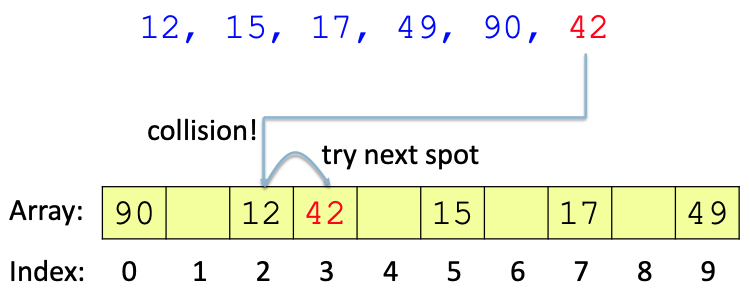
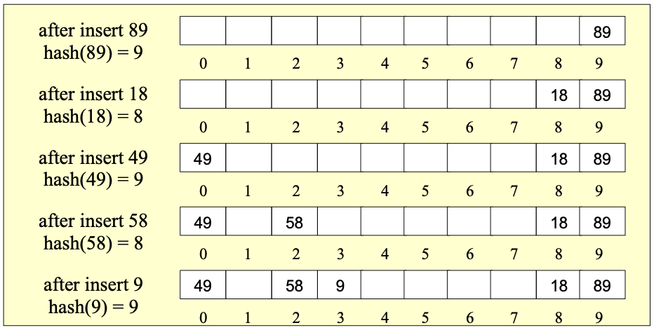
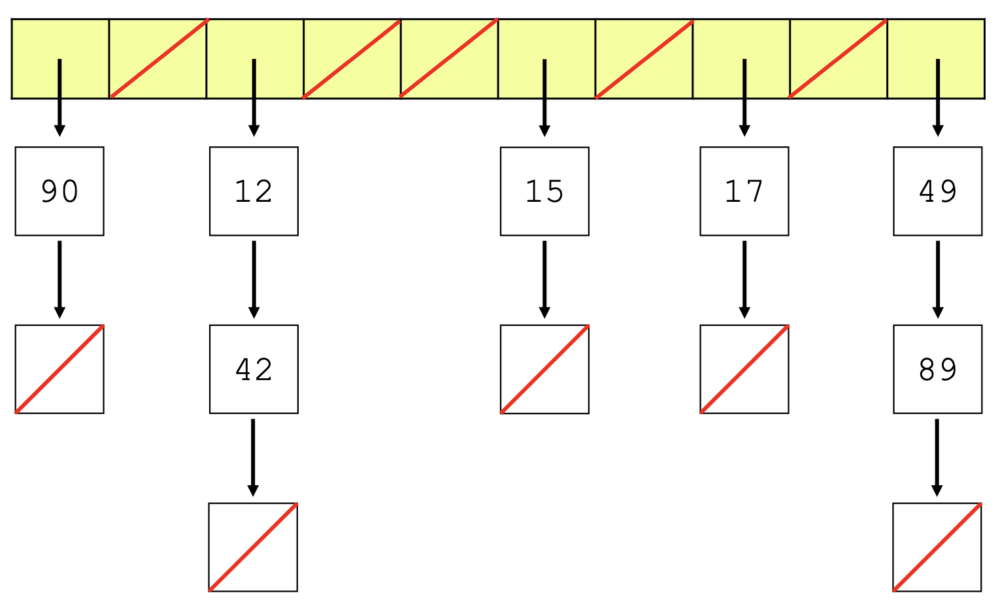

# Hash Tables

1. Terminologies
   - **hash function**: a method that maps an object to an integer, and this integer will be the index of the object stored in the hash table
   - **hash code**: the integer that the hash function returns given an object
   - **hash table**: the data structure to store objects based on their hash codes
1. Operations and ideal time complexity of hash tables
   - `insert(T E)`: O(1)
   - `search(T E)`: O(1)
   - `delete(T E)`: O(1)
1. load factor (λ) 

   - λ = n / m

     - n: the number of elements
     - m: the length of the hash table
   - average number of cells examined on an `insert` operation is `1/(1-λ)`

## Hash Function

1. Hash function

   (In Java we just use `<Object>.hashCode()` as their hash code. The default of this method is to return the memory address of the object. )

2. Good hash function

   - generates the same hash code for equal objects
   - Hash code should be evenly distributed for all possible input items
   - fast to compute

3. Hashing Strings -- Polynominal Hashing

   ```java
   int polyHash(String s, int prime, int x) {
     int hash = 0;
     for (int i = 0; i < s.length(); i++) {
       hash += (hash * x + s.charAt(i) ) % prime;
     }
     return hash;
   }
   ```

   

   

## Resolving Collisions

collision: non-equal objects map to the same index

There are multiple ways to resolve a collision:

- Open addressing: find an empty bucket
  - linear probing
  - quadradic probing
- seperate chaining: create a new storage linked to the index

### Open Addressing

#### Linear Probing

If the spot is already taken, step forward one index at a time until an empty space is found. 



- `insert`: starting from the hash code, sequentially scan the table (with wraparound) until an empty cell is found

- `search`: starting from the hash code, sequentially scan the table with wraparound:

  - if the item is found: return true
  - if an empty space is found or the array is full: return false

- `delete`: Find the item, then mark the item as deleted (**lazy delete**). We don't actually delete the item, or we might cause wrong result for `search` operation (see the graph below). 

  

Linear Probing will cause **primary clustering**. The bigger the clusters are, the more expensive the insertion will be.

#### Quadradic Probing

Quadradic Probing attempts to avoid large clustering problems in Linear Probing. If `hash(item) = H` and the cell H is occupied, we'll try H+1<sup>2</sup>, H+2<sup>2</sup>, H+3<sup>2</sup>, etc, until find an empty spot. (In fact we can use any quadratic function (ax^2 + bx + H) to check the next spot.)



To avoid collisions, we should:

- set the table size as a **prime number**. 

  - Compute the equation (0 + x<sup>2</sup>) % size with size = 16 and 17 individually. From the following table, we can see, for size = 16, only 0, 1, 4, 9 indexes can be used in Quadraic Probing. Therefore, to get more possibilities for the objects with the same hash values, we should set the table size as a prime number.
  
    | (0 + x<sup>2</sup>) % size | size = 16 | size = 17 |
    | -------------------------- | --------- | --------- |
    | x = 0                      | 0         | 0         |
    | 1                          | 1         | 1         |
    | 2                          | 4         | 4         |
    | 3                          | 9         | 9         |
    | 4                          | **0**     | 16        |
    | 5                          | **9**     | 8         |
    | 6                          | **4**     | 2         |
    | 7                          | **1**     | 15        |

- ensure the load factor is less than 0.5. This guarantees no cell is visited twice.

  - When λ >= 0.5, we should **resize** the table (the new size is the next prime number of 2 * size), then **rehash** all elements and put them into the new table.

    ```java
    int newSize = nextPrime(size * 2);// if size = 10, newSize = nextPrime(20) = 23.
    ```

Quadradic Probing doesn't eliminate the clustering problem. It just creates long runs of filled slots away from the hash position of keys, which is called **second clustering**. This is not as severe as primar clustering, but is still a problem.

### Seperate Chaining

Spererate Chaining can eliminate the clustering problem. In this method, We use an array of linked lists (`LinkedList<T>[]`) to store elements. The elements with the same hash code will be stored in the same linked list.



Time complexity:

- Insert: O(1)
- Search: O(n/m) -- O(1) if the **average list length** is a small constant
- Delete: O(n/m) -- O(1) if the average list length is a small constant

To make sure the list elength is small,  `n` should be closed to `m`. To do this, we usaually set the threshold of the load factor as 1.5.

## Hash Tables in Java

- `HashMap`
- `HashSet`

### HashMap vs. TreeMap

- hashmap - hash tables: unordered, takes O(N) to find the smallest item
- treemap - bianry search tree: ordered, takes O(logN) to find the smallest item