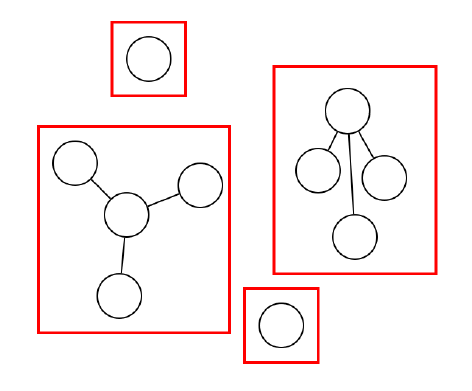
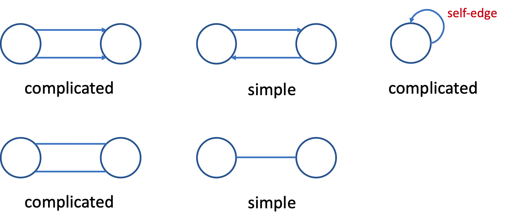
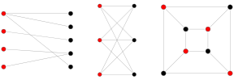

# Graph

Graph vs. Tree:

- Trees have no loops, graph do
- Trees store hierachical data, graph store unordered data

## Graph Basics

1. Types:
   - undirected graph
   - directed graph
   - weighted graph
   
2. Terminologies
   - Graph:
     - vertice / node
     - edge
     - adjacent vertices / neighbors: a node's neighbors are the nodes that are connected by an edge
     
   - subgraph: a subset of verteces and edges
     
   - path: if a node `s` can reach the node `v` following a sequence of edges, we say s->v is reachable, and the sequence of edges is the path.
   
   - cycle: a non-empty trail in which only the first and last node are equal
   
   - connected: 
     
     - An undirected graph is connected if there is a path between every pair of nodes
     - A directed graph is **strongly connected** if there is a pth between every pair of nodes.
     
     - connected components： a group of connected nodes compose a connected component. For example, there are 4 connected components in the following graph.
     
       
     
   - degree // TODO add a graph example
     - In-degree: the number of edges caming into a node
     - out-degree: the number of edges caming out of a node
   
3. Graph types:
   - simple graph: a pair of nodes can have at most 1 edge, and one node can't have self-edges. Otherwise, this graph is a complicated graph.
   
     
   
   - DAG: Directed Acyclic Graph - a directed graph with no cycles
   
     - Trees are DAGs
   
   - Bipartite graph: For a graph of nodes, if the the nodes can be divided into two groups, and all edges are between nodes in different groups, this graph is called bipartite graph or bigraph.
   
     
   
   - Complete graphs: a complete graph contains all possible edges
     - for undirected graph with N nodes, it has N(N - 1) / 2 edges
     - for directed graph with N nodes, it has N<sup>2</sup> edges
   
4. Graph Problems // TODO

## Graph representation

1. Node

   ```java
   public class Graph<T> {
     private class Node {
       T data;
       Set<Node> neighbors;
     }
     public Set<Node> nodes;
   }
   ```

   - adjacent list: suitable for sparse graph
   - adjacent matrix: suitable for dense graph
   - edge set

## Path Problems

### Path finding

Given `start` and `end` nodes, find a path from `start` to `end`. (Often we want shortest path with least costs.)

#### DFS - stack

#### BFS - queue

BFS can give us a shortest path.


### Shortest Path

BFS！！！

### Minimum Cost

// TODO 看看这个算法怎么写！！！

### Topological Sort

ordering of nodes

visit a node, then reduce the indegree of its neighbors by 1. (stack and queue both work)

```java
void topoSort(Graph g) {
  Queue q = empty queue;
  add all nodes with indegree 0 to q;
  while q is not empty:
  	n = q.dequeue();
	  output n;
  	for (node in n.neighbors) {
      node.indegree -= 1;
      if (node.indegree == 0) {
        q.enqueue(node);
      }
    }
}
```

time complexity: O(V + E)

## Minimum Spanning Tree

Given a graph, find minimum cost set of edges that still keep the graph connected.

Greedy Algorithm: at each step, we pick a "locally optimal" option.

Start with disconneted nodes, add edges.

### Prim's Algorithms

keep adding nodes to MST at a subset of nodes

- start with any vertex
- while there are vertices not yet in the MST: pick the lowest edge from this vertex to any node in MST

### Kruskal's Algorithms

We need to use disjoint set in this algorithm

- At beginning, every node is a tree. - O(V)
- Sort edges by cost - O(ElogE)
- for each edge, if its end points are in different trees, merge two them and add edge


