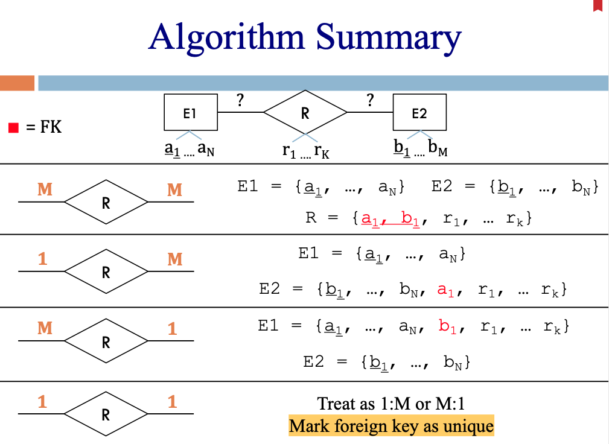
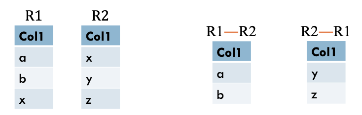
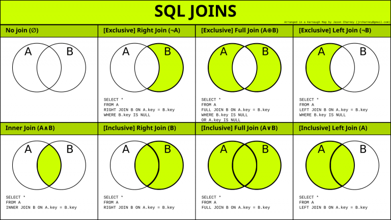

# 1 Intro

https://utah.zoom.us/j/95463678310
Meeting ID: 954 6367 8310
Passcode: 657611

## Course Intro

1. Assignments
   - Midterms (15%): 
   - Assignments (35%): 
   - Project (50%): implement a Canvas-like system
2. TA hours
   - Anusri Gunji
     - Email: [u1419627@utah.edu](mailto:u1419627@utah.edu)
     - Office/help hours: 
       - Wednesday 12:00 PM - 4:00 PM
       - Thursday 12:00 PM - 2:30 PM
   - Nischal Vangipuram
     - Email: [u1417975@utah.edu](mailto:u1417975@utah.edu) 
     - Office/help hours: 
       - Tuesday    12:00 PM - 3:00 PM
       - Wednesday 12:00 PM - 2:00 PM
       - Thursday   12:00 PM - 1:00 PM

## Database Intro

1. Database sytem contains two major components:
   - Database Management System (DBMS): underlying machinery
   - Query Language: common interface
2. Relational Database: store structured data
   - each row is a tuple and must be unique
3. Basic Design goals:
   - Don't store lists /arrays
   - Build compound information by referencing other tables
   - Enable powerful reasoning about data and relationships, cleaner design
   - Enable DBMS to optimize

# 2 Relational Database

## Terms

1. **Schema**: a schema is a set of attributes (name + type), which specifies the structure and rules of a table
   - schema doesn't specify any values!
2. **Attribute**: a name and a type (column heading)
3. **Instance**: the values in a table, which are a set of tuples
4. **Tuple**: one row
5. **Relation (a.k.a. table)**: a schema + instance

## Keys

Keys uniquely identify each tuple.

1. **Superkey**: a set of fields is a superkey if no two rows have the same values in those fields
2. **Key**: a key is a **minimal** set of fields to uniquely identify rows. A set of fields is a key if:
   - it's a superkey
   - None of its **proper subset** is a superkey
     - Proper subset: A proper subset of a set A is a subset of A that is not equal to A.
3. superkey vs. key:
   - a key must be a superkey
   - a superkey may not be a key
4. **Primary Key & Candidate Key:** If there are more than one keys in a schema, DBA should specify one key as a primary key, then the other keys are candidate keys.
   - specify primary key in SQL:`PRIMARY KEY (id)`
     - primary key should be simple, int preferred
   - specify candidate keys in SQL: `UNIQUE (name)`
5. **Referential Integrity**: Reference between values should always be valid. (When you delete a record in a table, then the referential to this record are all invalid ) 
6. **Foreign Key**: a Primary Key in another table
   - `FOREIGN KEY (sid) REFERENCES students(id) ON UPDATE CASCADE ON DELETE CASCADE`
   - If the referenced key is deleted, there are three options to do in the referencing table
     - delete corresponding records
     - Nullify the foreign key (bad design!)
     - disallow the change to the referenced table

## Using CADE MySQL

1. connect Utah vpn if you are not using UConnect
2. login to CADE: `ssh u1428723@lab1-17.eng.utah.edu`
3. run mysql: `mysql -h cs-db -u u1428723 -p`; enter the password

OR:

1. `mysql -h cs-db.eng.utah.edu -u <uid> -p` (don't need to use UConnect)

# 3 Entity-Relationship (ER) Model

1. Entity & Relationship
   - Entity: entity is a definable thing or concept within a system, like a student
   - **Entity Set**: a set of entities, e.g., all students
   - Relationship: how two entities are linked
2. **Weak Entity** (use double square to represent): In a relational database, a weak entity is an entity that cannot be uniquely identified by its own attributes alone. Therefore, it must use foreign keys in conjuction with its attributes to create a primary key. 
   - Partial Keys: the fields in the key except for the foreign keys are called partial keys. For example, a class must belongs to a course, so a class is a weak entity. `course_id, semester` is the key of class, then `semester` is the partial key.

   - Non-supporting relationship (use double diamond): 
     - must be 1-to-many
     - use at least a key from the entity it links to
3. **Cardinality**: In the relationship in ER model, cardinality refers to the maximum number of times an instance in one entity can relate to instances of another entity, e.g., 1-to-1, 1-to-many, many-to-many.
4. bold line / a double line indicates all entities in the set must participate in the relationship
5. ER to Relational Model Algorithm
   - 1-to-M: merge relationship table to "many" side
   - 1-to-1: merge relationship to one side. If the participation of one side is required, use that side and set the column to be `NOT NULL`
   - M-to-M: need a seperate table for relationship
   

Practice: Lecture3 slides 27

# 4 SQL Tables

## Data Types

1. Numeric:

     - TINYINT: 1

     - SMALLINT: 2

     - MEDIUMINT: 3

     - INT: 4

     - BIGINT: 8

     - **UNSIGNED**


2. Dates
   - TIME
   - DATE
   - DATETIME
   - TIMESTAMP
3. string:
     - VARCHAR (N): up to N characters
       - pick N: n bytes + 1 / 2 bytes for size
         - ASCII (<=255) : size = 1

         - LATIN (>255) : size = 2
     - CHAR(N): exact N characters
4. Blobs (Binary Large Objects): a binary string of variable length, generally used to store large files like images, audios, and videos
5. Enums

## Properties

1. Columns properties:

   - NOT NULL
   - PRIMARY KEY
   - AUTO_INCREMENT

2. Table properties:

   - PRIMARY KEY (col1, col2, ...)
   - FOREIGN KEY (col1) REFERECES table (col)
   - UNIQUE (col1, col2, ...)

3. Foreign Keys

   - Syntax: 

     ```sql
     FOREIGN KEY (<column>) REFERENCES <table>(<table’s key>)
     ON DELETE <action>
     ON UPDATE <action>
     ```

   - `<action>` can be:

     - RESTRICT (**default**): disallow the change
     - CASCADE: also delete/update in child table
     - SET NULL: nullify the key in child table
     - SET DEFAULT: set to column's default value

   - for example:

     ```sql
     FORREIGN KEY (ISBN) REFERECENS Titles(ISBN)
     ON UPDATE CASCADE ON DELETE RESTRICT
     ```

     In this case, if an ISBN also appears in the child table, the record won't be allowed to be deleted.

4. Set default values for a column: `date DATE DEFAULT CURDATE()`

# 5 Intro to SQL

## ER to Schema

1. It's not mecessary to add an ID to a weak entity. Say, for classes and courses, a class doesn't mean anything without a related course.
2. IS-A to Schema: base type & derived types
   - If the base type is abstract: only create schema for derived types
   - Otherwise, create schemas for both types

## SQL

1. DBMS vs. Query Language
   - SQL: language
     - SQL implementations: MySQL, PostgreSQL, SQL Server, ...
   - DBMS (Database Management System): implementation
2. SQL is a combination of DDL (Data Definition Language) and DML (Data Manipulation Language)

### DDL

#### Create Tables

1. Syntax: 

   ```sql
   CREATE TABLE <name> (
      <column1Name> <type> <properties>,
      <column2Name> <type> <properties>,
      ...
      <table properties>
    );
   ```

2. Column constraints:

     - NOT NULL | UNIQUE | PRIMARY KEY |FOREIGN KEY | AUTO_INCREMENT
     - CHECK (expression)
     - REFERENCES refutable (column) ON UPDATE action ON DELETE action
     - Give constraint a name: `CONSTRAINT <constraint_name> <constraint>`
     
       ```sql
       CREATE TABLE assignment_categories (
         id INT UNSIGNED NOT NULL AUTO_INCREMENT PRIMARY KEY,
         class_id INT UNSIGNED NOT NULL,
         name VARCHAR(100) NOT NULL,
         weight SMALLINT UNSIGNED NOT NULL,
         CONSTRAINT unique_name_class_id UNIQUE (name, class_id),
         CONSTRAINT check_weight_range CHECK (weight >= 0 AND weight <= 100),
         CONSTRAINT FK_class_id_2 FOREIGN KEY (class_id) REFERENCES classes(id) 
         	ON UPDATE CASCADE ON DELETE CASCADE
       );
       ```

#### Drop Tables

```sql
DROP TABLE <table_name>
```

#### Alter Tables

add, delete or modify columns in an existing table

- add columns:

  ```sql
  ALTER TABLE titles
  ADD COLUMN pub_date DATE;
  ```

- drop columns:

  ```sql
  ALTER TABLE titles
  DROP COLUMN pub_date;
  ```

- rename columns:

  ```sql
  ALTER TABLE <table>
  RENAME COLUMN <old_name> TO <new_name>;
  ```

- modify column datatypes:

  ```sql
  ALTER TABLE Inventory
  MODIFY COLUMN Serial INT UNSIGNED;
  ```

- add a foreign key:

  ```sql
  ALTER TABLE Phones
  ADD FOREIGN KEY CardNum 
  REFERENCES Patrons(CardNum);
  ```

### DML

#### SELECT

```mysql
SELECT [DISTINCT] target-list
FROM relation-list
[WHERE qualification]
[ORDER BY column] [DESC]
[LIMIT number]
```

#### INSERT

1. Insert into every column **in order**, you don't need to specify column names:

   ```mysql
   INSERT INTO Titles 
   VALUES (“978-0441172719”, “Dune”, “Herbert”),
   			 (....);
   ```

2. Insert into specified columns: (use this only when there are columns can be `NULL`/`DEFAULT`/`AUTO_INCREMENT`)

   ```mysql
   INSERT INTO Titles (ISBN, title, author)
   VALUES (“978-0441172719”, “Dune”, “Herbert”);
   ```

#### DELETE

```mysql
DELETE FROM Titles
WHERE author = "Herbert"
```

#### UPDATE

```sql
UPDATE Titles
SET Title = 'Dune', ISBN = 1003
WHERE ISBN = '978-0441172719';
```

Be careful when updating records. If you omit the `WHERE` clause, **ALL** records will be updated!

# 6 Relational Algebra

Relational Algebra: algebra that operate on relations 

1. π: projection. Output is a relation and has no duplicates. Examples: 

   - $π_{Title, Autor} (Titles)$
   - $π_{Title, Serial} (Titles × Inventory)$

2. σ: selection. Filter rows on condition

   - $σ_{CardNum > 3}(Patrons)$
   - $π_{Phone}(σ_{CardNum > 3}(Patrons × Phones))$

3. ×: Cartesian product (A x B = the set of all ordered pairs (a,b) where a in A and b in B)

   - R1 × R2 == R2 × R1

4. ∪: set union

   - relations must be **union compatible** (same column name and types in same order)
   - duplicates will be removed
   - R1 ∪ R2 == R2 ∪ R1

5. : set difference

   - relations must be **union compatible**

   

6. ∩: set intersection

   - R1 ∩ R2 = R1  (R1  R2)

7. ρ: rename operation (unary operator - single input)

   - syntax: $ρ(NewRelationName_{NewColname/OldColname},\ Expression)$

8. /: devision

   > Division operator A**÷**B or A/B can be applied if and only if:
   >
   > - Attributes of B is proper subset of Attributes of A.
   > - The relation returned by division operator will have attributes = (All attributes of A – All Attributes of B)
   > - The relation returned by division operator will return those tuples from relation A which are associated to every B’s tuple.

9.  ⋈: join
   - ⋈: natural join
   - $⋈_{condition}$: theta join (join on condition)

# 7 RA to SQL

|                  | RA              | SQL                              |
| ---------------- | --------------- | -------------------------------- |
| Projection       | π               | SELECT                           |
| Selection        | σ               | WHERE                            |
| Cross Product    | ×               | JOIN                             |
| Set Union        | ∪               | UNION ALL                        |
| Set Difference   |                | NOT IN, exlusive left/right join |
| Set Intersection | ∩               | IN, INNER JOIN, NATURAL JOIN     |
| Rename           | ρ               | AS                               |
| Natural Join     | ⋈               | NATURAL JOIN                     |
| JOIN ON          | $⋈_{condition}$ | JOIN ... ON ...                  |
| Division         | /               | nested EXISTS (see lec 10)       |

# 8 Advanced Queries I

## Nested Queries

1. Every derived table must have its own alias, e.g.

   ```sql
   SELECT Serial
   FROM (
   	SELECT ISBN FROM Titles
     WHERE Title = 'Lorax'
   ) AS lorax
   NATURAL JOIN Inventory;
   ```

2. The nested query after `IN` doesn't need alias, e.g.,

   ```sql
   SELECT Addr FROM CorporateLocs
   WHERE Addr IN (
     SELECT Addr FROM RetailLocs
   );
   ```

## Union

1. UNION: no duplicates

   ```sql
   SELECT Addr FROM CorporateLocs
   UNION
   SELECT Addr FROM RetailLocs
   ```

2. UNION ALL: allow duplicates

## Practice

1. All Patrons who have not checked out a book

   ```sql
   SELECT CardNum, Name
   FROM Patrons
   WHERE CardNum NOT IN (
   	SELECT DISTINCT CardNum FROM CheckedIN
   );
   ```

2. **All Patrons who have checked out ‘The Lorax’ AND ‘Harry Potter’**

   ```sql
   SELECT CardNum, Name
   FROM (
   	SELECT CardNum
     FROM CheckedOut
     NATURAL JOIN Inventory
     NATURAL JOIN Titles
     WHERE Title = 'The Lorax'
   ) AS lorax
   NATURAL JOIN (
   	SELECT CardNum
     FROM CheckedOut
     NATURAL JOIN Inventory
     NATURAL JOIN Titles
     WHERE Title = 'The Harry Potter'
   ) As hp
   NATURAL JOIN Patrons;
   ```

# 9 Advanced Queries II

## JOIN

1. Self-join

   ```sql
   -- find all students share the same phonenumbers --
   SELECT *
   FROM Phones p1
   INNER JOIN Phones p2
   	ON p1.Phone = p2.Phone AND p1.CardNum != p2.CardNum;
   ```

2. Inner Join vs. Outer Join

   - `INNER JOIN`: We can use either `JOIN ... ON...` or `JOIN ... WHERE ...`

     - `JOIN`, `INNER JOIN`, `,` are all inner join (but for `,` we can only use `JOIN ... WHERE ...`)

       ```sql
       SELECT * FROM 
       Phones p1, Phones p2
       WHERE p1.CardNum != p2.CardNum AND p1.Phone = p2.Phone;
       ```

   - `OUTER JOIN`: `LEFT/RIGHT [OUTER] JOIN` -- must use `ON` clause!!

     - Shortcut: if the column names are the same, you can use `NATURAL LEFT/RIGHT JOIN`, then you don't need to use `ON` clause

   - `NATURAL JOIN`: join two tables on the columns (must have the same name) they have in common
   
     - `NATURAL JOIN` is INNER JOIN, but `NATURAL LEFT JOIN` is `LEFT JOIN`
   
   		

## NULL

1. `NULL` doesn't have **reflexive property** (a number always equals to itself), which means `NULL != NULL`

2. Different from programming languages, SQL supports 3 logic values: `TRUE`, `FALSE`, `NULL`. And `NULL` means unknown.  

   - Boolean Operators on `NULL` always return NULL!!!

     ```sql
     5 = NULL -- NULL
     5 != NULL -- NULL
     NULL = NULL -- NULL
     NULL != NULL -- NULL
     ```

3. If NULL is used where a Boolean is expected, interpreted as FALSE

4. Use `IS [NOT]` for `NULL`:

     - `WHERE CardNum != NULL` // wrong

       - For example, `SELECT * FROM Patrons NATURAL LEFT JOIN CheckedOut WHERE Serial != NULL;` will return an empty set
       
     - `WHERE CardNum IS NOT NULL` // right

       - ```sql
         mysql > SELECT * FROM Patrons NATURAL LEFT JOIN CheckedOut WHERE Serial IS NOT NULL;
         +---------+------+--------+
         | CardNum | Name | Serial |
         +---------+------+--------+
         |       1 | Joe  |   1001 |
         |       1 | Joe  |   1004 |
         |       4 | Dan  |   1005 |
         |       4 | Dan  |   1006 |
         +---------+------+--------+
         4 rows in set (0.10 sec)
         ```


## Nested Query as Condition

1.  `ANY`/`ALL`: compare between a single column value with a range of other values

   - `ANY`: returns true if the operation is true for **any** of the values in the range. For exampe, find any students who have ever get an "A"

     ```sql
     SELECT Name
     FROM Students
     WHERE sID = ANY (
     	SELECT sID
       FROM Enroll
       WHERE grade = 'A'
     );
     ```
     
   - `ALL`: returns true if the operation is true for **all** of the values in the range. For example, find students who are younger than all the students enrolled in "Databases"
   
     ```sql
     SELECT name, DOB
     FROM students
     WHERE DOB > ALL (
     	SELECT DOB
       FROM students
       NATURAL JOIN enroll e
       INNER JOIN courses c
       	ON e.cid = c.cid
       WHERE c.name = 'Databases'
     );
     ```


2. 
     EXISTS: 
     - syntax: 
       
       - `EXISTS`: returns TRUE if the subquery returns one or more records
       
       - `NOT EXISTS`: returns TRUE if the subquery returns no record
       
         ```sql
         select x from y where
         [NOT] EXISTS
         (select ...);
         ```
       
       - Note, the `EXISTS` clause in SQL operates on a **row-by-row** basis. It evaluates the subquery for each row in the outer query individually.
       
     - Examples:
       
       - select students who are enrolled in Databases courses:
       
         ```sql
         SELECT sid, name, grade
         FROM enroll e
         NATURAL JOIN students s
         WHERE EXISTS (
         	SELECT sid
           FROM courses c
           WHERE c.name = 'Databases' AND c.cid = e.cid
         )
         ```
       
         result:
       
         ```sql
         +-----+----------+-------+
         | sid | name     | grade |
         +-----+----------+-------+
         |   1 | Hermione | A     |
         |   2 | Harry    | B     |
         +-----+----------+-------+
         ```
       
         Note, you must use `c.cid = e.cid` to **correlate** the inner query to the outer query. (we call this **correlated subquery**)
       
       - In comparison, the following query will return every sid in students because the inner query returns TRUE to every row in outer query.
       
         ```sql
         SELECT sid, name
         FROM students
         WHERE EXISTS (
         	SELECT sid
           FROM enroll
           NATURAL JOIN courses c
           WHERE c.name = 'Databases'
         );
         ```
       
       - SELECT students id, name, course name, and grade who are not enrolled in "Databases"
       
         ```sql
         SELECT e.sid, s.name, cc.name, e.grade
         FROM enroll e
         NATURAL JOIN courses cc
         JOIN students s
         	ON e.sid = s.sid
         WHERE NOT EXISTS (
         	SELECT s.sid
           FROM courses c
           WHERE c.name = 'Databases' AND c.cid = e.cid
         );
         ```

## Practice

1. CREATE tables and insert data:

   ```sql
   DROP TABLE IF EXISTS enroll;
   DROP TABLE IF EXISTS students;
   DROP TABLE IF EXISTS courses;
   
   CREATE TABLE students (
     sid INT UNSIGNED PRIMARY KEY AUTO_INCREMENT NOT NULL,
     name VARCHAR(100) NOT NULL,
     DOB SMALLINT NOT NULL
   );
   
   CREATE TABLE courses (
     cid INT UNSIGNED NOT NULL PRIMARY KEY,
     name VARCHAR(100) NOT NULL
   );
   
   CREATE TABLE enroll (
     sid INT UNSIGNED NOT NULL,
     cid INT UNSIGNED NOT NULL,
     grade ENUM('A', 'A-', 'B+', 'B', 'B-', 'C+', 'C', 'C-', 'D+', 'D', 'D-', 'E', 'X', 'WF', 'EW', 'EU', 'F'),
     PRIMARY KEY (sid, cid),
     CONSTRAINT FK_student_id FOREIGN KEY (sid) REFERENCES students(sid),
     CONSTRAINT FK_class_id FOREIGN KEY (cid) REFERENCES courses(cid)
   );
   
   INSERT INTO students (Name, DOB) VALUES 
   ('Hermione', 1980), ('Harry', 1979), ('Ron', 1980), ('Malfoy', 1982); 
   
   INSERT INTO courses (cID, name) VALUES 
   (3500, 'SW Practice'),
   (3810, 'Architecture'),
   (5530, 'Databases');
   
   INSERT INTO enroll (sID, cID, grade) VALUES 
   (1, 3500, 'A'),
   (1, 3810, 'A-'),
   (1, 5530, 'A'),
   (2, 3810, 'A'),
   (2, 5530, 'B'),
   (3, 3500, 'C'),
   (3, 3810, 'B'),
   (4, 3500, 'C');
   ```

2. Find Names of Patrons who have not checked out a book. Use outer join. [Exclusive left join!]

   ```sql
   SELECT Name
   FROM Patrons
   NATURAL LEFT JOIN CheckedOut
   WHERE Serial IS NULL;
   ```


3. Find students who are not enrolled in databases

   ```sql
   SELECT sID, Name
   FROM Students
   WHERE sID NOT IN (
   	SELECT sID
     FROM Enrolled
     NATURAL INNER JOIN Courses
     WHERE Name="Databases"
   );
   ```

4. Find all students younger than *everyone* taking Databases

   ```sql
   SELECT name, DOB
   FROM students
   WHERE DOB > ALL (
   	SELECT DOB
     FROM students
     NATURAL JOIN enroll e
     INNER JOIN courses c
     	ON e.cid = c.cid
     WHERE c.name = 'Databases'
   );
   ```

5. **Find students who take every courses:**

   ```sql
   SELECT s.name
   FROM students s
   WHERE NOT EXISTS (
   	SELECT c.cid
   	FROM courses c
   	WHERE NOT EXISTS (
   		SELECT e.cID
   		FROM enroll e
   		WHERE e.cID = c.cID AND e.sID = s.sID
   	)
   );
   ```

6. Find students who doesn't take every course:

   ```sql
   SELECT s.name
   FROM students s
   WHERE EXISTS (
   	SELECT c.cid
   	FROM courses c
   	WHERE NOT EXISTS (
   		SELECT e.cID
   		FROM enroll e
   		WHERE e.cID = c.cID AND e.sID = s.sID
   	)
   );
   ```

7. Find students who take all the courses that the student with a sid 2 takes

   ```sql
   SELECT s.sid, s.name
   FROM students s 
   WHERE s.sid != 2 AND NOT EXISTS (
   	SELECT e1.cid
     FROM enroll e1
     WHERE e1.sid = 2 AND NOT EXISTS (
     	SELECT e2.cid
       FROM enroll e2
       WHERE e2.sid = s.sid AND e2.cid = e1.cid
     )
   );
   ```

8. Find course numbers of each student. This course number should be bigger than the the average course number of that student are enrolled.

   ```sql
   SELECT e1.sid, e1.cid
   FROM enroll e1
   WHERE e1.cid > (
   	SELECT AVG(e2.cid)
     FROM enroll e2
     WHERE e1.sid = e2.sid
   );
   ```

# 10 Advanced Queries III

1. regrex

   - `%`: 0 or more arbitrary chars
     - `LIKE '%star'`: ends with star
     - `LIKE  star%`: starts with star
     - `LIKE %star%`: contains star
   - `_`: any 1 char

2. aggregate functions + GROUP BY

   - COUNT() -- no spaces between the function name and the parenthese!

     ```sql
     -- COUNT the number of courses each student enroll
     SELECT name, COUNT(cid) AS num_courses
     FROM students
     NATURAL LEFT JOIN enroll
     GROUP BY name;
     ```

     Note, don't use `COUNT(*)`, of if a student doesn't enroll any course, their num_courses will be 1!

   - MAX

   - MIN

   - AVG

   - SUM

3. WHERE vs. HAVING

   - `WHERE`: used before `GROUP BY` to filter rows

   - `HAVING`: used after `GROUP BY` to filter groups

   - e.g., Find students with 2 or more courses earning an A

     ```sql
     SELECT sid, COUNT(*) as num_courses
     FROM enroll
     WHERE grade = 'A'
     GROUP BY sid
     HAVING num_courses >= 2;
     ```

4. CASE

   ```sql
   SELECT
     CASE
       WHEN grade = 'A' THEN 'Superior'
       WHEN grade = 'B' THEN 'Good'
       WHEN grade = 'C' THEN 'Adequate'
       ELSE 'Poor'
     END AS remarks
   FROM enroll;
   ```

5. dynamic delete

   - use IN and WHERE:

     ```sql
     -- delte all students who once got an A
     DELETE FROM students
     WHERE sid IN (
     	SELECT sid
       FROM enroll WHERE grade = 'A'
     )
     ```

   - use JOIN

     ```sql
     -- delete all enroll records of "Databases"
     DELETE t1
     FROM enroll t1
     JOIN courses t2
     	ON t1.cid = t2.cid
     WHERE t2.name = "Databases";
     ```

6. dynamic insert:

   - `INSERT IGNORE`: turn errors into warning

## Practice

1. Find number of students in each course

   ```sql
   SELECT cid, name, COUNT(sid) AS num_students
   FROM enroll
   NATURAL RIGHT JOIN courses
   GROUP BY cid;
   ```

2. Find number of courses for each student

   ```sql
   SELECT sid, name, COUNT(cid) AS num_courses
   FROM enroll
   NATURAL RIGHT JOIN students
   GROUP BY sid;
   ```

3. Find the Name of the cheapest item from each Dept

   ```sql
   SELECT a.name, price, a.dept
   FROM items a
   INNER JOIN (
   	SELECT dept, MIN(price) AS min_price
     FROM items
     GROUP BY dept
   ) b
   ON a.dept = b.dept AND a.price = b.min_price;
   ```

4. **Find the name of the oldest student in each course**

   ```sql
   SELECT sid, name, stu.cid, DOB
   FROM (
     SELECT sid, name, cid, DOB
     FROM students s
     NATURAL JOIN enroll e
   ) stu
   JOIN (
   	SELECT cid, MIN(DOB) AS min_dob
     FROM students
     NATURAL JOIN enroll e
     GROUP BY cid
   ) eldest
   ON stu.cid = eldest.cid AND stu.DOB = eldest.min_dob;
   ```

5. Find the average number of students per major

   ```sql
   SELECT AVG(num_students)
   FROM (
     SELECT major, COUNT(*) AS num_students
     FROM students
     GROUP By major
   ) a
   ```

   or:

   ```sql
   SELECT COUNT(*) / COUNT(DISTINCT major)
   FROM students;
   ```

6. Find age in years of all students

   ```sql
   SELECT name, TIMESTAMDIFFERENCE(YEAR, MAKEDATE(DOB, 1), CURDATE()) AS age
   FROM students;
   ```

7. Write a query to checkout “The Lorax” for “Joe”

   ```sql
   INSERT INTO CheckedOut (CardNum, Serial) 
   VALUES (
     SELECT CardNum FROM Patrons WHERE Name = "Joe",
     SELECT Serial FROM Inventory 
     NATURAL JOIN Titles
     WHERE Title = "The Lorax" AND Serial NOT IN (
     	SELECT Serial FROm CheckedOut
     )
     LIMIT 1
   )
   ```

   

# Practice

1. Get the Titles of all books by <Author>

   ```sql
   SELECT *
   FROM Titles
   WHERE Author = 'Kennedy';
   ```

2. Get Serial numbers of all books by <Author>

   ```sql
   SELECT Serial 
   FROM Inventory
   NATURAL JOIN Titles
   WHERE Author = 'Tolkien';
   ```

3. Get the Titles of all books checked out by <Patron’s name>

   ```sql
   SELECT Title
   FROM Patrons p
   NATURAL JOIN CheckedOut
   NATURAL JOIN Inventory
   NATURAL JOIN Titles
   WHERE p.Name = 'Joe';
   ```

4. Get phone number(s) of anyone with <Title> checked out

   ```sql
   SELECT Phone
   FROM Phones
   NATURAL JOIN CheckedOut
   NATURAL JOIN Inventory
   NATURAL JOIN Titles
   WHERE Title = 'The Hobbit';
   ```

5. Find the Titles of the library's oldest <N> books. Assume the lowest serial number is the oldest book.

   ```sql
   SELECT Serial, Title
   FROM Titles
   NATURAL JOIN Inventory
   ORDER BY Serial
   LIMIT 5;
   ```

6. Find the name of the person who has checked out the most recent book. Assume higher serial numbers are newer. **Note that this query is not concerned with the absolute highest serial number, it is concerned with the highest one that has been checked out.**

   ```sql
   SELECT Name
   FROM Patrons
   NATURAL JOIN CheckedOut
   JOIN (
   	SELECT MAX(Serial) AS max_serial
     FROM CheckedOut
   ) a
   ON Serial = max_serial;
   ```

   

7. Find the phone number(s) of anyone who has not checked out any books. If a phone number belongs to two Patrons where one of them could have checked out a book, then that phone number should not be included in the output.

   ```sql
   SELECT Phone
   FROM Phones
   WHERE Phone NOT IN (
   	SELECT Phone
     FROM CheckedOut
     NATURAL JOIN Phones
   );
   ```

   

8. The library wants to expand the number of unique selections in its inventory, thus, it must know the ISBN and Title of all books that it owns at least one copy of. Create a query that will return the ISBN and Title of every book in the library, but will not return the same book twice.

   ```sql
   SELECT DISTINCT ISBN, Title
   FROM Titles
   NATURAL JOIN Inventory;
   ```

9. Find the names of any player who played any games in 2018.

   ```sql
   WITH g AS (
   	SELECT 
   )
   ```

   
