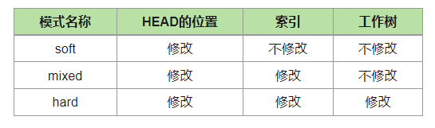

[TOC]


# 基本指令

- clone：克隆远程数据库到本地

  - `git clone <repository> <directory>`将远程数据库克隆到置顶目录

- pull：把远程数据库的内容更新到本地数据库（包括变更日志）

  - `git pull <respostory> <refspec>`
    - 例如：`git pull origin master`
    - refspec: reference specification，具体的引用

- add：把变更添加到索引

  - `git remote add <name> <url>`：添加远程数据库
    - name：远程数据库名称，一般使用origin
    - url：远程数据库地址

- commit：提交该次变更，并附上变更说明

  - `git commit -m "xxx"`

- push：将本地数据库的修改内容共享到远程数据库

  - 当在克隆的数据库目录执行推送时，可以省略数据库和分支名称
  - `git push -u origin master`

- `git log`：显示所有的版本信息，不包括已经删除的commit记录和reset操作

    - `git log --graph --oneline`：以文本形式显示更新记录的流程图

      - --oneline：在一行内显示提交信息

      ```
      $ git log --graph --oneline
      *   acf43c1 (HEAD -> master) 合并
      |\
      | * ddd2d8d (origin/master) 添加pull的作用
      * | 496d56d 添加commit的作用
      |/
      * 0b3da25 添加add的说明
      * 564da06 modified sample.txt
      * 7e91564 first commit
      ```

- `git reflog`：显示所有的操作记录，包括被提交、回退操作，一般用于恢复本地的错误操作。
  
- 标签：
  
  - `git tag <tagname>`：在HEAD指向的提交里添加标签
  - `git tag -a <tagname> -m "<message>"`：添加带注解的标签
  - `git tag -d <tagname>`：删除标签
  - `git tag`：显示标签列表
  - `git tag -n`：显示标签列表及其注解
  - `git log --decorate`：显示包含标签的历史记录
  
- `git checkout <filename>`：将文件恢复到最近一次提交时的状态

    - `git chekcout -- <filename>`：同上，“--”的意思是后面的声明无论长啥样都是文件名。如"-f"是一个文件，则可以用`git checkout -- -f`

# 分支

在共同开发同一个项目时，不同的人员负责的模块不同，每个人都会新建一个自己的分支，待完成工作后再将自己分支上的修改合并到主分支（一般命名为master）。


## 两种分支

- Merge分支：通常就是主分支
- Topic分支（特性分支）：Topic分支是为了开发新功能或修复bug而建立的分支。完成作业后，要把Topic分支合并回Merge分支。

## 切换分支

### HEAD

HEAD指向现在使用中的分支的最后一次更新。通过移动HEAD，可以恢复到之前的某次提交状态。

- `~`和`^`：

  

## 合并分支

假设我们创建了一个bugfix分支。

### 法一：merge

- 如果在创建bugfix分支后，master分支没有被更改过，则可以直接把master分支的位置移动到bugfix最新分支上。这种合并叫**fast-forward（快进）合并**。

  

  

- 如果master分支有过更新，则要合并两个分支的修改，生成一个提交，并将master分支的HEAD移动到该次提交上。这种合并是non fast-forward合并。

  

### 法二：rebase

rebase bugfix分支，会使bugfix分支的历史记录被添加在master分支的后面。如下图所示，历史记录将呈一条直线。


注意：

- 如果移动X和Y时发生了冲突，则需要手动修改冲突部分。

- rebase之后，master的HEAD位置不变。因此，合并后要手动将master的HEAD移动到bugfix那里。


总结：merge和rebase的特点

- merge：可以保留分支的历史记录，但是历史记录较为复杂
- rebase：历史记录简单，**但是可能导致原本的提交内容无法正常运行？**


**没看懂：**

您可以根据开发团队的需要分别使用merge和rebase。

例如，想简化历史记录，

- 在topic分支中更新merge分支的最新代码，请使用rebase。
- 向merge分支导入topic分支的话，先使用rebase，再使用merge。【why？】

## 一种好用的git分支模型

- 主分支：
  - master分支：用于管理发布状态
  - develop分支：用于日常开发
- feature分支：在develop分支上开发新功能或进行bug修复
- release分支：为发布做准备。日常开发是在develop分支上进行的，但到了可以发布的状态时，会新建release分支，为发布做最后的bug修正
- hotfix分支：如果发布的产品需要紧急修正，则创建hotfix分支进行修改，然后合并


## 相关指令

- `git branch <branch_name>`：创建新分支
- `git branch`：查看分支列表
- `git checkout <branch_name>`：切换分支
- `git checkout -b <branch_name>`：创建并切换分支
- `git merge <branch_name>`：合并分支
- `git branch -d <branch_name>`：删除分支
- `git rebase master`：采用rebase的方式将当前分支合并到master分支后

# 改写提交

- `git commit -amend`：修改最近一次的提交的注释

- `git revert HEAD`：取消HEAD指向的提交

  

- `git reset --hard HEAD~~`：取消最后两次的提交

  - 有三种模式：

    

  

- `git cherry-pick <提交的编号>`：从其他分支复制指定的提交，然后导入到现在的分支

  - 若发生冲突，则修改冲突后再add和commit

    

- 改写提交的历史记录：

  - `git rebase -i HEAD~~`：选中最后两次提交
  - 然后对选中的提交进行操作：
    - pick：采用该次提交
    - reword：采用该次提交，并修改提交的信息
    - edit：采用该次提交，并修改该次提交的内容
    - squash：采用该次提交，并合并到前面的提交中
    - fixup：类似于"squash"，但是会丢弃这次提交的信息
    - ……
  - `git rebase --abort`：停止并抹去当前的rebase操作
  - `git rebase --continue`：如果rebase操作还没结束，则要使用这个指令继续执行rebase操作

- `git merge --squash <branch_name>`：将其他分支（<branch_name>）的提交合并成一个提交，并添加到当前分支

  


# 将本地更改push到远端

1. git checkout weibo_spider

2. 在本地文件中做出变动

3. 提交本次更改

   ```
   git add .
   git commit -m "message"
   ```

4. 将更改同步至远端仓库的分支：git push origin weibo_spider

5. 在网页上填写变更说明，pull a request

6. 待审批通过后, complete（这个操作相当于在远端合并分支）

7. 本地切换到master分支：git checkout master

8. 将远端仓库同步到本地：git pull origin master

## 设置git credential

目的：避免每次push都要输入密码

# 有用的指令

1. Remove the files that are listed in `.gitignore` but are still in the repo:

   ```bash
   git rm --cached `git ls-files -i -c --exclude-from=.gitignore`
   ```

   
