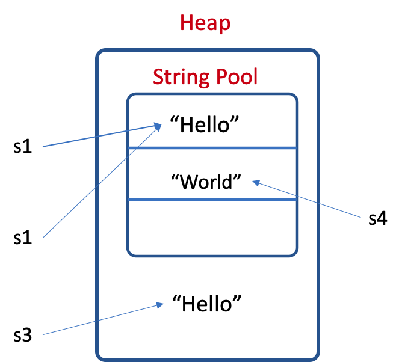
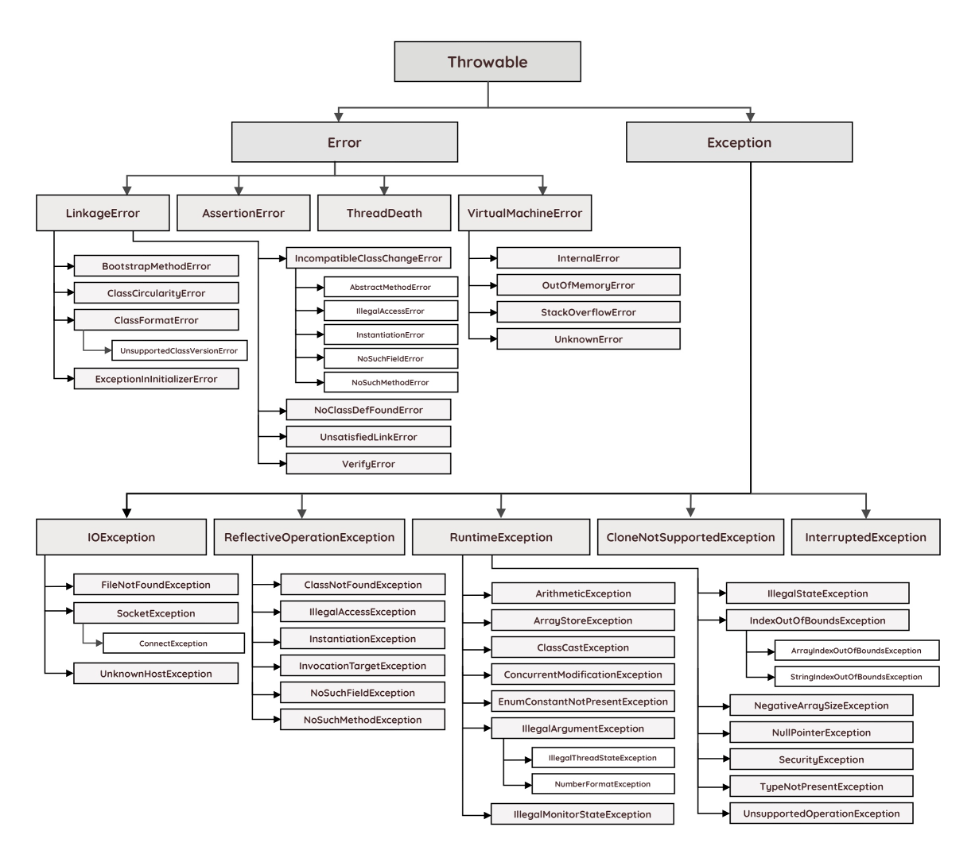

# Intro

1. Why java?

   - Android apps use java

   - java is safer (not crash) than C++

     - automatically check array bounds

     - hides pointers: **java don't use pointers, only use reference**
       - To know more about C++ pointer errors, please refer to my C++ Notes.

     - explicitly requires exception handling

   - java programs are portable

2. **Garbage collection**: Java scans memory on a regular basis to find non-accessible heap memory, and then automatically frees it. As a result, unreferenced objects will be removed, which makes Java memory-efficient.

3. Java platform components

   - **JRE** (Java Runtime Environment): a software that Java programs require to run correctly. For Java web & mobile applications, JRE communicates between the Java program and the operating system. With JRE, you can run your program in any operating system.

     > A software program needs a runtime environment that provides access to memory and other system resources such as program files and dependencies. In the past, most software used the operating system directly as its runtime environment. However, this meant that developers had to write different code for each operating system that they wanted their applications to run on. The Java Runtime Environment (JRE) technology was created as a solution to this problem. [What is JRE](https://aws.amazon.com/what-is/java-runtime-environment/)

   - **JDK** (Java Development Kit): a collection of software tools that are used for developing java applications. (When you are writing java code, you are using JDK.)

   - **JVM** (Java Virtual Machine): a program to run java program anywhere

4. compilation

   - C++: .cpp -> .o -> executable

   - Java: .java -> .class -> .jar -> JVM

     ```bash
     javac HelloWorld.java # compile the program
     java HelloWorld # run the program
     ```

5. Java vs. C++

   - All java code is written in classes

# Data types

## Primitive types

Primitives are stored on stack. Anything other than primitive types are **reference types** (or objects). All reference types are 8 bytes, which holds the address of the real data. And the real data is stored on heap.

[](https://github.com/Sonia-96/UCB-CS61B-Data_Structures_Fall_2020/blob/master/notes/images/reference_types.png)

| Primitive types | Size/bits | Wrapper class (Object data type) | Size/bits |
| --------------- | --------- | -------------------------------- | --------- |
| int             | 32        | Integer                          | 64        |
| byte            | 8         | Byte                             | 64        |
| short           | 16        | Short                            | 64        |
| long            | 64        | Long                             | 64        |
| float           | 32        | Float                            | 64        |
| double          | 64        | Double                           | 64        |
| char            | 16        | Character                        | 64        |
| boolean         | 1         | Boolean                          | 64        |

We use primitives' corresponding wrapper classes in generic types. e.g., 

```java
List<Integer> list = new ArrayList<>();
```

## String

String is a reference type, and is immutable in Java -- even only appending a char to a String, we still need to rebuild the whole String.

### String literals & String Objects

```java
String s1 = "Hello"; // string literal
String s2 = "Hello"; // string literal
String s3 = new String("Hello"); // string object
System.out.println(s1 == s2); // true
System.out.println(s1 == s3); // false
System.out.println(s1.equals(s3)); // true;
```

### String Pool

Java has a String Pool in the heap to store all string literals. When we create a string literal, JVM will first check if the literal exisits in the pool. If the literal already exists, JVM will return a reference to the pooled instance. If not, JVM will create a new String object in the String Pool.

When we use `new` to create a `String`,  JVM will create a new String object in the normal heap space intead  of the string pool. 



## Array

1. fixed array

   ```java
   int[] intArray = new int[10];
   int len = intArray.length;
   ```

2. dynamic array (resizable)

   - `ArrayList`(recommended): faster due to multi threads support

     ```java
     ArrayList<Integer> names = new ArrayList<>(); // we must use wrapper class in <>
     ```

   - `Vector`: single thread (synchronized)

     ```java
     Vector<Integer> v = new Vector<>(5); // Integer is generic type
     for (int i = 0; i < 5;i++ ){
       v.add(i);
     }
     v.remove(v.size() - 1);
     ```

### ArrayList\<T>

1. walking through 

     - for-loop
     
     - for-each loop
     
     -  **Iterator**
     
       ```java
       Iterator iter = names.iterator();
       while (iter.hasNext()) {
         out.println(iter.next());
       }
       ```


2. copy

   ```java
   ArrayList<String> moreNamew = new ArrayList<>(names); // this is a shllow copy!!! 
   ```

## Generics

To make a class to be compatible with different data types, we can use generics.

### Syntax

1. In declaration: `className<T>`

   ```java
   class MyContainer<T> {
     T data[];
     int size, capacity;
     
     public void add(T item) {...};
     public void remove(T item) {...};
   }
   ```

   Note, you can only use reference types for generics, e.g.,  `Integer`, `Double`, `Character`, `Boolean`, `Short`, `Long`, `Byte`, `Float`.

2. In instantiation: `MyContainer<T> container = new MyContainer<>()`

3. comman type parameters:

   - T - Type
   - E - Element
   - K - Key
   - N - Number
   - V - Value

### Auto boxing/unboxing

1. auto boxing: during compiling, the primitive types will be converted to corresponding reference types automatically. e.g., 

   ```java
   ArrayList<Integer> list = new ArrayList<>();
   list.add(5);
   ```

2. auto unboxing: reference types - > primitive types

   ```java
   int num = list.get(0);
   ```

### Wildcard

The **question mark (?)** is known as the **wildcard** in generic programming. It represents an unknown type. 

- upper bounded wildcard: `<? extends E>` -- `E` or anyclass extends the class `E`
- lower bounded wildcard: `<? super E>` -- `E` or anyclass that is a super-class of `E`

### static generic method

`static` methods can have their own generic types in their signatures.

```java
public static <T> boolean contains(T[] array, T item) {
  for (T t : array) {
    if (t.equals(item)) {
      return true;
    }
  }
  return false;
}
```


# File I/O

## Streams & Adapters

**Streams** read or write by bytes, which are not readable for human. 

1. Input Streams
   - `System.in`: Stream connected to the console
   - `FileInputStream`: Stream connected to a file
   - `ByteArrayInputStream`
   - `ObjectInputStream`: reads in an Object, so you can send it across the network, or to a file
2. Output Streams
   - `System.out`
   - `FileOutputStream`
   - `ObjectOutputStream`

**Adapters** are higher level objects that use streams to provide higher level operations. We can use adapters to deal with normal data types, e.g. String, numeric values, etc.

## File Input

### Scanner

1. user input

   ```java
   Scanner s = new Scanner(System.in); // create a scanner object
   int i = s.nextInt();
   double d = s.nextDouble();
   byte b = s.nextByte();
   String str = s.nextLine();
   ```

2. file input:

   ```java
   File file = new File("test.txt");
   Scanner sc = new Scanner(file);
   String s = sc.nextLine(); // read next String by line
   s = sc.next(); //read next String by word
   int i = sc.nextInt(); // read next int
   ```


## File Output

### FileWriter

```java
FileWriter myWriter = new FileWriter("<filename>");
myWriter.write("Put this text into a file.\n");
myWriter.close();
```

return a whole file to the output stream:

```java
FileInputStream fin = new FileInputStream("filename");
fin.transferTo(outStream);
pw.flush()
```

### [PrintWriter](https://docs.oracle.com/javase/7/docs/api/java/io/PrintWriter.html)

```java
PrintWriter pw = new PrintWriter("<filename>");
pw.print(...);
pw.printf(...);
pw.println(...);
pw.close();
```

[PrintWriter vs. FileWriter](https://medium.com/geekculture/using-printwriter-vs-filewriter-in-java-2958df85f105)

# Modifiers

## Access modifiers

Access modifiers are used to control access to members of a class.

|                       | class | package | subclass (same pkg) | subclass (diff pkg) | World |
| --------------------- | ----- | ------- | ------------------- | ------------------- | ----- |
| public                | Y     | Y       | Y                   | Y                   | Y     |
| protected             | Y     | Y       | Y                   | Y                   | N     |
| default (no modifier) | Y     | Y       | Y                   | N                   | N     |
| private               | Y     | N       | N                   | N                   | N     |

https://docs.oracle.com/javase/tutorial/java/javaOO/accesscontrol.html

## Final

Use `final` to mark constants: `public final String resourcePath = "../resources/"`

## Static

#### Classes

#### Methods

- **static methods (class methods)** : class methods belongs to the whole class, instead of an instance of that class. 
  - A static method does not have an object attached to it. So we don't need an object or `this` to access it.
  -  we should use className to call a static method, e.g., `Math.min()`
  - `main()` should always be static 
  
- **non-static methods (instance methods)**: instance methods belong to a single object
  - we should use objectName to call a non-static method, e.g., `f1.reduce()` in the Fraction assignment


differences between static & non-static methods:

1. Static methods can only access static variables and methods. If a static method wants to access non-static variables/methods, it must use an object.
2. Instance methods can access both static & non-static variables and methods inside the class
3. Static methods can't use `this` keyword 

```java
public class Main {
    static int x = 0;
    int y = 10;
  
  	void print_ns() {
        System.out.println(x);
        System.out.println(y);
    }

    static void print_s() {
        System.out.println(x); 
        // System.out.println(y); // syntax error!
    }
  
  	void static main(String[] args) {
      	Main test = new Main();
      	test.print_ns(); // use an object to call a non-static method
      	Main.print_s(); // use class name to call static methods (or just print_s() here)
    }
}
```

#### Variable

- static variable belongs to the whole class; all instances of the class share the same static variable. Static variables already exist before an object is created.
- non-static variable only belongs to an object

# Exception

Exceptions are a way of handling unexpected errors.

- `throws`: When a function is annotated with throws, it tells callers of that function that they should catch that particular exception. For example: 

  ```java
  public void func(int i) throws IOException {
    ...
  }
  ```

  

- thow an exception: when we encounter an exception, the program will stop

  ```java
  public void add(T x) {
    if (x == null) {
      throw new IllegalArgumentException("can't add null");
    }
    ...
  }
  ```

- `try-catch-finally`: when we encounter an exception, the program will output the error information but not stop

  `try` lets you attempt execution of a piece of code, `catch` lets you catch any exceptions thrown during that execution, `finally` always executes after try and catch and is often used for cleanup (close streams/sockets etc).
  
  ```java
  try {
      // something that may throw an exception
  } catch (Exception e) {
      // handle the error
  } finally {
    // executes regarless of the result of try 
  }
  ```

Note: only throw an exception when you can handle it!

## Exception types

- `IoException`
  - `FileNotFoundException`

- `RunTimeException`
  - `ArithmeticException`
  - `ArrayIndexOutOfBoundsException`

- ...



## Useful methods for exceptions

```java
public Fraction( long n, long d ) throws ArithmeticException {
  if (d == 0) {
    throw new ArithmeticException("denominator can't be 0!");
  }
}
```

1. `printStackTrace()`: display the class stack down to where the exception occurred

   ```java
   try {
     Fraction f9 = new Fraction(30, 0);
   } catch (ArithmeticException e) {
     e.printStackTrace();
   }
   ```

2. `getMessage()`

   ```java
   try {
     Fraction f9 = new Fraction(30, 0);
   } catch (ArithmeticException e) {
     System.out.println(e.getMessage()); // what's the difference between  print(e) & print(e.getMessage())?
   }
   ```

# Interface

Interface is a blueprint of a class. An Interface doesn't implement its methods, only specifies their signatures. These methods are called **abstract methods**.

Note, a subclass and its parent class should be "is-a" relationship. For example:

- Cat "is-a" Animal:white_check_mark: 
- Cat "has-a" Claw:x:

If you want to implement a method in a Interface, the method should be `default`。

## Implements

When you initialize a subclass, the type can be either superclass or subclass. If it is superclass, the object can only use the methods of superclass. If it's subclass, the object can only use the methods of subclass.

```java
Interface Drawable {
  void draw();
}

class Bird implements Drawable {
  private String name;
  private String color;
  
  @Override
  public void draw() {System.out.println("Drawing a bird")};
  public void fly() {System.out.println("A bird can fly")};
  
  public static void main(String[] args) {
    Drawable b1 = new Bird();
    b1.draw();
    // b1.fly(); // b1 cannot fly, because it's not Bird!!
    
    Bird b2 = new Bird();
    b2.fly(); // b2 can fly
  }
}
```

# Inheritance

## Extends

If a subclass `extends` a base class, the subclass can inherite the following things from the base class:

- all static variables and instance variables
- all **non-private** methods
- all non-private inner classes

### keyword super

A subclass can use `super` to use the variables and methods from its base class.

- use constructor: `super(parameters)`
- use methods: `super.methodName(parameters)`
- use variables: `super.variableName`

## Override

Overriding vs. Overloading:

- Overriding（方法重写）: two functions have the same name and same signatures. Overriding is usually happened when a subclass inherits a baseclass, and we should add `@Override` annotation in front of the method in the subclass.
- Overloading（方法重载）: two functions have the same name but different signatures

### Dynamic method selection

A variable has two types:

- **compile-time type (static type)** **编译类型**：the type in the variable declaration
- **run-time type (dynamic type)** **运行时的类型**：the type in the variable initializaiton

For example, 

```java
Person employee = new Employee();
```

for the object `employee`, its static type is `Person`, and dynamic type is `Employee`. 

When java runs an overriden method, it will first choose the method in the dynamic type. This principle is called ”dynamic method selection“.

Note, this princinple does not apply to overloaded methods. For overloaded methods, java only matches the methods in its static type.

https://cs61b.bencuan.me/oop/dynamic-method-selection

### extends vs. implements

| implements                                                 | Extends                                                      |
| ---------------------------------------------------------- | ------------------------------------------------------------ |
| a class can implements an Interface                        | a class can extends another class, and an interface can extends another interface |
| subclasses have to implements all methods in the interface | subclasses don't have to implements all methods in the base class |
| a class can implements multiple interfaces                 | a class can only extends one class                           |
| an interface cannot `implements` another interface         | an interface can `extends` another interface                 |

## Abstraction

## Polymorphism

Polymorphism means "many forms". In Java, polymorphism refers to the ability of a class to provide different implementations of a method. 

### Interface Comparable

`Comparable<T>` is a built-in interface in Java. Many built-in classes in Java have implemented `Comparable<T>`, e.g., `String`, `Integer`. To implements Comparable Interface, the class must implements the method `int compareTo(T o)`.

```java
public class Dog implements Comparable<Dog>{
    private String name;
    private int size;

    @Override
    public int compareTo(Dog o) {
        return this.size - o.size; // if return value < 0, this < o; if > 0, this > o, else equals
    }
}
```

After implementing the `Comparable<T>` interface, the objects of this class can be sorted by methods like `Collections.sort()`, `Arrays.sort()`.

### Interface Comparator

`Comparator<T>` is also a built-in interface in Java. We need to import this interface before implementing it (`Comparable` doesn't need this).  To implement `Comparator`, we need to implement the method `public int compare(Object o1, Object o2)`.

```java
public class DogComparator implements Comparator<Dog> {
  	@Overrie
  	public int compare(Dog d1, Dog d2) {
      return d1.size - d2.size; 
    }
}
```

When sorting Dog objects, we need to create a new DogComparator:

```java
Dog[] dogs = {dog1, dog2, ...};
Arrays.sort(dogs, new DogComparator());
```

We can use lamda function to create a comparator directly, instead of first defining a new class :

```java
Arrays.sort(dogs, (c1, c2) -> (c1.size - c2.size));
```

# Miscelaneous

## Enumerated Types

Enumerated types are named constants that can increase the readability and the correctness of your code. 

```c
enum days_of_week {
  MON=1, TUE, WED, THU, FRI, SAT, SUN
};
```

- In a enumerated type, the default value of the first member is 0. The subsequent members are incremented by 1 over its previous member.

- The enumerated names cannot change throughout the program. 

Note, the convention for indicating that a name denotes a constant is to write the name in **all uppercase**. 

## switch statement

alternative syntax
