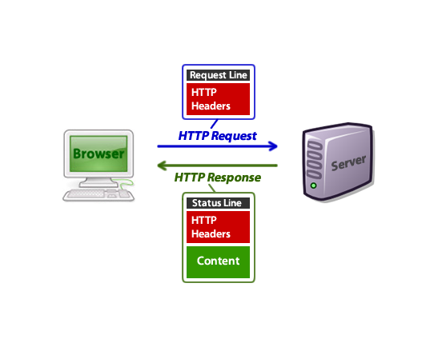
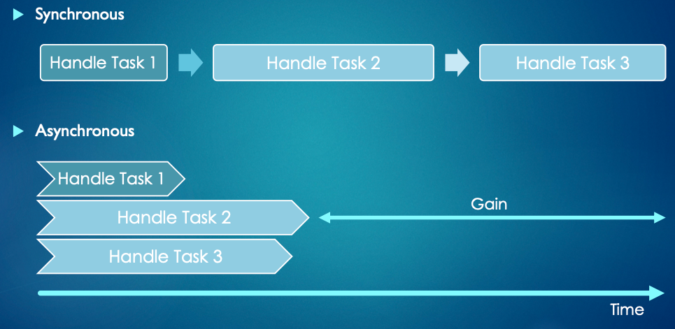

# 1 Web Pages

## Unix

### Unix Permissions

d<span style="color:red">rwx</span><span style="color:blue">r-x</span><span style="color:green">---</span>

- d - directory
- <span style="color:red">owner's permissions</span>
  - r - read
  - w - write
  - x - execute (run a program, or allows cd into a directory)

- <span style="color:blue">group's permissions</span> (try running groups in cmd)
- <span style="color:green">everyone else's permissions</span>

commands:

- `chmod` (change mode): modifies the permission of the file. `chmod [+-=][permissions] [filename]`
  - `chmod go+rX images`: add read and execute permissions for group and others
  - `chmod u=rwx,g=rx,o=r myfile`: the user can read, write, execute; group can ...

- `ls -l`: list information of each file under the path
- `ls -ld`: ???

### Home Directory

commands: 

- `echo`: display the string or text or variable that passed as an argument
  - `echo $HOME`: display home directory (i.e. `~`)
  - `echo $PATH`: $PATH is a list of directories the computer will look through to find commands you run
  - `echo $SHELL`

- `cd $HOME ` / `cd ~` / `cd`: enter home directory
- `env`: environment variables in your system 

## Web Client & Server

- web client: e.g., web browser -> display info that is hosted on the web server
- web server: a program that allows a web browser to talk with and receive requested files
  - popular web servers:
    - Apach (Free, 34% of the market)
    - Apach Tomcat (Java based)
    - Nginx (Free, 34% of the market)
    - LiteSpeed (Paid, 8% of the market)

## HTML

HTML - Hyper Text Markup Language

1. HTML is a static language, not programming language

2. Tags & Attributes:  tags make up the HTML code; attributes are used to modify the tag

   - `<tag attr1="value1" attr2="value2"> stuff </tag>`
     - Attributes can be from CSS
   - `<tag>`: some tags don't contain "stuff", like `` 

3. basic HTML web page frame

   ```html
   <!DOCTYPE html>
   <html>
     <head lang="en"> - header info for the web page
       <meta charset="utf-8">
       <title>Webpage Title</title>
     </head>
   	<body> - the real information of the web page
       
     </body>
   </html>
   ```

### Common Tags

- `<a href="https://google.com"> This is a link for google </a>`: a hyperlink
  - <a href="https://google.com"> This is a link for google </a>

- ``: no closing tag

- `<ul>`: unordered list

- `<ol>`: ordered list
  - `<li>`

- Grouping:

  - `<div>`

  - `<span>`

- `<script>`: for Javascript

- `<video>`

### Colors

1. Color is stored as RGB, and 1 byte for each value.  e.g., 0xFF0033 is mostly red, with a little blue. 

2. We use int (4 bytes) to store color. The extra 1 byte is used for opacity.

Note, the smallest trunk that the computer deals with is 1 byte. For 32-bits systems, the normal size they deal with is 4 bytes. For 64-bits systems, the normal size is 8 bytes.

## CSS

CSS: Cascading Style Sheets - describes the styling

1. Link CSS file to your HTML file: (rel is for relation)

   ```html
   <head>
     <link rel="stylesheet" type="text/css" href="styles.css">
   </head>
   ```

2. Selectors:

   ```css
   /* tag selector */
   tagName {}
   
   /* class selector */
   .className {}
   
   /* id selector */
   #id {}
   
   /* descendent selector (select all a inside li)*/
   li a {}
   ```

   [CSS selectors references](https://www.w3schools.com/cssref/css_selectors.asp)

## Emacs shortcuts

open emacs editor: `emacs -nw`

1. create a new file: C-x C-f
2. save a file: C-x C-s
3. split the screen: C-x 2
4. switch buffers: C-x b
5. move between split windows: C-x o
6. suspend Emacs: C-z
7. fg: return Emacs
8. cancel a command: C-g
9. save file: C-x C-s
10. mark set: C-space (the language mode should be English, not Chinese)
11. copy: M-w
12. cut: C-w
13. paste: C-y
14. move the cursor:
    - By line: C-a to start, C-e to end

# 2 Basic Network Architecture

## Client / Server Model

Most networking applications are using client / server model, e.g., web browser, zoom, facebook.


Networked applications without cline/servers are often called "**peer to peer**" applications, e.g., BitTorrent.

## Data Transfer Layers - OSI layer model

OSI (Open Systems Interconnection) Layer Model. From the bottom to the top, the layers are:

1. **Physical layer**: the physical medium that transmits **raw bit stream** between devices, e.g., radio wave, electric signals
2. **Data Link layer**: breaks up packets into frames and sends them from source to destination. e.g., ethernet, wifi
3. **Network layer**: transmit data from one host to the other in different networks. The network layer use **IP** to route packets to a destination node, e.g., iPv4, iPv6
4. :star:**Transport layer**: how data gets from a **program** to another program. Transport layer deals with bytes.
   - we use **port** to decide which program the data belongs to
   - TCP & UDP - standards that enable application program and computing devices to exchange data over network
     - **UDP** defines source port and destination port, but cannot check if the data is received. 
     - **TCP** gurantees your will receive all data because it will resend lost package
   - We use Sockets to connect client and server
   
5. :star::star:**Application layer**: how your application parses the data it sends/receives. (eg. **HTTP**) (Application layer deals with important information)

https://www.geeksforgeeks.org/layers-of-osi-model/

## Protocols

Protocols define how two programs communicates. e.g., HTTP, ssh, smtp

- **HTTP**: Hypertext Transfer Protocol -- a request-response protocol that describes the order and syntax for presenting information.
  - text-based, stateless (no session information), for web pages
- **HTTPS**: HTTP  with encryption and verification
- UDP: compare to TCP, UDP is not reliable, because it can't gurantee all data will be received. (live video may use UDP, because users can't move back)
- **DNS** (Domain name system): translate human readable computer names into unique IP address
- TLS (Transport Layer Security): TLS is used in HTPPS to secure data. i.e., TLS pacekt is secured.

### Protocol layers

- lowest level - internet protocol: specifies how small “packets” of data (with no inherent semantic information) are passed between machines.
- next level- TCP
- highest level - application protocol

### TCP/IP

A packet based on TCP/IP protocol has following information:

- IP header: 
  - Version/type/length
  - ID/Flags
  - Time/protocol/Checksum
    - checksum: A checksum is a value that represents the number of bits in a transmission message and is used by IT professionals to detect high-level errors within data transmissions.
- TCP header
  - Source
  - Destination
- Payload (application data)

#### IP

1. IP: a unique machine ID

   - IPv4: 32 bits, ~4.3 billion addresses.
     - an IPv4 address is like W.X.Y.Z., each number is in range of [0, 255]. e.g., 10.17.165.139
     - W.X.Y routs the data to a local network, Z specifies the machine on the network
     
   - IPv6: 128 bits. Every atom in the universe can has its IP.

2. reading your IP address: run `ifconfig` in the terminal, your IPv4 address is under `en0` and next to `inet` and IPv6 address is near to `inet6`

#### TCP

1. TCP specifies which program on the machine gets the data -- **port** number

2. Many common applications use fixed port numbers:

   - HTTP - 80
   
   
      - HTPPS - 443
   
   
      - ssh - 21
        - School of Computing change the port to 5522 to avoid hits
   
   
      - Doom - 666
   
3. **socket**: TCP connection


## Wireshark

- `loopback`: look for the traffic of the program on your computer
- `Wifi: en0`: look for the traffic of programs over internet

## Lab

### Ping

`ping` command relies on the Internet Control Message Protocol (ICMP). Its basic use is to confirm the connectivity between two hosts.

```bash
ping 10.17.165.139 # send requests to this IP address
ping -c 10 10.17.165.139 # send 10 echo requests
```

`ping` can show **round-trip time** (response time + reply time) for each transmitted packet

```bash
sonia@Yues-MacBook-Pro Java&Web % ping -c 5 google.com
PING google.com (142.250.189.14): 56 data bytes
64 bytes from 142.250.189.14: icmp_seq=0 ttl=57 time=46.433 ms
64 bytes from 142.250.189.14: icmp_seq=1 ttl=57 time=51.359 ms
64 bytes from 142.250.189.14: icmp_seq=2 ttl=57 time=46.906 ms
64 bytes from 142.250.189.14: icmp_seq=3 ttl=57 time=60.286 ms
64 bytes from 142.250.189.14: icmp_seq=4 ttl=57 time=53.585 ms

--- google.com ping statistics ---
5 packets transmitted, 5 packets received, 0.0% packet loss
round-trip min/avg/max/stddev = 46.433/51.714/60.286/5.062 ms
```

# 3 Basic Networking

## Socket

Socket is an **open TCP connection** to a program somewhere else. A Socket includes the information of source and destination IPs and source and destination port numbers. We use Socket to transmit information between the server and the client.

### ServerSocket

ServerSocket lifecyle:

- `.accept()` : wait for a connection. returns a Socket when is connected to the client
  - a single ServerSocket can accept() many clients simultaneously
- `.close()`: disconnect with the client and end the program

### Socket I/O

1. read a socket:

   ```java
   InputStream inStream = client.getIntputStream();
   Scanner sc = new Scanner(inStream);
   ```

2. write to a socket:

   ```java
   OutputStream outStream = client.getOutputStream();
   PrintWriter pw = new PrintWriter(outStream);
   pw.println(...);
   pw.flush(); // send output data immediately
   ```

   return a whole file to the output stream:

   ```java
   FileInputStream fin = new FileInputStream("filename");
   fin.transferTo(outStream);
   pw.flush()
   ```

   Note, output data is usually stored in a buffer (a large array) until the OS decides there's enough data to send

1. TCP connection

   OS will randomly choose a port (normally big)

## HTTP Headers

HTTP headers are the core part of HTTP requests and responses. They carry information about the client browser, the requested page, the server, and more. ([HTTP Headers for Dummies](https://code.tutsplus.com/tutorials/http-headers-for-dummies--net-8039))



### HTTP Request 

an example:

```bash
GET /tutorials/other/top-20-mysql-best-practices/ HTTP/1.1 # a GET request for the file
Host: code.tutsplus.com
User-Agent: Mozilla/5.0 (Windows; U; Windows NT 6.1; en-US; rv:1.9.1.5) Gecko/20091102 Firefox/3.5.5 (.NET CLR 3.5.30729)
Accept: text/html,application/xhtml+xml,application/xml;q=0.9,*/*;q=0.8
Accept-Language: en-us,en;q=0.5
Accept-Encoding: gzip,deflate
Accept-Charset: ISO-8859-1,utf-8;q=0.7,*;q=0.7
Keep-Alive: 300
Connection: keep-alive
Cookie: PHPSESSID=r2t5uvjq435r4q7ib3vtdjq120
Pragma: no-cache
Cache-Control: no-cache
 # A blank line is treated as the termination of a request or a response.
```

Important!! A blank line is treated as the termination of a request or a response.

### HTTP Response

```bash
HTTP/1.1 200 OK # HTTP status code # or 404 file not found
Transfer-Encoding: chunked
Date: Sat, 28 Nov 2009 04:36:25 GMT
Server: LiteSpeed
Connection: close
X-Powered-By: W3 Total Cache/0.8
Pragma: public
Expires: Sat, 28 Nov 2009 05:36:25 GMT
Etag: "pub1259380237;gz"
Cache-Control: max-age=3600, public
Content-Type: text/html; charset=UTF-8 # important
Last-Modified: Sat, 28 Nov 2009 03:50:37 GMT
X-Pingback: https://code.tutsplus.com/xmlrpc.php
Content-Encoding: gzip
Vary: Accept-Encoding, Cookie, User-Agent
 
<!DOCTYPE html PUBLIC "-//W3C//DTD XHTML 1.0 Strict//EN" "https://www.w3.org/TR/xhtml1/DTD/xhtml1-strict.dtd">
<html xmlns="http://www.w3.org/1999/xhtml">
<head>
<meta http-equiv="Content-Type" content="text/html; charset=utf-8" />
<title>Top 20+ MySQL Best Practices - Nettuts+</title>
<!-- ... rest of the html ... -->
```

## Basic HTTP Server

1. use web browser or curl as a client

   - `curl -v 127.0.0.1` 

     - `-v` for verbose
     - how to find your own machine: use `127.0.01` or `localhost` or `<your own IP>`

2. port

   Lower port are reserved and require administrator privileges, so we use 8080 - `localhost:8080`

# 4 JavaScript

JS can make web pages interactive, may be the most used programming language in the world.

- script language: no need to set up environment, no compiler

## Variable Declaration

**Dynamic Typing**: variables in JavaScript has no explicit types. 

- `let someName = value;`：use `let` to declare a variable, the type and value of the variable can be changed. But DON'T CHANGE A VARIABLE"S DATA TYPE!! You may forget the type of the variable later.
- `const SOME_NAME = value;`：declaring a constant variable
- `var x`: old version, and scoping is strange -- don't use!!

```javascript
let x;
let y = 10;
y = "hello"; // DON'T do this!
let arr = [4, 7.2, "hello"];
let obj = {};
obj = {"name": "john", "gpa": 3.7, "year": 3}; 
obj.gender = "male";
```

## Functions

### Declaration

There are two ways to declare a function:

1. function declaration

   `function myFunctionName(param1, param2) {...}`

2. function expression

   create a function like a variable: `let myFunctionName = function(param1, param2) {...}`

### Arguments

1. `arguments` is an hidden variable for functions , which is an array containing the parameters of the function

   ```javascript
   function doit(x, y, z) {
     console.log(arguments.length);
     console.log(arguments[0]);
     console.log(y);
   }
   
   doit(99);
   ```

   Output:

   ```javascript
   3
   99
   undefined
   ```

Q: Functions in Java vs. Javascript?

- In Java, a function must be declared inside of a class. In JS, a function  can be an object.
- In JS, a function can be saved in a variable. In Java, it can't.
- In Java, functions has access modifiers like `public`, `protected`, `default`, `private`. In JS, they don't. 

## Objects

Objects in JS is similar to map -- key-value pairs

- no pre-set structure
- Accesse a field:
  - `obj.field`
  - `obj['field']`: but `obj.2` is illegal

- add a method: `obj.aMethod = function(parameters) {...};`
- call a method: `obj.aMethod()`

```javascript
let mouse = {};
mouse.x = 0;
mouse.y = 100;
mouse['moveRight'] = true;
mouse.draw = function(a, b) {...};
```

## Miscellaneous

- No Main
- "use strict": "bad syntax" is not allowed

### Equals

```javascript
3 == '3';// true. JS tries to convert things to match
3 === '3'; // false. strictly equal
```

### loops

1. For-each loop

   ```javascript
   for (let prop in obj); // iterate through the fileds of an object
   for (let val of array); // iterate through the items in an array
   ```

2. for loop & while loop are the same as Java 

   ```javascript
   let x = Math.random().toFixed(2); // x = 0.35, a string!!
   x += 10; // 0.3510
   x = Number(x) // convert x to a number
   ```

## JSON

JSON (JavaScript Object Notation), a way of serializing data. JSON is used to represent objects and pass them (their data) around in many different applications.

An example:

```json
{  
    "employee": [
      {  
        "name":       "sonoo",   
        "salary":      56000,   
        "married":    true  
    	},
      {
        "name": "Sonia",
        "slalry": 100000,
        "married": false
      }
    ]
}  
```

## DOM

DOM(Document Object Model). A page is stored as a tree; each element is a node. And the root is `document`.

JavaScript use DOM to manipulate. A JS file will be run as soon as it is seen.

- window: web browser 
  - `window.onload = main`: set main() to `onload` (here `main()` is a **callback function**)
    - The `onload` event occurs when an object has been loaded. Onload is most often used within the \<body> element to execute a script once <u>a web page has completely loaded all content (including images, script files, CSS files, etc.)</u>.

### Document

document is the root of DOM.

- `document.writeln( “<p> Hello World </p> “ );`: adds the text directly to the body
- `document.body`: the \<body> element of the page

### Selecting Elements

1. Select elements

   - Method 1：`document.<elementName>`

   - Method 2：`getElement()`

     - `document.getElementById()`: return only one element

     - `document.getElementsByTagName()`: reutrn an array

     - `document.getElementsByClassName()`: return an array

   - Method 3：querySelector() (most commonly used)

     - `document.querySelector()`：choose the first selector that meets the condition, the condition can be elementName, #id, and .class:

       ```javascript
       document.querySelector('h1'); // finds first h1 element
       document.querySelector('#red'); // find first element with ID od red
       document.querySelector('.big'); // find first element with class of big
       document.querySelector('a[title="Java"]'); // find first <a> with attribute title of "Java"
       ```

      - `document.querySelectorAll()`：choose all selectors that meet the condition

### Traversing DOM

- `parentElement`：父结点

- `children`：子结点

  - `element.querySelectorAll()`: find all descendents meeting the condition

- `nextSibling` & `previousSibling`：同胞结点

- `nextElementSibling` & `previoudElementSibling`

  - `nextElementSibling`返回的是一个元素的结点，而`nextSibling`可能返回非元素的结点

  - 例如：有两个连续的\

    ```javascript
    const img = document.querySelector('img');
    img.nextSibling; // 返回的是#text，这是两个img元素之间留的空白
    img.nextElementSibling; // 返回的是下一个img
    ```


### Modifying DOM

1. createElement(...);

   ```javascript
   let myP = document.createElement('p'); // create a paragraph
   let myText = document.createTextNode("This is a paragraph");
   myP.appendChild(myText);
   document.body.appendChild(myP); // to show the paragraph
   ```

2. remove elements:

   ```javascript
   element.remove();
   node.removeChild(element);
   ```

   

3. set styles

   ```java
   myP.style.background = "red";
   myP.style.fontWeight = "bold";
   myP.innerText = "Hello World";
   myP.innerHTML = "To <a src='www.google.com'>Google</a>"
   ```

4. Note, a node can have only one parent! if you want to set a node as children for multiple parents, you should use `<nodeName>.cloneNode()`

  # 5 Callbacks & AJAX

## Callbacks

A callback function is a function passed into another function as a parameter, which is then invoked by the outer function to complete some kind of  action. In event based programming, we use callbacks (or listeners) to respond to user's actions and inputs.

3 different ways to do this:

- in HTML

  ```html
  
  ```

- in JS, define a function

  ```javascript
  element.onclick = function(event) {...};
  ```

- in JS, add a listener (recommended)

  ```javascript
  element.addEventListener("click", functionName);
  element.addEventListener("click", function() {...});
  ```

## AJAX - Asynchronous JS and XML

AJAX is mainly a web dev technique used to send and retreive data in the background **without refreshing a webpage**. 

With AJAX, you can:

- Read data from a web server - after a web page has loaded
- Update a webpage - without reloading a webpage (which can reduce the load of the server and make you webpage faster)
- Send data to a web server -  in the background

### sync & async

- Syn: step1 -> step2 -> step3 (only starts step2 until we finish the step1)
- Async: starts step 1, step 2, and step3 together, and use callbacks to know when they each is done. Asyncrhonous program is more efficient!



### Implmentation

```javascript
let request = new XMLHTTPRequest();
request.open("GET", <url>); // other methods: POST, PUT
// check if the requested data is available
request.addEventListeners("load", handleAjaxSuccessCB); // CB - callbacks. You should define it by yourself
request.addEventListeners("error", handleAjaxErrorCB);
requenst.send(); // send the request
```

Note:

- In `handleAjaxSuccessCb()`, we can get the requested data by accessing the filed `request.reponseText`.

### Other useful methods

- `window.onload = function() {...}`: call this function after HTML/CSS have finished loading
- `window.setInterval(func, delay)`:  run `func` every `delay` ms
  - we can use this method to request data from the server every 10 seconds
- `window.setTimeOut(func, delay)`: run `func` after a `delay` ms (not recommended)
- `window.requestAnimationFrame(callback)`: the browser will run `callback` 60 times per second (60 Hz). 
  - I think this method is like a faster version of `window.setInterval`. In other words, `window.requestAnimationFrame(callback)` has the same effect as`window.setInterval(callback, 16.7)`. (1000 ms / 60 = 16.7 ms)
- `<event>.stopPropagation()`: prevents further propagation of the current event in the capturing and bubbling phases. But it can not stop default behaviors like clicking on a link.
- `<event>.preventDefault()`: if the event does not get explicitly handled, its default action should not be taken as it normally would be. In this way, you can stop default behaviors like clicking on a link.

# 6 Drawing with JS

two ways to draw with JS:

- \<canvas>

  Wee need an element `canvas` in HTML:

  ```html
  <canvas width="1000" height="500"></canvas>
  ```

  Draw in JavaScript file:

  ```javascript
  let canvas = document.getElementsByTagName("canvas")[0];
  let context = canvas.getContext("2d");
  // draw images
  let img = new Image();
  image.src = "cheese.png";
  context.draw(image, 0, 0, img.width * 0.5, img.height * 0.5); // x, y, width, height
  // erase the context
  context.fillStyle = "#FFFFFF";
  context.fillRec(0, 0, canvas.width, canvans.height);
  ```

- \<svg>

# 7 Web Sockets

## Imeplemntation

```javascript
let ws = new WebSocket(url); // e.g. ws://localhost:8080/
ws.onOpen = handleConnectCB;
ws.onError = handleErrorCB;
ws.onClose = handleCloseCB;
ws.onmessage = handleMessageCB;
ws.send("<message>");
ws.close();

wsOpen = false;
function handleConnectCB() {
  wsOpen = true;
  // other actions
}
```

Q: difference between AJAX and web sockets?

- AJAX is a client-side approach, web sockets is a bi-direction communication
- AJAX is a single request, web sockets will keep opening.
