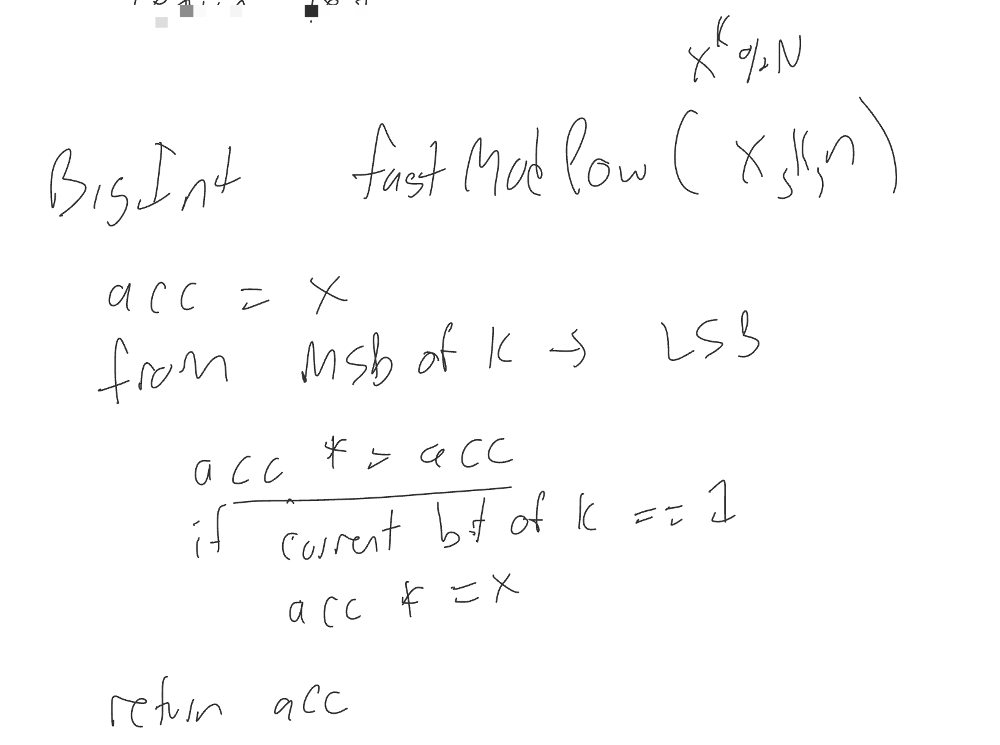

# 1 Buffer Overflow

1. code:
   
   - // c code
   
   - Diff between call & jump: call will return an address (then the process can jump to that address)
   - solutions:
     - use safe API 
       - in c++, we use string. 2 pros:
         - string can grow
         - string store its chars on heap. 
           - heap overflow is not as serious as buffer overflow because we don't modify the return address
     - use safe API bounds checking
       - `fgets()`

2. Shellcode (不太懂)
   - for example: `execve(“/bin/sh”, [“/bin/sh”], NULL);`
   - syscall (copy the syscall number of `execve` number into rax)

3. Compiler / OS mitigations
   - stack canaries: stack check guard (___stack_chk_guard)
   - make stacks grow up 
   - address space layout randomization (ASLR)
   - separate code stack and data stack
   - write or execute: the stack is writable is not executable, so jumping to the shell code will get a seg fault
   - BSD "pledge"

### Low Level Tools

1. `c++filt __ZNSt3__14coutE`
2. `otool`
   - `-tV`: disassemble
   - `-p`

3. Lldb

// TODO: read the assembly code, preparing for the lab on Friday. Know how to draw the stack picture. 

### Defense

1. isolation: processes, containers, VMs, Physical Isolation

# 2 Code Injection - SQL

Solutions:

1. Set DB permissions
2. Restrict sqlQuery function to run only one statement
3. Sanitize user input:
   - remove `;`, `'`, `"`, `--`
   - Escape: `'` -> `\'`
4. modern best practice: 

# 3 Return Oriented Programming

an executable code can't be writable

x86: variable length instructions

ret instruction is only one byte, e.g., ret 0xC3

return instruction is usefuly for attacker because we can know the return address (后面补充). rsp += 8

attacker can change the return address, then change the control flow

"return to libc": overwrite return address to return in the middle of a syscall wrapper like exec (?)

ASLR: address space layout randomization. 

> **Address space layout randomization** (ASLR) is a memory-protection process for operating systems (OSes) that guards against buffer-overflow attacks by randomizing the location where system executables are loaded into memory.


Attacker: looks for C3 bytes while **compiling** so they know all return addresses. Look back from `ret` they can know each stack contents. (? 理解不一定正确)


**mprotect** - syscall to change page permissions

A typical attack:

ROP chain: https://www.ired.team/offensive-security/code-injection-process-injection/binary-exploitation/rop-chaining-return-oriented-programming


solutions:

1. reduce the number of useful gadgets
   - replace all C3 bytes that are not return (//TODO why this helps?)
   - try to add "poison" before normal C3 instructions
2. ASLR

# 4 Side-channel Attack

side-channel attack: attacks that are not caused by bugs in code, but

## Example 1: check password

e.g. checkpassword: 


Attackers can use timer to figure out the password. The longer the runtime is, the more correct the provided password is.

Improvement1: return true/false in the end

```java
check_password_v2(String provided, String expected) {
  bool ret = true;
  if (provided.length) // TODO
}
```

improvement2: check hash. the timing won't leak any important information.

## Example 2: fastModPow

k here is probably the private key. Since the key length is fixed, the number of the bit 1 can affect the actual running time.



Solution 1: add `else acc *= 1` after the if. Serious problem: `acc *= 1` and `acc *=x` has different power usage. But this requires physical access for the attacker, which is difficult to implement.

## Other measurements

1. EM([Electromagnetic Analysis](https://www.sciencedirect.com/topics/engineering/electromagnetic-analysis)) Analysis

2. Acoustices (?)

3. Differential fault analysis

   > **Differential fault analysis** (DFA) is a type of active [side-channel attack](https://en.wikipedia.org/wiki/Side-channel_attack) in the field of [cryptography](https://en.wikipedia.org/wiki/Cryptography), specifically [cryptanalysis](https://en.wikipedia.org/wiki/Cryptanalysis). The principle is to induce *faults*—unexpected environmental conditions—into cryptographic operations to reveal their internal states. (Wikipedia)

## Data Remanence

DoEncryptionStuff

even after the function returns, the private key bytes are still on the stack

Solution: zero out the key bytes. But the compiler sees that you won't use this memory space anymore so they might not do this. 

(dead store elimination)

Solution: zero out the key bytes while the compiler won't ompimize it away (really hard!)

Mmap returns zeroed pages

# 5 Meltdown / Spectre

Knowledge included: page table, virtual memory, caches, kernel, concurrency, CPU Architecture

## Speculative Execution

The CPU guesses which way the branch will go, then starts on the expected branch instruction before the check is finished. If the CPU guesses right, the program will speed up. If it guesses wrong, the changes are reverted and the results are ignored. It behaves as if they were never executed, except they may modify hidden CPU state or read memory into cache. Based on these races, attackers can read sensitive information from your memory.

- **meltdown**: exploits speculative execution around **memory accesses**
- **spectre**: exploits speculative execution around **branch prediction**

## Meltdown

1. Speculative execution will load some data into cache when they read it from RAM. For example, given following registers:

   - rcx: a pointer to the data we can't access (page that is not readable)
   - rbx: a "probe array" which has 256 entries, each entry is one page. We don't care about the data in this array, but care about which page is in cache, which is in RAM. 

   ```assembly
   mov al, byte[rcx] # a = *rcx. move one byte from rcx to the register rax. we'll get seg fault once the page table is checked. This is a slow check, so it will take a while
   shl rax, Oxc # shift left. a << 12 = a * 2 ** 12 = a * 4096 (page size)
   mov rbx, [rbx + rax] # rbx = bx[a]. bx[a] will be copied to cache (why???)
   ```

   Note, `al` is the least significant byte of the `rax` register.

   It's very easy to catch a seg fault and let your program keep going. 

   Before attack, make sure no pages of rbx array are in cache. After attack, there should be exactly one page in cache, and the index should be the byte we read from protected memory.

   How to figure out which page is in cache?  We can use a timing program to measure the time (**timing side channel**) of reading each page. The fastest time was the one in cache. The index is the byte we read before.

   finally, we can read the memory that we don't have permissions. 

2. why this is so bad: we have virtual address space, and it's 2 ** 48 bits per page (very big) // TODO not quite understand

   - Map kernal memory into each process, so syscall doesn't have to switch page tables (marked as not readable, writable, and executable), so they will be a lot faster
   - Kernel keeps all physical memory mapped into its address space

3. Fixes: Kernel page table isolation

   - Main idea: don't map the kernal into user processes. But how can we do this without making everything slower?
   - Solution: CPUs added PID field to TLB entries (stores virtual address to physical address mappings) , when we switch to a new process, all these mappings are invalid, because each process has different mappings. This makes context switch faster. Kernel gets its own set of TLB entries

## Spectre

Spectre also uses the same trick, but instead of reading protected memory, it tres to circumvent bounds checks. For example, for the fowlloing code example:

```c++
if (index > array.length) {
  throw an exception
}
```

Spectre will make bounds check as slow as possible, so it can read out-of-bound memory and copy it into the cache before the program crashes.

# 6 Denial of Service

We've talked about: the ways to make a program to do what they shouldn't:

- code injection: use user input as code
- stack smashing: change control flow
- side-channel attack: leak data

1. DoS: get the program to not do what it should. Usually we just overwhelm the system with requests to block legitimate requests

2. fun DoS: "fork bomb". see the following shell scripts:

   

   ```c++
   while (true) {
   	fork(); // PID is 16 bits, may be running out quickly
   }
   ```

   Problems:

   - running out of PID
   - scheduler's process collection get "full" (it's double linked list, but will be really big then get slow)

3. Network DoS Attacks

   - `ping` : generate pure network layer data, won't use transport layer. 
   - If I want to use `ping` to overwhelm the google server, there are 2 issues:
     - google's server is more powerful than my laptop
     - google will respond with the same amount of pongs which will overwhelm my laptop
   - Solution: 
     - use a bunch of attackers. We call this **bot net**.
     - IP sporting: put a fake src address in the IP header

4. TCP SYN Spooting

   - when a client send SYN, the server will allocate a receive buffer
   - if a client only send SYNs but won't respond, they will quickoy run out of the server's resources // TODO review ben's explaination

5. App Layer: HTTP specific attack

   pseduocode to parse the headers:

   ```java
   while (nextLine is not empty) {
     parse this line
   }
   ```

   If there's no empty line, the server will be block.

   Server's solution:

   - add timeout for each request -- a smart client can resend before the timeout
   - Slowloris: a kind of attack. makes up + sends HTTP headers periodically. This may exhausts thread. (server has one thread for each connection)

6. App Layer: DNS + indirection

   - since UDP is not connection based, make DNS request, spoot my IP to the victim's IP in the src field. Then traffic is amplified.
   - Memcached ? // TODO review video
   - example: 2018 GitHub ddos attack -- an advertising for the attacker's bot net https://www.cloudflare.com/learning/ddos/famous-ddos-attacks/#:~:text=The%20February%202018%20GitHub%20DDoS,of%20126.9%20million%20per%20second.
   - controlling botnets: IRC (?)

## Defense

1. buy more computers
2. fight IP spooting
3. traffic classification: legitimate vs. malicious -> super hard!!
4. TCP SYN spoofies:
   - delay allocation of buffers (SYN Cookie???)
5. Rate limiting

# 7 Firewalls

Firewall: seperate your private entwork from the internet, and forwared some packets and drop other packes.

## Network Layer

1. network layer: src/dest IP addresses
2. transport layer: port numbers
3. potential policies: 
   - public web servers listen on 80, 443 (https)
   - strategy 1: allow packets to web server IP + port 80 / 443, drop other incoming packets
   - strategy 2: allow packets to ports > 1024 to all IPs + with ACK flag 
     - probelm: others outside the private network cannot onnect to the server; only work for TCP since UDP doesn't have ACK flag
   - add state info for the connection. 
     - This is easy for TCP connection, just check the header
     - UCP connection is not stateful. We'll just also som period of time to accept packets from the other side.
4. Packet Filter Firewalls
   - data packet inspection: firewall examines the data part. But since most traffic is now encrypted, this way is less common now.

## Application Proxy Firewalls

Proxy: 代理服务器，即Proxy服务器，在互联网上的完成跑腿服务。当你在浏览器中设置了某个Proxy服务器之后，由你的浏览器所发出的任何要求，都会被送到Proxy服务器上去，由这台Proxy服务器代为处理。

TODO why we use proxy server?

The same idea at transport layer: circuit level gateways

## Host Firewalls

Run on host machine between kernel and applications. This is like the last defence for the traffic attacking the kernel.

Example: DMZ


# 8 Authenication & Access Control

1. 4 ways for authentication

   - Somgthing the user knows: password

   - Something the user has: key card, tokens (CSPRNG),  Phone (ZFA App), email, SMS, private key

     - Cons:
       - can be stolen

   - Something the user is: face, fingerprint, retina scan (possibly better to consider this as a username than a password)

     - pros: 

       - hard to stolen
       - nothing to remember

     - cons:

       - ethic issues -- having a database of fingerprints is pretty scary
       - not revocable

   - Something the user can do: 
     - gait analysis
     - Voice prompt: suseptible to "replay" or need a more accurate model. We need to handle false positive (allow access to imposter) and false negative (deny access to user)
     - signature

2. Mix + match
   - most common: password + "has"
   - encrypted private key (?)
3. Attacks to consider
   - "client" attacks: password guessing
     - defense: verification
   - Denial of Service: 
     - defense: rate limiting, locking accounts
   - Reelay ??? 
   - Host attacks
4. After Authentication
   - keep track of user
     - Unix systems 
       - use PCB (has user_id). fork - new pid, same user_id
       - Main control: file permissions
     - My web server: make a new user for this program and run all processes as that user, then I can limit access via permissions
   - Access Contro Lists (ACLs)
     - files can have mutliple owners/groups
   - Role Bases Access Control
     - assign permissions to roles, and assign roles to users
5. Authentication after login
   - after login, the server gives me a token. I will include it in my all future requests.

# 9 Malware, Intrusioin Detection

1. What attackers want to do: "payload"
   - Data theft
   - Inject/falsify data
   - Encrypt data and ransom it
   - delete data
   - Break stuffs controlled by a computer
   - Establish persistent accesses
   - Spamming

2. Computer Viruses: attach to some hosts, which are usually files that execute some code when opened, then hosts reproduce the viruses
   - hosts examples: word doce + VBA macros, PDF with JS in it
3. Propagation: spam all contacts via email
   - if I and my friend have many mutual contacts, it will reinfect for many times. To avoid this, the attacker need to mark the contact that has been infected.
4. Worms
   - Worms are even more scary than viruses because they are not dependent on the file to be opened. They can run as their own processes.
   - Morris Worm: 3 exploits on common software
     - sendmain -> code injection
     - fingerd (d stands for daemon) -> buffer overflow vulnerability
     - username/password guessing
5. WannaCrypt: WannaCry_ransomware_attack
6. RootKits: 
   - malware that runs in the kernel, can modify the operation of syscalls (they can use `ps` syscall to hide the process of this malware)
   - a case: SONY BMG. CDs contained a RootKit modified the windows explorer to hide all files starts with "$sys$", so other malwares can hide themselves by naming start with "$sys$"

7. Who are the attackers?

   - state sponsored group
   - criminals
   - political group

8. What are the skills?

   - script kiddies: running published malware code

     - defense: the malware usually is old, so make sure to update the software because they might be already patched

     > 脚本小子（script kiddie）是一个[贬义词](贬义词.html)，用来描述以「[黑客](黑客.html)」自居并沾沾自喜的初学者。脚本小子不像真正的黑客那样发现系统漏洞，他们通常使用别人开发的进程来恶意破坏他人系统。通常的[刻板印象](刻板印象.html)为一位没有专科经验的[少年](少年.html)，破坏无辜网站企图使得他的朋友感到惊讶，因而称之为脚本小子。
     >
     > 脚本小子常常从某些网站上复制[脚本](脚本.html)代码，然后到处粘贴，却并不一定明白他们的方法与原理。他们钦慕于黑客的能力与探索精神，但与黑客所不同的是，脚本小子通常只是对计算机系统有基础了解与爱好，但并不注重进程语言、[算法](算法.html)和[数据结构](数据结构.html)的研究，虽然这些对于真正的黑客来说是必须具备的素质。

   - Midrange: can modity existing tools

   - Pros: NSA, NSO

9. Intrusion Lifecycle
   - Pre-intrusion: should know about:
     - network reconnaissance
       - defense: a attacker need to do port scanning to find the server. This traffic is unusual. We can recognize the attacker and block them on this step.
     - victims' software versions
     - Info on admins/users info
   - Intrusion: actually use BO (buffer overflow) + CI (code injection) to gain some accesses
   - Privilege Escalation
     - exploits
     - social engineering
     - install keylogger
   - Exploitation
     - data theft
     - destruction
     - surveillance
   - Maintaining access
     - turn off software updates
     - create a user account
     - steal credentials
     - install backdoor server
   - Cover up 掩盖
     - delete files and logs

# 10 Isolation

感觉这章很重要，有时间要重温这节lecture。

Isolation Spectrum
