# 1 Intro

## Cryptography

- Cryptography: secure communication in the presence of adversaries

- Cryptoanalysis: attempts to break cryptographic systems

1. Adversaries:

     - Eavesdropper
     
     -  man in the middle ([MITM](https://www.imperva.com/learn/application-security/man-in-the-middle-attack-mitm/)): "broadly speaking, a MITM attack is the equivalent of a mailman opening your bank statement, writting down your account details, then resealing the envolope and delivering it to your door"
     
         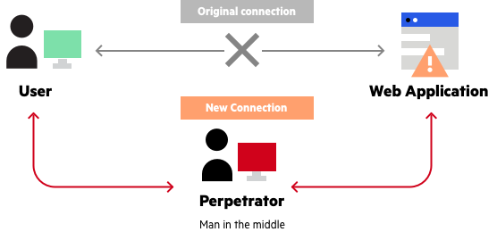
     
     - assume adversaries have NSA(National Security Agency)-sized data centers

2. Secure communication requirements:
   - **Confidentiality:** only the sender and the intended receiver can understand the message
   - **Message Integrity**: the message between the sender and the receiver should not be altered in transit, either maliciously or by accident
   - **End-point Authentication**: both the sender and the receiver can verify the identity of the other party involved in the communication
   - **Non-repudiation**: the assurance that someone cannot deny the validity of something. For example, if I receive a message from you, you cannot say this is not from you.

3. Cryptographic Components

   - plaintext: original message
   - cyphertext: encrypted message
   - Keys:
     - Shared secrete key (**symmetric cryptography**): K<sub>A</sub> == K<sub>B</sub> and are secret
     - Public key  (**asymmetric cryptography**): parties have a public key (everyone knows) and a secret key (only Alice and Bob knows)
     - Symmetric crypto is usually faster than asymmetric crypto, so in practice we often use a combination of both //TODO what's the advantages of public key crypto?

   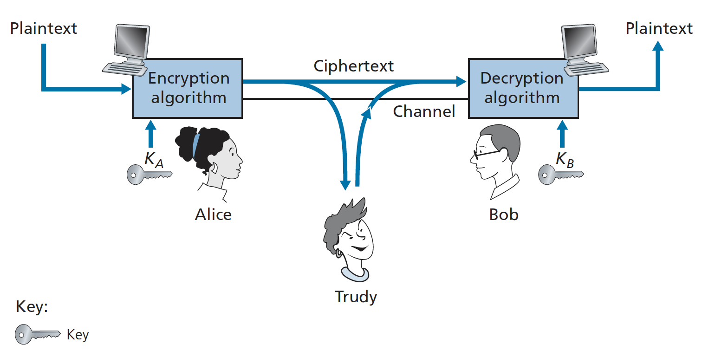

## Cryptography Building Blocks

1. Requirements for builidng blocks:
   - deterministic: a plaintext can generate only one cyphertext
   - Reversible: we can decrypt cyphertext to the plaintext
   - Efficient to compute
2. Common building blocks:
   - **substitution**: replace each byte with a different byte
     - **Caeser Cypher** crypto system: each alpha letter is rotated by an offset, e.g., a -> d, b -> e, ...
       - for example, "DSZQUP SVMFT" -> "CRYPTO RULES", for which the key is the offset 1
       - symmetric algorithm:
         - Encrypt: CC(plaintext, key)
         - Decrypt: CC(cyphertext, -key)
   - **permutation**: shifting things around
     - pig latin: move the consonant clusters to the end and add "ay", e.g., "CRYPTO RULES" -> "YPTOCRAY ULESRAY"
   - **XOR**: bitwise exclusive or. XOR and plus are similar, but XOR is slightly nicer because plus need to deal with carrying / borrowing bits
     - important applications of XOR:
       - a ^ b ^ b = a
       - x ^ 0 = x
3. Downsides of the above building blocks:
   - Substitution: easy to decode. Since substitution is used for bytes, there are only 2<sup>8</sup> possible keys. We can use brute force or statistical analysis to find the key.
   - Permutations: [ref](https://en.wikibooks.org/wiki/Cryptography/Permutation_cipher)
     - the plaintext may have to be padded (e.g., -ay in pig latin) (if the padding is identifiable then part of the key is revealed)
     - information related to the length of the key is revealed by the length of the ciphertext.

## Types of Attack

A cryptosystem is secure if attacks can only use brute force to do key guessing.

1. **Cyphertext Only**: the attacker has access to only the intercepted cyphertext.
   - For example, the statistical analysis can help in a cypiertext-only attack for Ceaser Cypher
2. **Known Plaintext**: the attacker knows some of the cyphertext & plaintext pairs
3. **Chosen Plaintext**: the attacker can choose plaintexts and view their corresponding cyphertext. For example, the attacker might try encrpting messages `000000` and `000001`. If the output cyphertexts are very similar, the attacker can know something about the key from the difference.
4. Cyphertext should:
   - appear random: avoid cyphertext-only and known-plaintext attacks
   - small changes to input should result in large changes to cyphertext ("Avalanche effect"): avoid chosen plaintext 
   - possible combining 3 different building blocks in various orders

# 2 Symmetric Cyptography

## Block Cypher

In a block cypher （分组加密）, the message to be encrypted is processed in blocks of `k` bits. Say, if k = 64, the message will be broken into 64-bit blocks and each block will be encrypted independently. 

1. usually the cyphertext and plaintext are the same size

   - if cyphertext < plaintext, this algorithm is not reversible because not each input can have a unique output

   - in theory, cyphytext can be bigger than plaintext, but we never see such algorithms

2. The block cypher's security depends on the key size and the block size. 

   - For a n-bit key size, there are 2<sup>n</sup> possibible keys. The attacker has to guess at least 50% of possibilities, which is  2<sup>n-1</sup> before they get the correct answer. The bigger the key size is, the more difficult it is to decode the message.
   - For a n-bit block size, there are 2<sup>n</sup> possible inputs and 2<sup>n</sup>! permutations (one-to-one mappings).  Say, if the block size is 2 bits. There are only 4 possible inputs and 4!=24 possible mappings. Therefore, if the block size is too small, the attacker don't even need to guess the key, they just use brute force to guess the mapping.

In theory, we can use only substitutions to implement a "perfect" block cypher. To explain, we can map each possible input to a output, and the values are chosen randomly. However, this requires the sender and the receiver to maintain a hash table, which can be huge. For example, for a 64-bit block, there are 2<sup>64</sup> 8-byte entries in the table, which is 2<sup>34</sup> GB. Apparently this is infeasible.

Instread, the block cypher use functions to simulate randomly permuted tables.

### DES (Data Encryption Standard)

DES is old and broken. 64-bit block size, 56-bit key size (too small for the modern computing).

DES is a type of **Feistel Network**. 

For encryption:

- A n-bit palintext is split into left and right halfves, each are n/2 bits.

- The network operated in a series of rounds. Each round use a different **round key** and the same **mangler function**. The mangler function is not reversible. For i-th round, L<sub>i</sub> = R<sub>i-1</sub>, and R<sub>i</sub> = L<sub>i-1</sub> ⊕ F(K<sub>i-1</sub>, R<sub>i-1</sub>)

  - > The purpose of the rounds is to make each input bit affect most (if not all) of the final output bits. (If only one round were used, a given input bit would affect only 8 of the 64 output bits.)

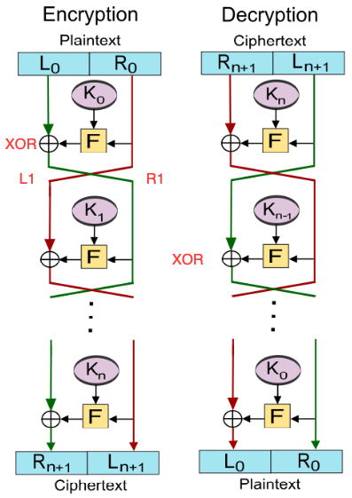

For decryption, we just need to all operations in reverse order.

advantages:

- mangler functions are non-invertible, but the whole scheme is invertible

downsides: 

- requires operations like bit swapping, which is easy in hardware implementation but inefficient in software. so this scheme is not efficient in software
- 56 bits are too small for a key

// Q: are round keys totally different and 互不关联？还是说K1依靠于K0生成？

### 3DES

Since DES's key size is too small, we can do DES three times: E(D(E(m, k1), k2), k3), each time use a different key.

Advantages:

- triple the key length
- using an existing cypher

Drawbacks: 

- triple the processing time
- subject to MITM attack ([ref](https://sandilands.info/crypto/EncryptionandAttacks.html#x15-700007.3))

### AES (Advanced Encryption Standard)

new, good

1. features:

   - 128 block size (variabale)

   - Key size: 128, 192, or 256. bigger key size -> more rounds

   - efficient in software

2. Operations: (all are reversible)

   - sub bytes: b[i] = table[b[i]]. can use hash table or **inverse table**

   - Shift rows: rotate row i left by i columns (so row 0 won't move, row 1 move left by 1 column, row 2 move left by 2 columns, ...)

   - mix columns 

     ```
     for each column:
     	for each row:
     		look up column for byte[row][col]
     		rotate that result so it's top in the current row (// TODO how to rotate?)
     	xor all the looked-up columns together
     ```
   
   - Add rounkey key: xor with the round key

# 3 Stream Cypher

Main idea: generate a **keystream** (pseudo random bits) and XOR with the plaintext byte by byte. This requires us to implement a good pseduo random number generator. 

- Encryption: plaintext xor key
- Decryption: cyphertext xor key

## CSPRNG

Cryptographically Secure Pseudo Random Number Generator

Requirement: If the attacker sees k bits of output, they can't predict next bit.

**Properties we want for CSPRNG:**

- The secrete internal states should be complicated enough so that the output won't reveal it
- If the internal state is revealed, you can't figure out previous outputs
- Maxize the "**period**" as long as possible before getting a duplicate internal state
  - The length of the PRNG sequence before it repeats is called its **period**


## RC4 Algorithm

RC - Ron's Code. RC4 is broken. Don't use it in practice! (expected period = 10 ** 100)

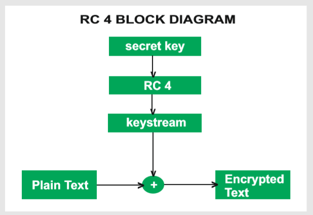

1. Initialize internal state: create a 1 * 255 array with values ranges from 0 - 255 in order

   ```c++
   		std::array<uint8_t, 256> state{};
       for (int i = 0; i < 256; i++) {
           state[i] = i;
       }
   ```

2. Key Scheduling Algorithm: use the secrete key to rearrange the array

   ```c++
   		int j = 0;
       for (int i = 0; i < 256; i++) {
           j = (j + state[i] + key[i % key.size()]) % 256;
           std::swap(state[i], state[j]);
       }
   ```

3. PRGA(Pseudo Random Generation Algorithm) -- generate the keystream

   ```c++
   		int i = 0, j = 0;
       while (true) {
         	i = (i + 1) % 256;
           j = (j + state[i]) % 256;
           std::swap(state[i], state[j]);
           uint8_t output = state[(state[i] + state[j]) % 256]; // this is the next byte of the keystream
       }
   ```

Advantages:

- easy to implement, fast to compute, at the same time has good quality

Drawbacks:

- the first few bytes generated from PRGA are not very random, which might leak some inforamtion of the key

## ChaCha20

ChaCha20 is the most popular stream cypher algorithm now. It takes in three parameters: key, stream position, nonce (number used once. Nonce is not secrete, but helps avoid accidental stream reuse) and use operations like add, xor, and rotate.

## Bit Flipping Attacks

The attacker can change the cyphertext which will result in a predictable change of the plaintext, although the attacker is not able to learn the plaintext itself. The attack is especially dangerous when the attacker knows the format of the message. In such a situation, the attacker can turn it into a similar message but one in which some important information is altered.

If the attacker knows part of the plaintext, they can easily modify the cyphertext and trick the receiver.

- Alice -> Bob: C = M xor K
- Attacker intercepts the message M, forges a fake message M' and compute X = M xor M'
- Attacker intercepts the cyphertext, and send to Bob: C' = C xor X 
- Bob decrypts the message:  C' xor K = M xor K xor M xor M' xor K = M'

The receiver gets a modified message!

## Summary

1. RC4 is confidential but can't guarantee data integrity. 

2. stream cypher vs. block cypher:
   - stream cypher & bloc cypher are both confidential
   - block cypher has beeter data integrity. If one bit is changed in the cyphertext, the plaintext decrypted will by huge different, which is easier to detect.

# 4 Cryptographic Hashing

## Intro to Crypto Hash

1. What's Hash function useful for?
   - verify data integrity (checksum): The sender sends you the message and its hash value. After receiving the message, you can compute its hash value and compare it with the expected value. If they are the same, your data is not modified by the attacker.
   - Authentication: salt hash
   - a short way of referring to an object
   - generating unique names: git use this to name commits
2. Properties of Crypto Hash Functions:
   - Collision resistant: 
     - attackers cannot find 2 messages that hash to the same value
     - attackers know the hash value but still cannot know anything about the key
   - irreversible
   - output should appear random
   - avalanche effect: any changes to a message will cause a big change in hash
3. **Collision Attacks**: try to find two different inputs producing the same hash value
   - **Chosen Prefix Collision Attack**: Given two different prefixes *p*1 and *p*2, find two appendages *m*1 and *m*2 such that *hash*(*p*1 ∥ *m*1) = *hash*(*p*2 ∥ *m*2), where ∥ denotes the concatenation operation.
4. **Collision Avoidance**
   - "Birthday Paradox": With a group of 23 people, there is a 50% chance that two share a birthday. When the number of people is increased to 80, the odds jump to a staggering 99.98%!
   - for a b-bit key, there are 2<sup>b</sup> possible hashes. To get a 50% chance to make a collision, there should be at least 2<sup>b/2</sup> hashes. Therefore, increase the key size can decrease the collision rate.

## Common Crypto Hash Functions

1. Merkle Damgard Hash Functions

   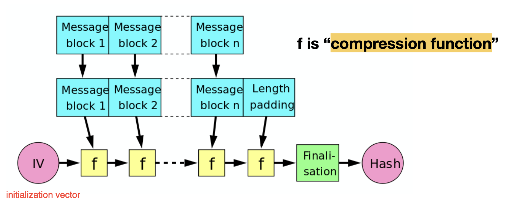

2. Hash functions:
   - MD5: broken
   - SHA-1: 128-bit key
   - SHA-2: similar to SHA-1, but use long key size, which is 256 or 512 bits
   - SHA-3's design are totally different from SHA-2. So if there's an attack on SHA-2,  it won't work on SHA-3
   - Blake: the best hash function so far

## HMAC(Hash Message Authentication Code)

1. Message Integrity Checking. 

   - If the attacker knows the message and the hash algorithm, they can reproduce the hash value of the message and send it to the receiver. This will cause the problem of confidentiality.
   - To avoid this problem, we'll add an authentication code to the message. We just hash the message with a secrete key. The attacker doesn't know the key, so they can't forge the message.H(message | key) --> HMAC algorithm
2. HMAC algorithm:

   - compute H(K |H(K|M)) (| means concatenantion, K is the secret key)
   - H(K|M) or H(K|M | K) is not secure
3. To perform the message integrity:
   - Alice computes H(K + H(K + M)) (HMAC)
   - Alice apppend HMAC to the message (K xor M, HMAC)
   - Bob receives the message, decrypts it as M', and calculate HMAC . If they are equal, then Bob concludes everything is fine. 

## Salted Hash -- Storing passwords

Main idea: compute Hash(password + salt) for 40k+ times

- the salt value is random, whcih means that each user has a different salt 
- the server only stores the username, salt, and the hash of each user. (Password is not stored!!!)
- when a user logs in, the server computes the hash of their password + salt, and compares it with the stored hash. If they are equal, then the user logs in successfully. 

The properties for the hash function:

- the hash function should be slow for password, so it would take attackers longer time to crack it
- the hash function should work well on CPU but bad on GPU

A common algorithm for this is BCrypt.

# 5 Public key (Asymmetric) Crypto

The **symmetric cryptography** requires a shared secrete key between the sender and the receiver. But sharing the key itself requires secure communication. To solve this problem, the **public key cryptography** makes it possible to transmit encrypted messages without distributing any secrete keys. And this system can also be used for authentication and digital signature.

## Main Idea

If Alice wants to send a message to Bob:

1. Alice encrypts the message with Bob's public key (K<sub>B</sub><sup>+</sup>): K<sub>B</sub><sup>+</sup>(m)
2. Bob decrypts the message with his private key (K<sub>B</sub><sup>-</sup>): K<sub>B</sub><sup>-</sup>(K<sub>B</sub><sup>+</sup>(m)) = m

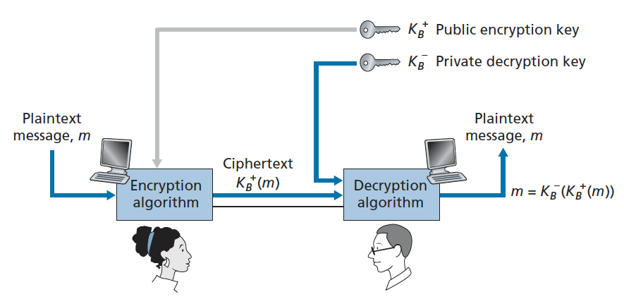

Since anyone can use Bob's public key to send him a encrypted message, a **digital signature** is needed to bind a sender to a message.

## Diffie-Hellman

|       | Secrete Number | Public Key                                     | Private Key                                                  |
| ----- | -------------- | ---------------------------------------------- | ------------------------------------------------------------ |
| Alice | S<sub>A</sub>  | T<sub>A</sub> = g<sup>S<sub>A</sub></sup> % N  | T<sub>B</sub><sup>S<sub>A</sub></sup> =  g<sup>S<sub>A</sub>S<sub>B </sub></sup> % N |
| Bob   | S<sub>B</sub>  | T<sub>B</sub> = g<sup>S<sub>B </sub></sup> % N | T<sub>A</sub><sup>S<sub>B</sub></sup> =  g<sup>S<sub>A</sub>S<sub>B </sub></sup> % N |

Note, g and N are public. A common choice of g is 2.

To decode the private key, we need to solve g<sup>x</sup> % N = T<sub>A</sub>.  With the mod N, this will be really really hard! This is called **discrete logarithm problem** which is impractical to solve for big numbers. (That's why DH generates long keys)

Diffie-Hellman allows the parties to compute the private key without sending the secrete numbers over the network. After each party gets the private key, they switch to symmetric cryptography (like AES) to communicate with that secret key. 

## RSA

RSA is similar to Diffie-Hellman, with the equation that m<sup>ed</sup> % N = m, for which e, d, N are carefully chosen.

1. Generate public and private RSA keys:
   - Pick 2 big prime numbers `p` and `q`. The larger the values, the more difficult it is to break the RSA, but the longer it takes to perform the encoding and decoding.
   - Compute `n` = p * q, `z` = (p - 1) * (q - 1)
   - Choose a number `e`: e < n && e and z has no common factors (e and z are relatively prime)
   - Choose a number `d`: e * d % z = 1
   - `<e, n>` is public key, `<d, n>` is private key
2. If Alice wants to send a message (`m` in bit pattern, which is smaller than `n`) to Bob:
   - Alice encrypts the message: C = m<sup>e</sup> % n
   - Bob decrypts the cyphertext: C<sup>d</sup> % n = m<sup>de</sup> % n = m,

3. Signatures with RSA
   - you sign the message with your private key: s = m<sup>d</sup> % n
   - people verify the message with your public key: m = s<sup>e</sup> =  m<sup>de</sup> % n. They will get the original message if the signature is valid! 

The security of RSA lies in the fact that there's no algorithms for quickly factoring a number, in this case `n`, into primes `p` and `q`. This is called **prime factoration** problem. If one knew `p` and `q`, and given the public key `e`, they could easily compute the secrete key `d`.

Summary:

- encrypt with public key: encryption
- encrypt with private key: signature

## Fast Exponentiation

The public key cryptography depends on our ability to quickly compute x<sup>n</sup> % m, with n and m as big prime numbers. 

Say, the exponent is 32 = 0b 100011 = 2^5 + 2 ^ 1 + 2 ^ 0. Then x<sup>32</sup> = x<sup>2^5</sup> * x<sup> 2 ^ 1</sup> * x <sup>2 ^ 0</sup> % m. We only need 3 modulo multiplications to get the result.

```java
// compute x ^ n % m
public static int fastExponentiation(int x, int n, int m) {
  int res = 1;
  while (n > 0) {
    if ((n & 1) == 1) {
      res = res * x % m;
    }
    n >>= 1;
    x = x * x % m;
  }
  return res;
}
```

## Elliptic Curve

Elliptic curve is a way to generate private and public keys. It can generate much shorter keys which are slightly more difficult to be decoded than the descrete logarithm problem. ref: https://www.youtube.com/watch?v=NF1pwjL9-DE

In Diffie-Hellman, the private key is g<sup>x</sup> % N, while in Elliptic Curve Cryptography, the private key is e * g. The curve has 2 properties: given g an e * g (g is a point, e is an integer), it's super hard to figure out e. (Why??? it seems like just a simple math.)

## Signed Certificate

A biggest problem in the public key cryptography is that everybody can use your public key to send you messages. For example, in Diffie Hellmen, Trudy can trick Alice and Bob with Trudy's own public key. Alice/Bob assumes it's Bob/Alice's public key, so they will establish shared secret keys with Trudy.  

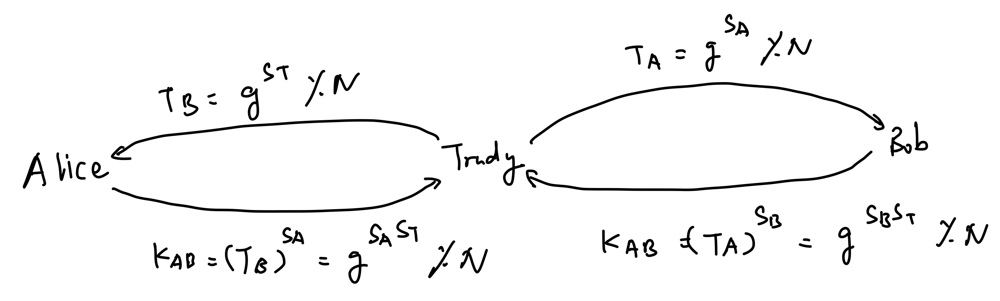

To avoid this problem, we should use **public key certificate** to verify that a public key belongs to a specific entity. **Certification Authorities (CA)** can verify the identity and issue certificates.

Selected fields in a certificate:


trust store: set of certificates that we trust without further authentication

# Summary

| Crypto Scheme     | Purpose                                                      |
| ----------------- | ------------------------------------------------------------ |
| Block Cypher      | Encrypt messages with the blocksize (not exactly)            |
| Stream Cypher     | Encrypt messages with any sizes                              |
| Crptographic Hash | Guarantee message integrity (HMAC); user authentication (salted hash) |
| Diffie Hellmen    | generate secret key                                          |
| RSA               | signature, encryption                                        |

# 6 Block Cypehr Modes of Operation

The way we use block cypher to send long message is known as its "mode of operation".

1. Electronic Code Book (ECB) Mode: 

   - encrypt each block with the same key

   - pros: efficient
   - cons: 
     - plaintext and cyphertext are deterministic -> vulnerable for konwn-plaintext attack
     - the attacker can rearrange (move, delete) the cyphertext to modify the message -> vulnerable for **block arrangement attack**

   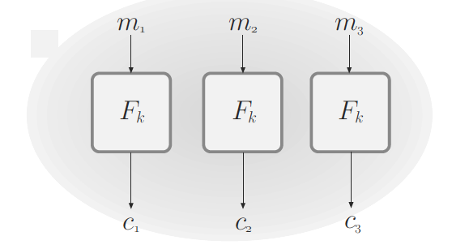

2. Cypher Block Chaining Mode: 

   - xor the first message with a random block (the initialization vector), and encrypt other blocks with the previous cyphertext

   - Pros:
     - susceptible to bit flipping attack: can detect bit flipping attacks because in a certain round the decrypted text would be garbage
   - cons: 
     - must encrypt the message consequentially (in order)


   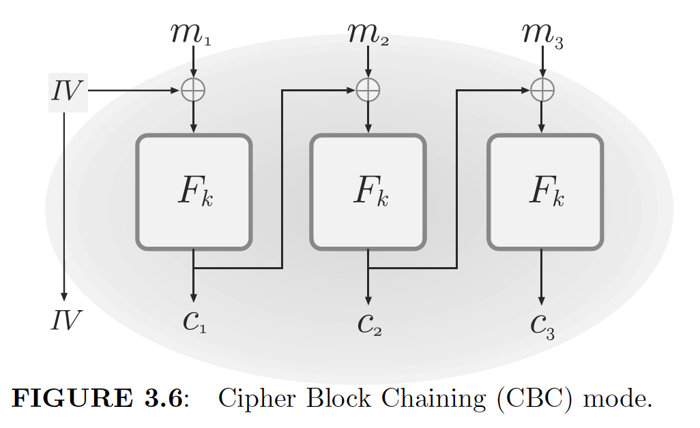

3. Output Feedback (OFB) Mode

   - Generate keystream in each block and xor with plaintext. This mode turns block cypher into stream cypher (unsyncrhonized stream cypher), and has many advantages:
     - 1) F doesn't need to be invertible, since xor itself is invertible. 
       2) the message doesn't need to be the multiple of block size 

   - Cons: 
     - must be done sequentially (but the computation of the keystream can be done independently from the message encryption)


   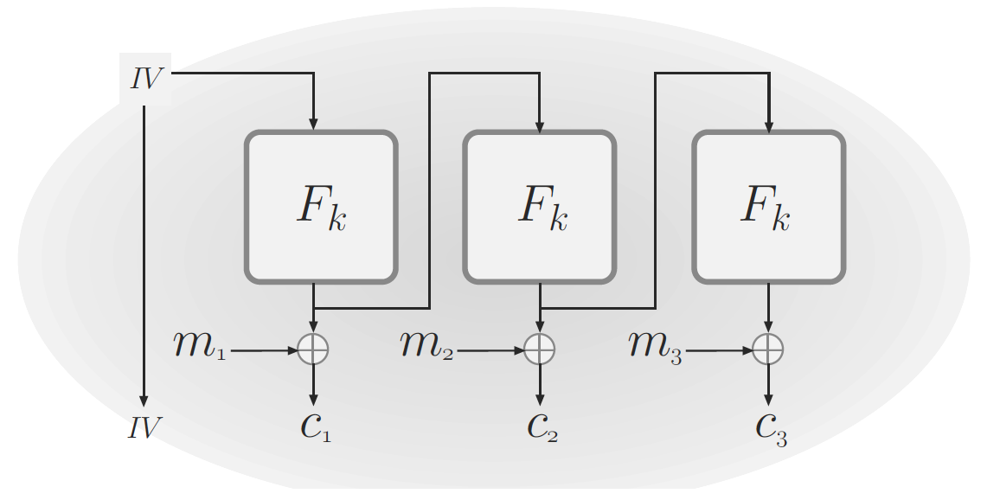

4. Counter (CTR) Mode

   - cons: each block can be done in parallel

   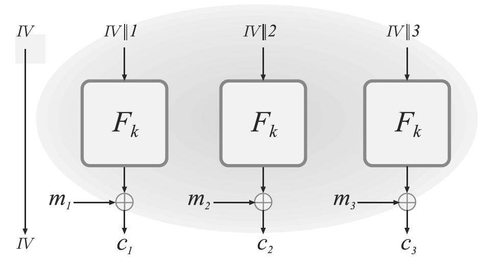

5. Galois Counter Mode (GCM): most popular operations. 
   -  GCM can be viewed as **encrypt-then-authenticate** paradigm, with CTR as the underlying encryption scheme and GMAC as the underlying message authentication code (GCM = CTR + GMAC)
   - One thing to notice for this mode is that if the IV repeats, the integrity of the scheme might be completely broken. So never repeat the IV!

# 7 Authentication Protocols

## Shared secret based protocols

How can Bob verify the sender is Alice? (how to challenge A)

1. P1

   - A -> B: I am Alice. 
   - B -> A: a randome number R
   - A -> B: f(R, key) (f can be a hash function like HMAC)
   - Issues:
     - Alice doesn't know whether she's actually talking to Bob. Trudy can pretend to be Bob and talk to Alice. (need authentication for Bob)
     - Trudy can intercept the message from Alice, save R and f(R, key), then offline guesses key

2. P2, a minor tweak

   - A -> B: 
   - B -> A: f(R, key)
   - A decrypt R and send back to B
   - Attacks: Now Alice is pretty sure she's talking to Bob, but
     - If there's some structure to R, Trudy can pretend to be Alice, get f(R, key)  from Bob and guess the key offline
     - If R has no structure, Trudy can evasdrop from Alice to get R

3. Using a timestamp

   - A -> B: I am Alice + f(time, key)
   - Bob will decrypt the the message and make sure he got a recent timestamp
   - Attacks:
     - the Trudy can intercept the message and send it to other server since the timestamp is still valid

4. public key crypto:

      - first method: signature

        - A -> B: I am Alice

        - B -> A: a randome number

        - A -> B: sign(R) with Alice's private key

        - issues: Alice can sign any message from Bob, even like "I hearby agree to give Bob all my money"

      - second method:

        - A -> B: I am Alice
        - B -> A: encrypt(R, Alice's public key)
        - A decrypt the message and sends R back
        - issues: Alice is decrypting anything she's given

5. Mutual Authentication with shared secrets

      - method 1: F is  HMAC or encrypt:

        - A -> B: I am Alice

        - B -> A: R1

        - A -> B: f(R1, Kab), R2

        - B -> A: f(R2, Kab)

      - method 2: cut down the message from 4 to 3 (nog good)

        - A send R2 in the first message

        - issues:

          - Refraction Attack: Trudy fakes that they are Alice and send a message to Bob. To pass the challenge, Trudy will send a second message with the random number then they can get the answer from Bob.
          
            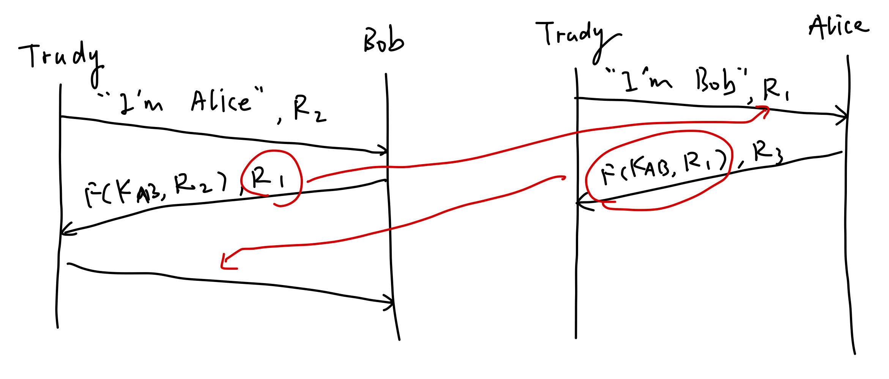
          
          - Trudy can collect plaintext/encrypted pair (R, F(Kab, R)) from Bob and guess the key offline
        

6. Mutual authentication with public keys: avoids refraction attack since they use different public keys
   - A -> B: I am Alice, encrypt(R2, Bob's public key )
   - B->A: R2, encrypt(R1, Alice's public key)
   - A->B: R1


