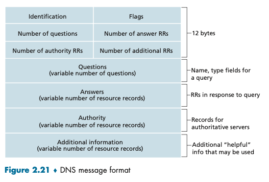
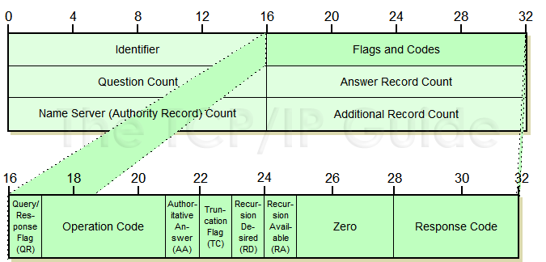
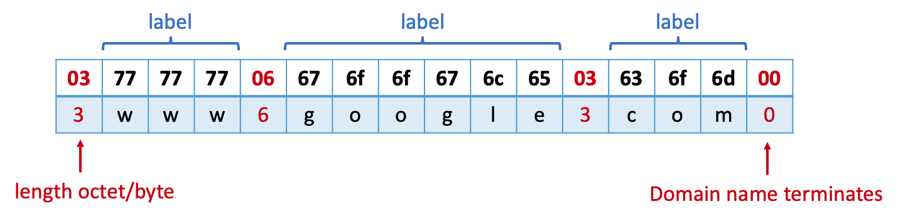
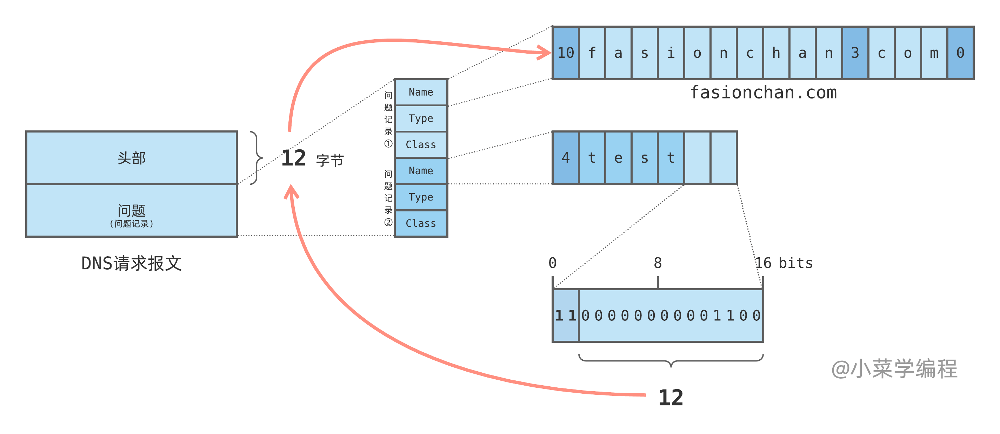

# DNS Protocol

## DNS Message

### Format



A DNS Message can be devided into 5 sections, some of which might be empty:

### Header

The header section is 12 bytes and always present in the message.



1. identifier (2 bytes): a request should have the same ID with it response, e.g., 0x0943

2. flags (2 bytes):

   - first byte:

     - Query/Response flag (QR): 1 bit, 0-query, 1-response

     - OpCode: 4 bits. 0 - standard query, 1- reversed query

     - Authoritive Answer (AA): 1 bit

     - Truncated (TC): 1 bit, if the message is more than 512 bits, it will be truncated

     - Recursion Desired (RD): 1 bit. 1 - Recursive query, 0- iterative query
       - 该位为 1 时，服务器必须处理这个请求：如果服务器没有授权回答，它必须替客户端请求其他 DNS 服务器，这也是所谓的 **递归查询** ；
       - 该位为 0 时，如果服务器没有授权回答，它就返回一个能够处理该查询的服务器列表给客户端，由客户端自己进行 **迭代查询** ；

   - second byte:

     - Recursion Available (RA): 1 bit
     - Reserver Bit (Z): 3 bits, should be 0
       - Note, in new DNS protocol, this is 1 bit, and the rest 3 bits are used for other flags. You can check this in Wireshark
     - Response Code (RCode): 4 bits. 0 - No error, 3 - name error. This is set as a part of response

3. question count (2 bytes): the number of questions

4. answer record count (2 bytes)

5. authority record count (2 bytes)

6. additional record count (2 bytes)

### Questions

1. For each question, they have 3 parts:

   - Question name (QName): QName is a domain name represented as a sequence of labels, where each label consists of a **length octet** followed by that number of octets. The length octet ranges from 0 ~ 63, because the maximum length of each label is 63. The domain name terminates with a zero length octet (0x00) for the null label of the root. For example:

     

   - Question type (QType): 2 bytes

   - Question class (QClass): 2 bytes

### Record

Answers, authority, and additional information are all included in resource record (RR). They all share the same format. Each resource record has the following 6 parts:

- name: a domain name to which this resource record pertains
- type: 2 bytes.
- class: 2 bytes
- TTL: unsigned 4-byte int, which is the time interval in seconds that the resource record can be cached before the source of the information could be again consulted
- rdlength: unsigned 2-byte integer which specifies the length of RData in bytes
- RData: a string of bytes that describes the resource. The format of this information depends on the type and class. For example, for the type A and calls IN, RData is an iPv4 address

### Message Compression

If a domain name appears more than once in a message, the entire domain name or a list of lables at the end of the domain name is replaced with a pointer to a prior occurence of the same name. The pointer is 2 byte. The first two bits are `0b11`, the rest bits are the offset.

```
    +--+--+--+--+--+--+--+--+--+--+--+--+--+--+--+--+
    | 1  1|                OFFSET                   |
    +--+--+--+--+--+--+--+--+--+--+--+--+--+--+--+--+
```

For example, a request has 2 questions: `fasionchan.com`, `test.fasionchan.com`. They have common lables `fasionchan.com`. For `fasionchan.com`, we can store the whole string, but for `test.fasionchan.com`, we only need to store `test`, then use a pointer to point to the first string. (the offset starts from the first byte of the message)

