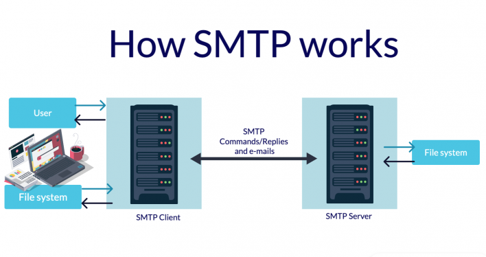
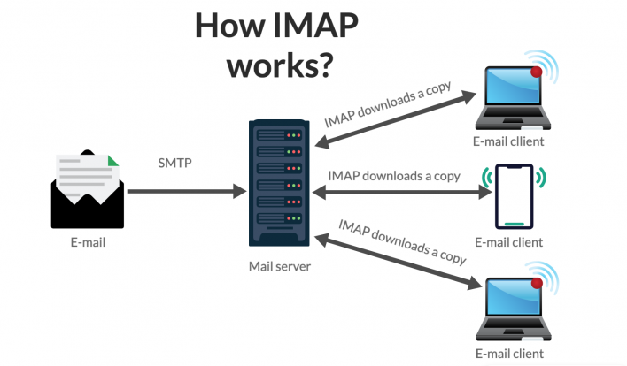
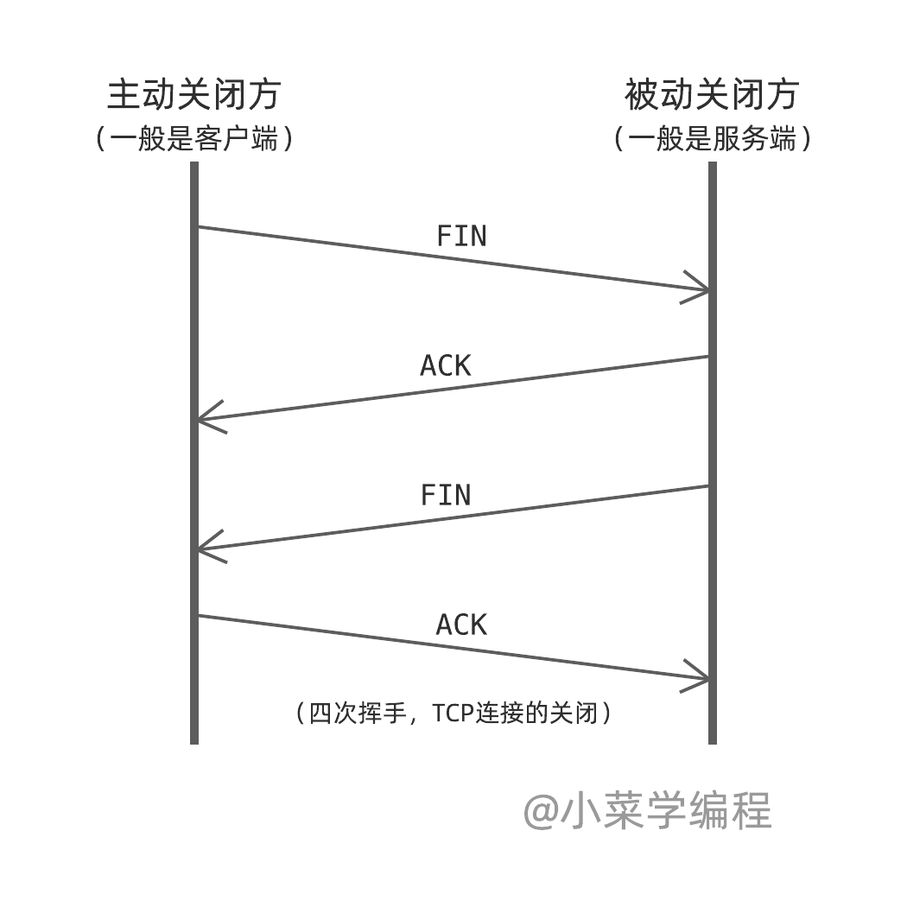

# 1 Intro

Course overview:
- Networking
- Cryptography
- Computer Security

## The Internet

the Internet: connect hosts and transmit data

- hosts: endpoint devices that want to exchange data. Clients and servers are both hosts.
- access network: a small network with many hosts. e.g., UConnect, Google Fiber, Xfinity
- internet backbone: networks with many high-capacity fiber optic links that can carry huge amounts of traffic, e.g., AT&T, T-mobile

## Switching

- circuit switching: reserve a line between people who are calling. This is wasteful if you don't speak for the whole duration of the call. 

  - Computer communication is bursty, which is not suitable for circuit switching.

- **packet switching:** Data is split into packets. Instead of reserving a path from host to host, at each **hop** along the path, the packet is forward to the next hop.

  - Packet: header + payload
  - voice phone calls use packet switching!

  

## Network Layers

From top to bottom, the network layers and corresponding protocols:

1. **Application Layer**: how applications parse the data
   - HTTP protocol: web page. a type of client-server protocol
   - SATP protocol: email
   - DNS: turn human-readable domain names to numeric numbers
2. **Transport Layer**: process to process communication (port)
   - TCP - Transmission Control Protocol: gurantees your will receive all data because it will resend lost packages
     - stream-based, reliable data transfer
   - UDP - User Datagraph Protocol: cannot gurantee you receive all data
     - IP packets + port numbers
3. **Network Layer**: host to host communication (IP) (multiple-hop communication)
   - IP protocol
4. Link Layer: one-hop communication, e.g. Wifi, Ethernet
   - breaks up packets into frames and sends them from source to destination
5. Physical Layer: mechanism for one hop communication, e.g., electrocal/optical/eletromagnetic wave stuff

"Programmers work in the application layer, have to make choices about the transport layer, and have to understand what goes wrong in the network layer."

# 2 Delays

## Four Common Delays

1. **Propogation Delay**: the time physical signal takes to travel between hops

   - depends on the distance and the speed of the connection (radio, fiber optics > electrical signal)

   - `propogation_delay = scale * distance / speed_of_light`
     - the type of the connection will influence the scale

2. **Processing Delay**: the time devices spend on examining packets (often just read the header)

   - processing delay is usually in the order of nanoseconds, which is constant and negligible

3. **Transmission Delay**: the time to convert packets from bits to physical signals. This depends on devices.

   - the devices are rated by their transmission delay, e.g., 1 Gbps ethernet device, 54 Mbps wireless device
   - `transmission_delay = data_length / device_transmission_rate`

4. **Queuing Delay**: the time that packets are stored in the queue. The queue is fix-sized. If the queue is full, the packets outside of the queue will be dropped. 
   - Queueing delay depends on how busy the network is. So queueing delay is very unpredictable and variable.
   
   - `traffic_intensity (TI) = incoming_data_rate * avg_size / transmission_rate`
   - we should keep TI < 1

## Measuring Delays

1. It's hard to measure the time from host1 to host2, because we will get delays to get the timestamp. But we can measure the time on the same host -- **Round Trip Time** (RTT)
   - RTT = 2 processing delays (~0) + 2 * (4 delays for each hop)

2. Queuing delay: test RTT for the packets of the same size between the same hops; the variability should be due to queueing delay (but probably they go different paths). 

   - For example, send 5 packets of the size 500 bytes from hop A to hop B. The time is 10 ms, 2.8 ms, 2.4 ms, 4 ms, and 5.5 ms (Note that this would be a difficult measurement to actually perform!). Assuming that the samllest time has no queuing delay, then the queuing delay for each packet is: 7.6 ms, 0.4 ms, 0 ms, 1.6 ms, 3.1 ms. Then the average queuing delay is 2.54ms.

3. Propagation delay: we can estimate propagation delay based on distance, but we don't actually calculate it directly. 

4. Transmission delay: Vary packet sizes and test RTT of each size for multiple times. The difference in the smllest time should be due to transmission delay.

   - For example:

     - 500-byte packets: 10 ms, 2.8 ms, 2.4 ms, 4 ms, and 5.5 ms
     - 1000-byte packets: 11.0 ms, 10 ms, 2.8 ms, 3.0 ms, and 5.5 ms

   - the smallest time has only transmission delay and propagation delay
     $$
     2.4 = 500 / transmission\_rate + propagation\_delay\\
     2.8 = 1000 / transmission\_rate + propagation\_delay
     $$

   - we can get: 
     $$
     transmission\_rate = 1250\ bytes/ms\\
     propagation\_delay= 2\ ms
     $$

   - Therefore, the transmission delay for 600-byte packets is 600 / 1250 = 0.48 ms, propagation delay is 2 ms.

## traceroute

Each packet has a "time to lie (TTL)" packet which specifys the number of hops it is allowed to travel. Many devices send a response when TTL gets 0.

- `traceroute`: sends packet with increasing TTL values and measure the RTT of any packet that gets a response

## Throughput

- Throughput: the amount of data (bits/s) that can be transmitted etween hosts
- bottleneck node: the minimum throughput device on a path

for example, if i send data from my laptop through my wifi to google server, the bottleneck node is highly propably my own wifi.The internet backbone usually has a big capacity so is rarely a bottleneck.

a bottleneck node is usually the access network.

# 3 Application Layer

homework: write a DNS server

Q: TCP - stream?

## Application Layer

1. Application layer is the highest layer, but it need to interace with lower layers:

   - get IP address from network layer

   - get port number (part of TCP/UDP) from transport layer

2. Application protocol designer should decide which transport layer protocols (TCP/UDP) to use based on the following needs:

   - reliable data transfer: all sent data need to be received in order, but potentially slow
   - latency: data need to be received in a certain time window
   - data rate

   TCP is reliable, UDP is fast. Streaming applications are more likely to use UDP.

3. Application Topology:

   - client/server model (most commonly used):
     - HTTP, web socket
   - peer to peer model: programs behaves as both clients and clients at various times. e.g., BitTorrent
     - Disadvantages: 
       - can be very slow if multiple computers access to the same computer
       - limited security (viruses, file security)
     - Advantages:
       - P2P networks operate without an expensive network
       - P2P networks usually have less network traffic than a client/server network

## Application Layer Protocols

### HTTP protocol

- use TCP
- Text based: is easier to read, write, and debug but has bigger size
- One-shot request/response model: Request -> response -> done
- Content Length header (content-length): the size of the body in bytes
- special characters: \r\n, ' ' (empty space), : (colon)

### [protocols for email](https://www.siteground.com/tutorials/email/protocols-pop3-smtp-imap/)

1. SMTP (Simple Mail Transfer Protocol): sending email

     - text-based, TCP-base

     - how SMTP works: laptop -> utah.edu email server (SMTP client) ->  (use SMTP to push emails to) gmail (SMTP Server) 
     
     

2. IMAP (internet message access protocol) /POP (post office protocol): receiving email

     - IMAP is text-based.
     
     -  both are TCP based
     
     - how IMAP works:
     
       

3. Your email server has to understand both SMTP and POP or IMAP to allow users to send and receive emails.

### BitTorrent

- a P2P protocol, used for sharing large files
- How to find peers? 
  - Originally, trackers servers track who are sharing the data via HTTP
  - Now, use a distrbuted hash table. You just need to know about one of your connected peer to bootsrap your peers list.
- originally used TCP, but now switch to UDP (uTP - UDP Torrent Protocol)

### DNS 

1. DNS (domain name system)

   - tanslate a domain name to an IP address: e.g., cs.utah.edu -> 155.22.17. 21 (iPv4)
   
   
      - binary protocol: for quick machine processing, reducing packet size
   
   
      - use UDP: because IP address is so small that both request and response can fit in one single packet
   

2. DNS system

   - a DNS server is called "**resolver**" and clients send queries to the resolver
   
   
      - How to respond to quries:
   
        - cached answer: respond the queries with answers in **cache** with the cached values
        - recursive query: ask another resolver for the answer
        - iterative query: find th answer themselves
          - e.g., for the address "shell.cs.utah.edu" (`.edu` is a top level domain)
            - ask a **root server** "where can I find DNS servers for .edu domains"
            - ask a .edu DNS server for the authorative server for `utah.edu` domains
            - keep asking the authorative servers for more specific subdomains until we get the answer
      - dig: DNS lookup utility
   
        - `dig +trace domain_name`
   - Adding the +trace option instructs dig to resolve the query from the root nameservers downwards and to report the results from each query step. Thus dig will only use the default or explicitly specified nameserver for the initial discovery of the root nameservers.
   
3. DNS query types:
   
      - Type A: “give me the IP for a hostname” - hostname
      - Type NS: “give mt the nameserver responsible for this hostname”
      - Type CNAME: “give me the 'canonical name 规范名称' of a hostname” which would tell you that google.com is really row3.rack2.lax02.westcoast.google.com
      - Type MX: “tell me the canonical name of the email server for this domain” - mail server

# 4 Transport Layer

## Reliable Data Transfer

In this part, we'll talk about how to build a reliable protocol on top of a unreliable network channel. (The data transmission in network layer is unreliable. 数据丢了就丢了)

process to process communication; use protocols TCP/UDP

1. port
   - usualy uint_16 (0 ~ 216 - 1 = 65535)
   - ports < 1024 are priviledged
   - Servers choose port number
   - clients are assigned an ephemeral port number ( a big number)
2. TCP/UDP
   - TCP: src & dest IP, src & dest port
   - UDP: only has dest IP & port, applications have to track src IP & port (我的理解正确吗？), and the app can receive from any sender
     - one socket for all senders???
   
   > A UDP listener listens for segments destined for a given port. Any segment from any sender is acceptable. In order to know who to reply to, the segment contains the source IP/port as well.
   >
   > For TCP, there is a persistent connection between endpoints. A TCP socket will only receive messages from the sender who initated the connection. As programmers, this means that if we use TCP, we don't have to manually think about which clients we're getting messages from. One socket is connected to one client.
3. Reliable Data Transfer
   - possible problems:
     - packets are corrupted
     - packets are not in order
     - packets are dropped
4. finite state machine (review lecture video & notes)
   - sender & receiver
5. checksum
6. sequence number: 
   - an ACK with a wrong sequence number will be treated as a NACK
   - timeout but don't receive ACK -> NACK
     - choose timeout: 1 RTT is the absolute minimum. usually we use this expression to set the timeout: `scale * RTT + std(RTT)`
       - too small: resend packets unnecessarily
       - too big: sender waits too long to resend

7. pipeling
   - Go back N
   - Selective Repeat

TODO: 

1. read: reliable data transfer
2. 3.4.3 GBN

## TCP

### Overview

1. Basic features of TCP:
   - Point to point: host to host
   
   - Full **duplex**: once the connection is established, both sides can send data at any time, even simultaneously
   
     > duplex (in communication system): allowing the transmission of two signals simultaneously in opposite directions.
   
   - conenction oriented: unlike UDP which doesn’t really know or care whether the receiver gets anything, TCP needs to know that the packet was received. It finds out because the receiver sends an Acknowledgement (or ACK) packet.
   
     - stateful? https://en.wikipedia.org/wiki/Connection-oriented_communication // TODo
   
   - reliable data transmission (RDT)
   
   - throttles senders to protect receiver and network
   
2. TCP segments (packet - network layer, frame - UDP, segment - TCP. They basically are the same things.)
   - headers: (in plain text)
     - src/dest ports: 2 bytes each
     
     - sequence number & ACK number: the units are bytes (in UDP, it's packet).  // TODO draw a picture
       
       - sequence number is the last received ACK number
       - ACK number is the number of the next byte that the receiver wants
       - ACK number on one side goes up as we send data
       
       - ACK number on one side goes up as we receive **in-order** data
       - even a message with no data should contain these 2 fields. An empty ACK will have as a sequence number the sequence number for the next byte it would send (but the data will have a length of zero). If a client sends several empty ACKs in a row, they'll all have the same sequence number.
       
     - Flags: `SNC`, `ACK`, `FIN`, `RST` (reset)
     
       - Q: what is RST?
     
     - `rwnd` (receive window): the amount of free space in the receive buffer. `rwnd` limits how fast the sender can send the data
     
       - The `rwnd` increases when the application reads data out of the buffer and decreases when it receives a message.

### Setup + Teardown

1. build connection - TCP handshake - 3 way handshake (TODO 绘图)
   - client: `SYN`, randomly choose a sequence number. e.g. seq=1000, ack=0 (ack number is not set), len=0 (the length of the data)
   - server: `SYN`, `ACK`. randomly choose a sequence number. seq=5000, ack=1001, len = 0
   - client: `ACK`, seq=1001, ack=5001 (may include application data)

2. close connection: `FIN` // TODO draw the picture by myself

   

### Reliable Data Transmission

#### Fast Retransmit

what if sender gets multiple segments with the same ACK number? Indicates a "hole" in the receiver buffer because packets arrives out of order (why ACK would be duplicate? since it based on seq + Len)

fast retransmit: resend packet after 3 duplicate ACKs

https://www.isi.edu/nsnam/DIRECTED_RESEARCH/DR_HYUNAH/D-Research/fast-retransmit.html

#### Delayed ACK

Q: what's the purpose of delayed ACK?

#### Timeouts

Timeout: how long transmitted data may remain unacknowledged before a connection is forcefully closed. 

timeout interval computation:

- estimates RTT with an "**exponentially weighted moving average**", usually alpha is 1/8
  $$
  estimateRTT = (1 - alpha) * estimateRTT + alpha * latestRTT
  $$
  
- also track the variance with an exponentially weighted moving average:
  $$
  estimateVar = (1 - beta) * estimateVar + beta * |packetRTT - estimateRTT|
  $$

- compute the timeout:
  $$
  timeout = estimateRTT + 4 * estimateVar
  $$
  

### Flow Control - receiver protection

slow transmission rate to make sure the receiver buffer will never be overflowed  

if rwnd=0, the sender wil stop sending data. Or the sender can send 1-byte segment to see if the receiver can handle this, so the sender can know the rwnd of the receiver.

> It's likely that the receiver application will eventually read from the buffer, making space for new segments, but it won't send any TCP messages informing the sender!
>
> To combat this, if the rwnd is 0, the sender sends 1 byte messages when it has data to send. Hopefully it will quickly get an ACK with a larger rwnd and can send larger segments right away. If the receiver takes its time, some of these 1-byte segments might get dropped and need to be resent after a timeout.

### Congestion Control - network protection

Flow control prevents one host from overwhelming the other, but it ignores the network. If the network is congested, packets will be delayed or dropped. If hosts just send the data as fast as they can, they will overwhelm the network. Therefore, we need to control the transmission rate based on the network condition, which is called "congestion control".

General principles for congestion control:

- lost packets -> network congestion -> slow down transmission
- ACKed packets -> good network -> speed up transmission

#### Congestion Window (cwnd)

Just like `rwnd` (receive window) limiting the sender's transmission rate, the sender tracks `cwnd` (**congestion window**) to limit how much data can be **in flight** (bytes in flight: the number of bytes that are sent but un-ACKed. Bytes in flight = LastByteSent - LastByteACKed) . 
$$
max(bytes\ in\ flight) = min (rwnd, cwnd)
$$

#### Congestion Control Protocol

A lost packet is detected either when the sender gets 3 duplicate ACKs, or when its timeout fires.

CCP switches among 3 different states based on packets being acknowledge / lost. (This is mechanism implemented in OS kernels.)

 // TODO review the lecture video or the corresponding charpters in the book

1. Slow Start mode
   - in the begining `cwnd`= 1 MSS (max segement size) 
   - Every time we get an ACK, cwnd += MSS // TODO actually it's cwnd * 2?
   - 1, 2, 4, 8, ... (exponentially increace, doubling)
   - but it can't grow forever. Slow start threshold: when `cwnd` > `ssthresh`, transition to congestion avoidance mode
2. Congestion Avoidance mode
   - we are close to the network limit, do no more doubling now
   - `cwnd += 1 MSS`
3. fast recovery: we don't need to dramatically reduce our sending data
   - `cwnd /= 2`
   - get new ACK: swich back to congestion avoidance mode

#### AIMD

AIMD: additive increase, multiplicative decrease

- fair: multiple TCP connections will send at the same rate on average

## TCP problems

1. Ossification: hard to change
2. middle boxes: snoop on TCP ???
3. Streaming: the content of multiiple files are in the same stream. the application need to split them
   - drawbacks: TCP only send full data to the application. So even the received data is fine, the application cannot use it until TCP received all data （我的理解对吗？
4. When I change wifi, my IP and port will change. TCP need to associate with that. The implementation is complicated.
5. handshake hell: tcp handshake -> tls handshake

### QUIC - quick UDP Internet Connections

Google invent QUIC, which  is built on UDP but has TCP's reliable data transfer and flow/congestion control features.

- connection is based on 64-bit connection ID -> no parking-lot problem
- Stream-based
- Handshake is slightly shortened and **reconnection don't need handshake**

# 5 Network Layer

host to host connection

## Destination Based Routing

examine dest IP and see which output link to use

IP address
