# 1 Intro

Course overview:
- Networking
- Cryptography
- Computer Security

## The Internet Topology

the Internet: 

- **hosts**: endpoint devices that want to exchange data. Clients and servers are both hosts.
  - hosts can be any physical device: phone, laptop, desktop, smart fridge, google server... 

- **access network**: a small network with many hosts. e.g., ISP (Xfinity, Google Fiber, ..), a corporate/academic network (UConnect,.. ) 
- **internet backbone**: a network with high-speed, high-capacity links, e.g., AT&T, T-mobile. Access network are connected to internet backbone

## Switching

- circuit switching: reserve a line between people who are calling. This is wasteful if you don't speak for the whole duration of the call. 

  - Computer communication is bursty, which is not suitable for circuit switching.

- **packet switching:** Data is split into packets. Instead of reserving a path from host to host, the packet is forward to the **next hop** at each hop along the path.

  - Packet: header + payload
  - voice phone calls use packet switching

  

## Network Layer Model

From top to bottom, the network layers and corresponding protocols are:

1. **Application Layer**: how applications parse the data. This layer is responsible for providing services to end-users, such as email, web browsing, and file transfer. Its main purpose is to enable communication between applications on different devices, using standard protocols such as HTTP, FTP, and SMTP.
   - HTTP protocol: web page. a type of client-server protocol
   - SMTP protocol: email
   - DNS: turn human-readable domain names to numeric numbers
2. **Transport Layer**: process to process communication (port)
   - TCP (Transmission Control Protocol): gurantees your will receive all data because it will resend lost packages
     - stream-based, reliable data transfer
   - UDP (User Datagraph Protocol): cannot gurantee you receive all data
     - IP packets + port numbers
3. **Network Layer**: host to host communication (IP) (multiple-hop communication)
   - IP protocol: IP networks are often described as **"best-effort" networks** because they deliver every packet as fast as they can but don't guarantee the full packets will be received.
   - DHCP
   - BGP
4. **Link Layer**: one-hop communication, e.g. Wifi, Ethernet
   - breaks up packets into frames and sends them from source to destination
   - ARP: address resolution protocol, IP -> MAC
5. Physical Layer: mechanism for one hop communication, e.g., electrocal/optical/eletromagnetic wave stuff. This layer is responsible for transmitting raw bits over a physical medium

"Programmers work in the application layer, have to make choices about the transport layer, and have to understand what goes wrong in the network layer."

# 2 Delays

## Four Common Delays

1. **Propagation Delay**: the time physical signal takes to travel between hops
   - depends on the distance and the speed of the connection (radio, fiber optics > electrical signal)
   
   - `propogation_delay = scale * distance / speed_of_light`
     - the type of the connection will influence the scale
   
2. **Processing Delay**: the time devices spend on examining packets (often just read the header), which is usually in the order of nanoseconds, so it's usually constant and negligible
   
3. **Transmission Delay**: the time to convert packets from bits to physical signals. This kind of delay depends on devices.
   - Devices are rated by their transmission delay, e.g., 1 Gbps ethernet device, 54 Mbps wireless device
   - `transmission_delay = data_length / device_transmission_rate`
   
4. **Queuing Delay**: the time that packets are stored in the queue. The queue is fix-sized. If the queue is full, the packets outside of the queue will be dropped. 
   - Queueing delay depends on how busy the network is. So queueing delay is very unpredictable and variable.
   
   - `traffic_intensity (TI) = incoming_data_rate * avg_size / transmission_rate`
   - we should keep TI < 1

## Measuring Delays

1. It's hard to measure the time from host1 to host2, because we will get delays to get the timestamp. But we can measure the time on the same host -- **Round Trip Time** (RTT)
   - RTT = 2 processing delays (~0) + 2 * (4 delays for each hop)

2. **Queuing delay**: test RTT for the packets of the same size between the same hops; the variability should be due to queueing delay (but probably they go different paths). 

   - For example, send 5 packets of the size 500 bytes from hop A to hop B. The time is 10 ms, 2.8 ms, 2.4 ms, 4 ms, and 5.5 ms (Note that this would be a difficult measurement to actually perform!). Assuming that the samllest time has no queuing delay, then the queuing delay for each packet is: 7.6 ms, 0.4 ms, 0 ms, 1.6 ms, 3.1 ms. Then the average queuing delay is 2.54ms.

3. **Propagation delay**: we can estimate propagation delay based on distance, but we don't actually calculate it directly. 

4. **Transmission delay**: Vary packet sizes and test RTT of each size for multiple times. The difference in the smllest time should be due to transmission delay.

   - For example:

     - 500-byte packets: 10 ms, 2.8 ms, 2.4 ms, 4 ms, and 5.5 ms
     - 1000-byte packets: 11.0 ms, 10 ms, 2.8 ms, 3.0 ms, and 5.5 ms

   - the smallest time has only transmission delay and propagation delay
     $$
     2.4 = 500 / transmission\_rate + propagation\_delay\\
     2.8 = 1000 / transmission\_rate + propagation\_delay
     $$

   - we can get: 
     $$
     transmission\_rate = 1250\ bytes/ms\\
     propagation\_delay= 2\ ms
     $$

   - Therefore, the transmission delay for 600-byte packets is 600 / 1250 = 0.48 ms, propagation delay is 2 ms.

## traceroute

Each packet has a "time to live (TTL)" packet which specifys the number of hops it is allowed to travel. Many devices send a response when TTL gets 0.

- `traceroute`: sends packet with increasing TTL values and measure the RTT of any packet that gets a response

## Throughput

- Throughput: the amount of data (bits/s) that can be transmitted between hosts
- bottleneck node: the minimum throughput device on a path

A bottleneck node is usually the access network. For example, if I send data from my laptop through my wifi to Google server, the bottleneck node is highly propably my own wifi. The internet backbone usually has a big capacity so is rarely a bottleneck.

# 3 Application Layer 

## Application Layer

1. Application layer is the highest layer, but it needs to interace with lower layers:

   - get IP address from network layer

   - get port number (part of TCP/UDP) from transport layer

2. Application protocol designer should decide which transport layer protocols (TCP/UDP) to use based on the following needs:

   - reliable data transfer: all sent data need to be received in order, but potentially slow
   - latency: data need to be received in a certain time window
   - data rate

   TCP is reliable, UDP is fast. Streaming applications are more likely to use UDP.

3. Application Topology:

   - client/server model (most commonly used):
     - HTTP, web socket
   - peer to peer model: programs behave as both clients at various times. e.g., BitTorrent
     - Disadvantages: 
       - can be very slow if multiple computers access to the same computer
       - limited security (viruses, file security)
     - Advantages:
       - P2P networks operate without an expensive network
       - P2P networks usually have less network traffic than a client/server network

## Application Layer Protocols

### HTTP protocol

- use TCP
- **Text based**: is easier to read, write, and debug but has bigger size
- One-shot request/response model: Request -> response -> done
- Content Length header (content-length): the size of the body in bytes
- special characters: \r\n, ' ' (empty space), : (colon)

### [Protocols for Email](https://www.siteground.com/tutorials/email/protocols-pop3-smtp-imap/)

1. SMTP (Simple Mail Transfer Protocol): sending email

     - text-based, TCP-base

     - how SMTP works: laptop -> utah.edu email server (SMTP client) ->  (use SMTP to push emails to) gmail (SMTP Server) 
     
     

2. IMAP (internet message access protocol) /POP (post office protocol): receiving email

     - IMAP is text-based.
     
     -  both are TCP based
     
     - how IMAP works:
     
       

Your email server has to understand both SMTP and POP or IMAP to allow users to send and receive emails.

### BitTorrent

- a P2P protocol, used for sharing large files
- How to find peers? 
  - Originally, servers track who are sharing the data via HTTP
  - Now, use a distrbuted hash table. You just need to know about one of your connected peer to bootsrap your peers list.
- originally used TCP, but now switch to UDP (uTP - UDP Torrent Protocol)

### DNS 

1. DNS (domain name system)

   - tanslate a domain name to an IP address: e.g., cs.utah.edu -> 155.22.17. 21 (iPv4)
   
   
      - binary protocol: for quick machine processing, reducing packet size
   
   
      - use UDP: because IP address is so small that both request and response can fit in one single packet
   

2. DNS system

   - a DNS server is called "**resolver**" and clients send queries to the resolver
   
   
      - How to respond to quries:
   
        - cached answer: respond the queries with answers in **cache** with the cached values
        - recursive query: ask another resolver for the answer
        - iterative query: find the answer themselves
          - e.g., for the address "shell.cs.utah.edu" (`.edu` is a top level domain)
            - ask a **root server** "where can I find DNS servers for .edu domains"
            - ask a .edu DNS server for the authorative server for `utah.edu` domains
            - keep asking the authorative servers for more specific subdomains until we get the answer
      - dig: DNS lookup utility
   
        - `dig +trace domain_name`
   - Adding the +trace option instructs dig to resolve the query from the root nameservers downwards and to report the results from each query step. Thus dig will only use the default or explicitly specified nameserver for the initial discovery of the root nameservers.
   
3. DNS query types:
   
      - Type A: “give me the IP for a hostname” - hostname
      - Type NS: “give mt the nameserver responsible for this hostname”
      - Type CNAME: “give me the 'canonical name 规范名称' of a hostname” which would tell you that google.com is really row3.rack2.lax02.westcoast.google.com
      - Type MX: “tell me the canonical name of the email server for this domain” - mail server
      
4. [DNS protocol](./DNS Protocol.md)

# 4 Transport Layer

## Transport Layer Features

1. process to process communication; use protocols TCP and UDP
2. port - process ID
   - usualy uint_16 (0 ~ 216 - 1 = 65535)
   - ports < 1024 are priviledged by the OS, so you need elevated priviledges to listen on those ports
   - the server chooses its own port number
     - standard port: 80 for HTTP, 443 for HTTPS, 53 for DNS
   - clients are assigned an ephemeral port number (usually a high arbitrary number) by the OS
3. TCP/UDP connections
   - Their segment/frames both have src & dest IP, src & dest port in the header
   - UDP socket: one socket for all senders
     - a UDP listenser listens for segments destined to a specific port. Any segment from any sender is acceptable. 
   - TCP socket: one socket for one sender
     - a TCP socket is specified by 4 numbers: src & dest IP, src & dest port. Therefore, a TCP socket can only receive messages from the client who initializes the connection

## Reliable Data Transfer (RDT)

In this part, we'll learn how to build a reliable protocol (TCP, the transport layer) on top of an unreliable network channel (IP, the network layer). With a reliable data transfer channel, there are no bits corrupted (bits are flipped from 0 to 1, or vice versa), no lost packets, and packets should be delivered in order.

In the following discussin, we'll use the following API for our RDT protocol (Note, to simplify the problem, we consider only unidirectional data transfer, but actually the sender and the receiver transmit packets in both directions). And we'll use **finite state machine (FSM)** to show the states of the sender and the receiver.

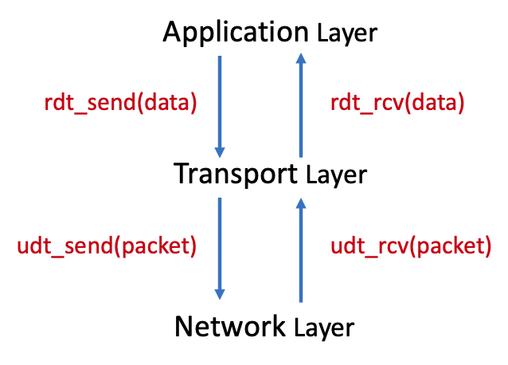

### rdt 1.0: built on reliable channel

If the unreliable channel is actually reliable, then the transport layer just calls `udt_send()` or `rcv` as needed.

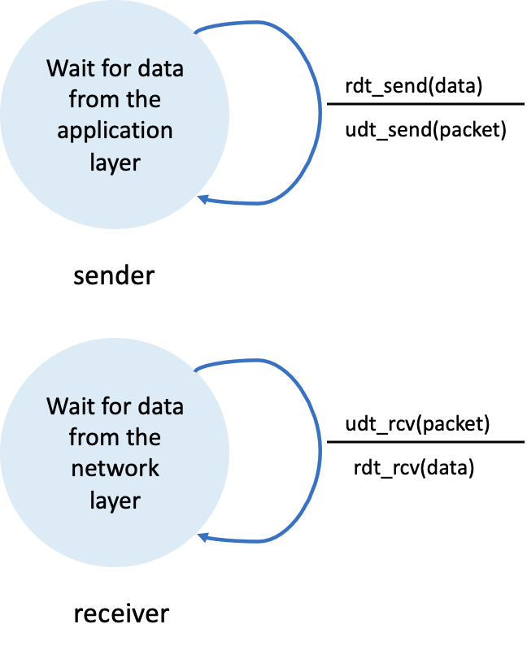

### rdt 2.0: bit errors (corruptions)

To handle bit errors, three additional pieces are added to the protocol:

- **error detection**: checksum
- **receiver feedback**: ACK/NAK  + sequence number
  - an ACK with a wrong sequence number will be treated as a NAK
- **retransmission**: resend the packet until it ges an ACK

The sender will not send a new packet until it is sure that the receiver has corectly received the current packet. Because of this behavior, rdt 2.0 is called **stop-and-wait** protocol. In this case, 1 bit (0/1) is enough for the sequence number.

### rdt 3.0: lossy channel with bit errors

Now, in addition to corrupting bits, the network layer might lose packets as well, which is not uncommon in today's computer network. Our way to solve this problem is **retransmission**. However, it's impractical for the sender to wait forever for a lost ACK, so we use **timeout** to specify the time to wait. If we don't receive ACK for a sent packet after the timeout, we treat it as NAK.

If the timeout is too small, the sender resends packets unnecessarily. If it's too big, the sender will wait for too long to resend. Therefore, we should choose a proper timeout value. Usually we use this expression to set the timeout: `scale * RTT + std(RTT)`

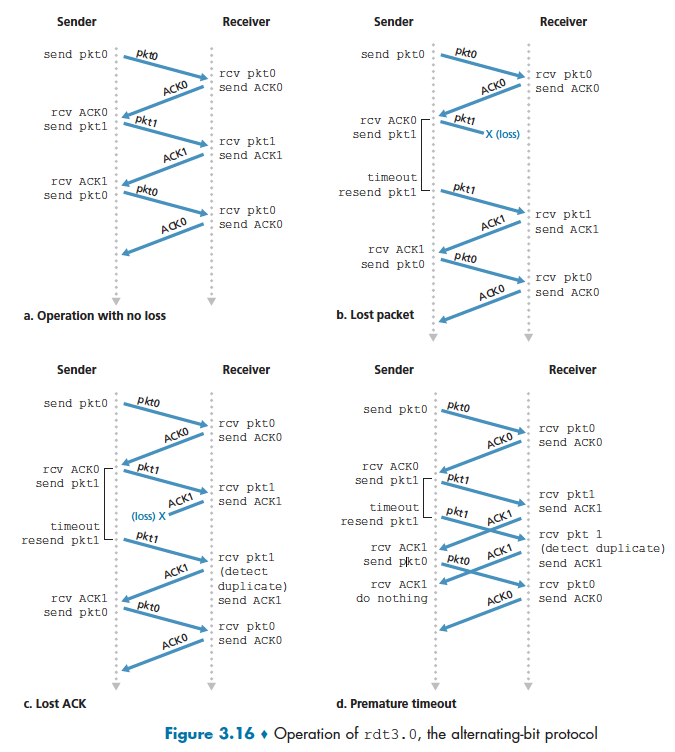

### rdt4.0: pipeling

The stop-and-wait protocol is too inefficient -- it will spend too much time in waiting for ACKs. Now, to solve this problem, the sender is allowed to send multiple packets without waiting for ACKs. This technique is called **pipeling**. Pipeling has the following consequences for the RDT protocols:

- The range of sequence numbers must be increased, since each in-flight (in-transit) packet must have a unique sequence number.
- The sender and the receiver need to buffer more than one packet (ACKed packets, sent but un-ACKed packets, unsent packets)

Two basic approaches toward pipelined error recovery can be identified: **Go-Back-N** (GBN) and **Selective Repeat**.

#### Go-Back-N (GBN)

GBN protocol allows no more than N (**window size**, a fixed number) un-ACKed packets in the pipeline.

- base: the sequence number of the oldest un-ACKed packet
- nextseqnum: the sequence number of the next packet to be sent

The sequence numbers that are bigger or equal than base + N cannot be used until an un-ACKed packet has been ACKed.

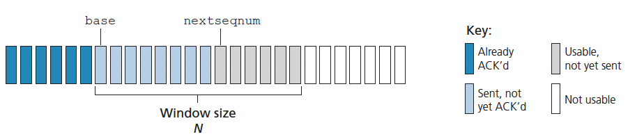

In GBN protocol, an acknowledged packet wih a sequence number n will be taken to be a cumulative acknowledgement, indicating that packets with a sequence numver <= n are all received. However, if a packet is not ACKed after the timeout, then all the packets after its sequence number need to be retransmitted. This causes many unnecassary retransmissions. 

#### Selective Repeat (SR)

Based on GBN, SR only retransmits un-ACKed packets. The receiver will acknowledge correctly received packet whether or not it is in order. The out-of-order packets will be buffered until the missing packet is received, at which point these packets can be delivered to the upper layer.

(the sliding window is moved forward when the lowest un-ACKed packet bacomes ACKed)

## TCP

### TCP Overview

1. Basic features of TCP:
   - **conenction oriented** (stateful): Unlike UDP which doesn’t really know or care whether the receiver gets anything, TCP needs to know that the packet was received. It finds out because the receiver sends an acknowledgement (or ACK) packet.
   - Point to point: between a single sender to a singgle receiver. communication between two processes, no broadcast
   - Full **duplex**: once the connection is established, both sides can send data at any time, even simultaneously
   - throttles senders to protect receiver and network
   - reliable data transmission
2. TCP segments header: (packet - network layer, frame - UDP, segment - TCP. They basically are the same things.)
   - src/dest ports: 2 bytes each
   - sequence number & ACK number: the unit is **byte** (in UDP, it's packet).  
     
     - **sequence number** is the last received ACK number
     - **ACK number** is the number of the next byte that the receiver wants (usually equals last seq number + 1)
     - ACK number on one side goes up as we send data
     
     - ACK number on one side goes up as we receive **in-order** data
     - even a message with no data should contain these 2 fields. An empty ACK will have a sequence number for the next byte it would send (but the data will have a length of zero). If a client sends several empty ACKs in a row, they'll all have the same sequence number.
     
     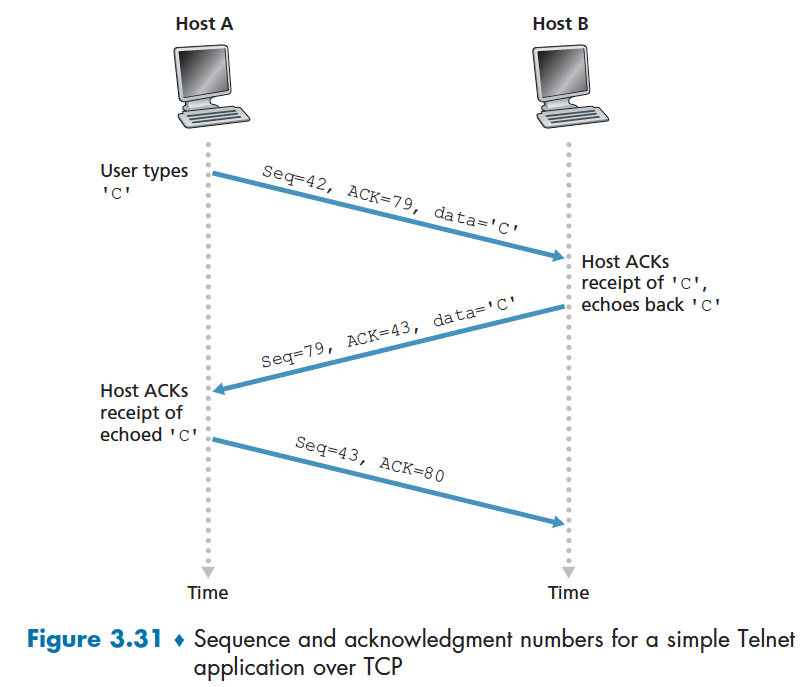
   - Flags: `SNC`, `ACK`, `FIN`, `RST` (reset)
   
     - the RST flag is set whenever a TCP packet doesn't comply with the protocol's criteria for a connection. It signifies that we should immediately terminate the connection.
   - `rwnd` (**receive window**): the number of available bytes in the **receive buffer**. `rwnd` limits how fast the sender can send the data
     - The `rwnd` increases when the application reads data out of the buffer and decreases when it receives a message.

### Setup + Teardown

1. build connection: TCP handshake - 3 way handshake
   - client: `SYN`, randomly choose a sequence number. e.g. seq=1000, ack=0 (ack number is not set), len=0 (the length of the data)
   - server: `SYN`, `ACK`. randomly choose a sequence number. seq=5000, ack=1001, len = 0
   - client: `ACK`, seq=1001, ack=5001 (may include application data)

   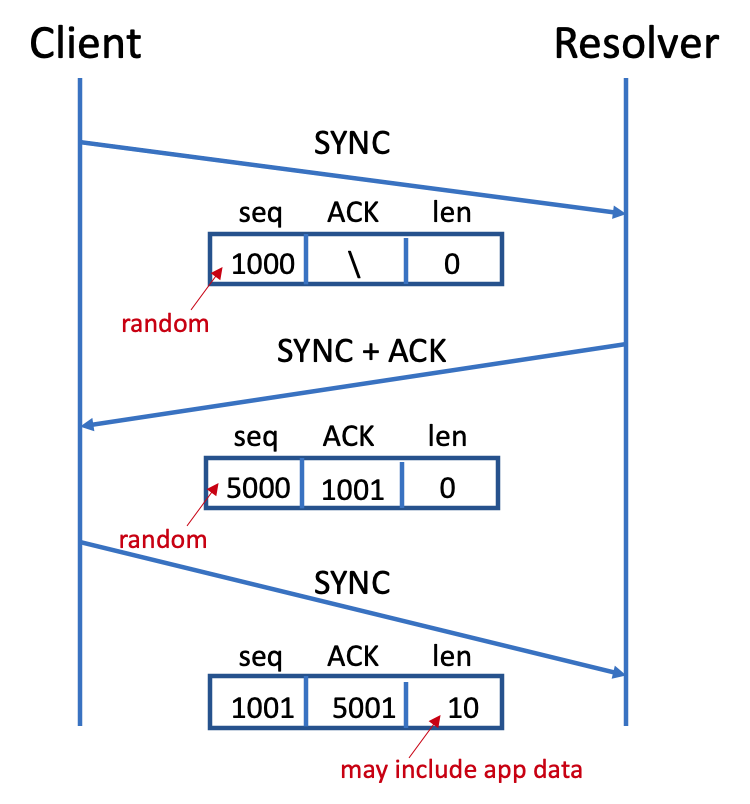
   
2. close connection: `FIN`

   

### Reliable Data Transmission

#### Fast Retransmit

The sender expects 1 ACK for each segment, with ACK number as `last seq number + length of segment + 1`. If it gets more than one of this, it means either packet loss or packet reordering. Once the sender receive 3 duplicate ACKs, rather than wait for timeout, the sender will immediately retranmit the packet starting with that sequence number. 

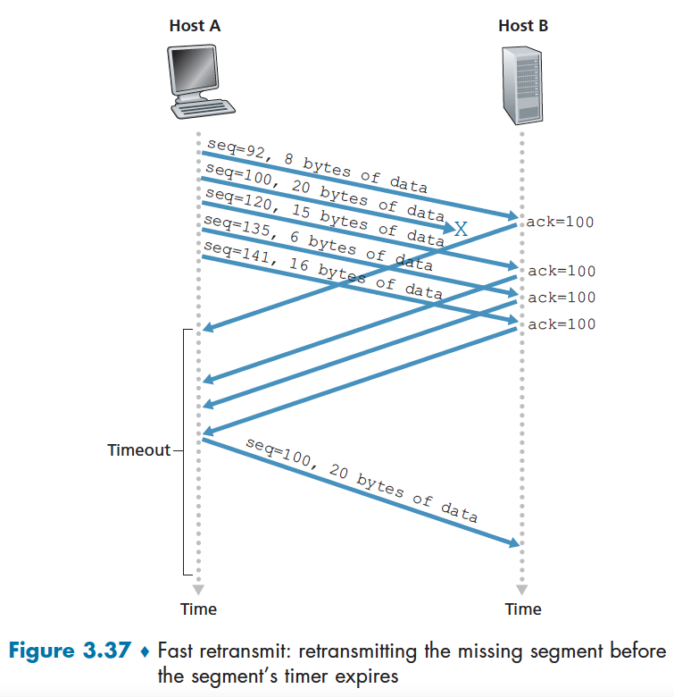

#### Delayed ACK

If TCP receive an in-order segment with an exepcted sequence number, and all data up to the expected sequence number are acknowleged (no pending ACKs), the sender will will wait for 500ms for another in-order segment. If next in-order segment doesn't arrive in this interval, send ACK. This ACK generation policy is called "delayed ACK".

#### Timeouts

Timeout: how long transmitted data may remain unacknowledged before a connection is forcefully closed. 

timeout interval computation:

- estimates RTT with an "**exponentially weighted moving average**", usually alpha is 1/8
  $$
  estimateRTT = (1 - alpha) * estimateRTT + alpha * latestRTT
  $$
  
- also track the variance with an exponentially weighted moving average:
  $$
  estimateVar = (1 - beta) * estimateVar + beta * |packetRTT - estimateRTT|
  $$

- compute the timeout:
  $$
  timeout = estimateRTT + 4 * estimateVar
  $$
  

#### Summary: TCP ACK generation policty

| Event                                                        | TCP Receiver Action                                          |
| ------------------------------------------------------------ | ------------------------------------------------------------ |
| Receive an in-order packet with no pending ACK               | delayed ACK                                                  |
| Receive an in-order packet with pending ACKs                 | ACK now with the ACK number for the most recent packet       |
| Receive an out-of-order packet with a high sequence number (gap created) | Immediately send a duplicate ACK for the last in-order segment |
| Receive a segment filling in the beginning of the gap        | ACK it immediately                                           |

### Flow Control - receiver protection

The flow control prevents the sender from overwhelming the receiver. To explain, the sender at each side of the TCP connection has a receive buffer. They send a TCP segment with a field “rwnd” (receive window), which tells the other side the number of available bytes in their receiver buffer. Then the sender on the other side should keep unacknowledged data less than the last rwnd it received.

Special care should be taken when rwnd = 0. Suppose the host B tells the host A its rwnd = 0, and also B has nothing to send to A. Now, consider what happens. As the application process  at B empties the buffer, TCP doesn't send any new segments to A with a new rwnd value. Therefore, A will never be informed that some space has opened up in B's buffer -- A is blocked and cannot transmit any more data. To solve this problem, TCP requires A to continue to send data with one byte when B's rwnd is 0.

// TODO draw a picture similar to the following, but consider the case when rwnd = 0

### Congestion Control - network protection

Flow control prevents one host from overwhelming the other, but it ignores the network. If the network is congested, packets will be delayed or dropped. If hosts just send the data as fast as they can, they will overwhelm the network. Therefore, we need to control the transmission rate based on the network condition, which is called "**congestion control**".

TCP uses end-to-end congestion control protocol, which means they ask for no information from intermediate routers. 

General principles for congestion control:

- lost packets -> network congestion -> slow down transmission
- ACKed packets -> good network -> speed up transmission

#### Congestion Window (cwnd)

Just like `rwnd` (receive window) limiting the sender's transmission rate, the sender tracks `cwnd` (**congestion window**) to limit how much data can be **in flight** (bytes in flight: the number of bytes that are sent but un-ACKed. Bytes in flight = LastByteSent - LastByteACKed) . 
$$
max(bytes\ in\ flight) = min (rwnd, cwnd)
$$

#### Congestion Control Protocol

TCP congestion control protocol tracks the congestion window by switching among 3 different states based on packets acknowledgement. (This mechanism is implemented in OS kernels.)

1. Slow Start: `cwnd` starts slow but grows exponentially, so the sender can find the avaliable bandwith quickly.
   - in the begining, `cwnd`= 1 MSS (max segement size)  -> starts slow
   - every time receive an ACK, cwnd += MSS -> grows exponentially
   - when `cwnd` > `ssthresh`, switch to congestion avoidance mode
2. Congestion Avoidance: `cwnd` grows linearly
   - new ACK: `cwnd += MSS * (MSS / cwnd)`
   - 3 duplicate ACKs: fast recovery
     - 3 duplicate ACKs means the network is still delievering packets from the sender to the receiver, which is less drastic than a timeout-indicated loss. 
3. fast recovery: we don't need to dramatically reduce the transmission rate
   - receive duplicate ACK: `cwnd += 1MSS`
   - get new ACK: switch back to congestion avoidance mode

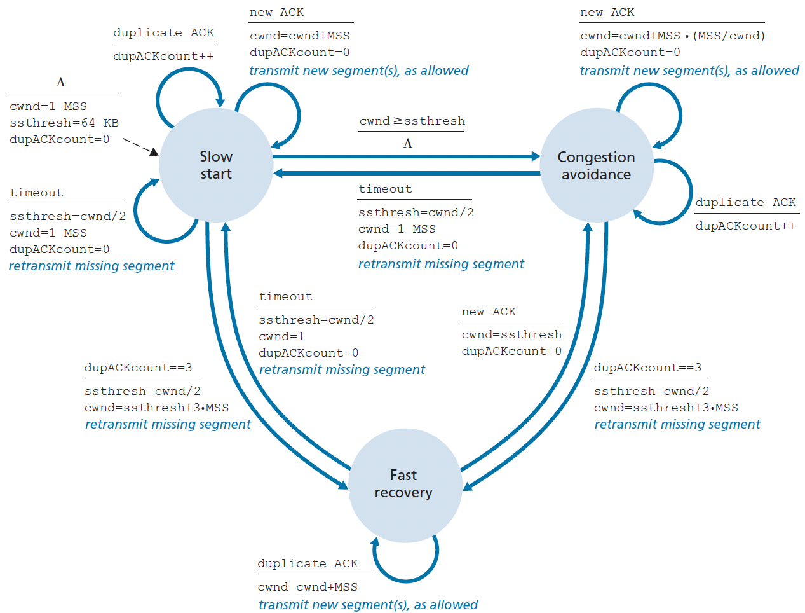

Evolution of TCP's congestion window (see the line of TCP Reno):

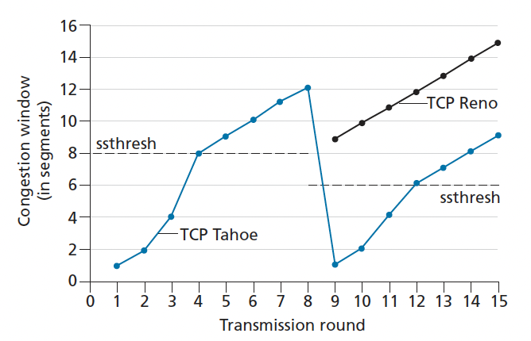 

The Congestion Control Protocol can be described by 4 words: additive increase, multiplicative decrease(AIMD). 

Advantages:

- this scheme gets us about 75% of maiximum possible transmission rate

- fairness: multiple TCP connections will send at the same rate on average

Disadvantages:

- The fairness only applis to TCP connections to the same host
  - doesn't guarantee fairness between hosts
  - a UDP socket can use all resources while TCP connections politely lower their transmission rate

## Summary: TCP vs. UDP

1. Similarities:

   - both used in transport layer
   - both specifies src/destination  IP and ports in the header

2. Differences:

   |                 | TCP                                                          | UDP                                                          |
   | --------------- | ------------------------------------------------------------ | ------------------------------------------------------------ |
   | Connection type | connection-oriented: one socker for one sender; need to do 3-way handshake | connectionless: one socket for all senders; no need to do handshake |
   | Reliable?       | Reliable, make sure all data received in order               | Non-reliable                                                 |
   | State           | Stateful, has ACK + sequence numbers in the packet           | stateless                                                    |
   | Uses            | reliable -- commonly used for apps like email, web browsing, file transfer | fast -- commonly used for DNS, video streaming, online gaming |
   | sequencing      | yes                                                          | No                                                           |

   

## QUIC

Google has been frustrated with some issues of TCP. This led them to develop a new protocol called QUIC (Quick UDP Internet Connections). 

Problems of TCP & how QUIC overcomes them

1. Ossification (not flexible): 

   - TCP:
     - middle boxes don't let Google send unusual or nonstrandard TCP packet
     - updating TCP requires update middle boxes + servers + clients, which is estimated to take 5 - 15 years
   - QUIC: built on UDP and all features are added in user space

2. handshake hell: 

   - TCP: 3-way handshake, which means clients must wait for at least 2 RRTs to receive data from the server
   - Handshake is slightly shortened and **reconnection don't need handshake**

3. Multiplexing: 

   - TCP: the content of multiple files are in the same stream. the application need to split them. TCP only send full data to the application. So even the received data is fine, the application cannot use it until TCP received all data  （理解可能不对）

   - QUIC: a single QUIC connection can have multiple streams

4. Parking lot problem: 

   - TCP: TCP connections are identified by IP + port. When you walk from your office to the parking lot, your phone will switch from using  WIFI to LTE. TCP connection can't be transferred during this switch.
   - QUIC: connection is based on 64-bit connection ID -> no parking-lot problem

5. head of line blocking:

   - TCP: TCP only sends full in-order data to the application. If a packet is lost for one stream, any data sent after it, regardless of which stream it's for, will be stuck in the receiver's receive buffer until that packet is retransmitted.
   - QUIC: a lost packet only blocks packets in its own stream

# 5 Network Layer 1: Data Plane

The network layer is responsible for moving packets from a sending host to a receiving host. To do so, every router in the network layer should **forward** and **route** packets to their destinations.

- **fowarding**: move a packet from its input link to an appropriate output link, which is network's **data plane** function.
  - traditional IP forwarding: use destination IP address
  - generalized forwarding: using several different fileds in the header
- **routing**: determine the route or path taken by packets as they flow from a sender to a receiver (use routing algorithm), which is network's **control plane** function.

## What's inside a router?

### Router Components

1. Hardware part - forwarding

     - **Input link** (port): input port performs several key functions:
       - network layer function: translate physical layer signals to bits (shown in the first box)
       - link layer function: interoporate with the link layer at the other side of the incoming link (shown in the second box and the dots)
       - lookup & forwarding: determine which output port this packet will be forwarded to
         - Note, forwarding decision is made in the input port!!!

     - **Switching fabrics**: connect the router's input ports to output ports. Switching fabric is like a network inside a network router!

     - Output link (port): (a home router usually have 4-6 input & output ports)
       - Store packet received from the switch fabric
       - Transmit packets over the outgoing link (transmit means turn bits to physical layer signal)

2. Software part- routing

   - **Routing processor**: performs control-panel function -- executing routing protocols, maintaining routing tables, and network management

### Destination Based Forwarding

A router uses a **forwarding table** to decide which output port a packet should be sent to. Forwarding table is a hash table with IP prefix as key and output port number as value. If a packet's destination IP matches the prefix stored in the forwarding table, the packet will be switched to the corresponding output port. If there're multiple matches, the router uses **longest prefix matching rule**.

For example, a router uses the folowing forwarding table. For the prefixes in the table, the number after the slash means the number of bits of the prefix, "0" after the prefix means any number. For example, "1.2.3.0/24" matches any IP address starts with "1.2.3". The packet with destination IP "1.2.3.5" will be swtiched to interface 0 (not 1!!), and "127.0.28.5" will be switched to default interface 3. (free bits are set to 0)

| Prefix     | Output Link Interface |
| ---------- | --------------------- |
| 1.2.3.0/24 | 0                     |
| 1.0.0.0/8  | 1                     |
| 1.3.0.0/16 | 2                     |
| Otherwise  | 3                     |

### Switching 

Switching means switching a packet from an input port to an output port. There are a number of ways to accomplish this:

- shared memory: the routing processor read from the input port then write to the output port
- a bus: a packet is written to all output ports through the bus, but only the port that should output the packet receive the packet, other ports just ignore it. Only a packet can be written to the bus at a time, so other ports have to wait their turn to forward their packets.
- an interconnection network: capable of forwarding multiple packets in parallel

These techniques can be combines/layered to maximize throughput and minimize delays.

### Queuing

A router contains several queues that can cause packet delays or packet loss:

- input queueing: waiting for the switching fabric to send them to the output port
- output queueing: waiting for transmission at the outgoing links

If we want to forward packets besed on their priorities, we can use several normal queues with different priorities (the queue with higher priority will send packets first) or a priority queue. 

## IP

### IP Address Assignment

IANA assigns big IP ranges for entities like universities and governments, and these entities will manually assign IPs to its routers. 

In small scale, each router needs to assign IPs to the connected devices (hosts). But devices come and go, it's impratical to assign IPs manually. Usually those network use use **Dynamic Host Configuration Protocol (DHCP)** to assign IPs automatically.

#### subnet

A subnet is a segmented piece of a larger network. The devices in a subnet are connected without a router, and they all share the same IP prefixes. For example, in the picture below, there are 3 routers and 6 subnets.  

- an IP address is technically associated with an **interface** (the boundary between the host and the physical link), rather than a host or a router that containing the interface. 

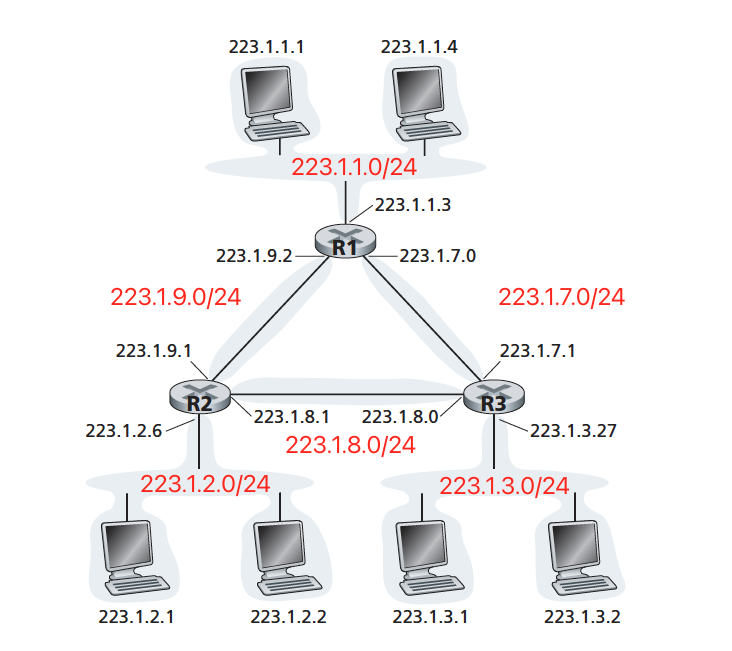

#### DHCP (Dynamic Host Configuration Protocol)

DHCP is used for **small-scale** IP addresses assignment. Server tracks allocated IP addresses or which IP addresses are available.

DHCP is a client-server protocol. When a client just enters a subnet, they doesn't have an IP. They need to ask for the server for it. 

There are 4 steps to assign an IP to a client:

1. client sends a **broadcast** message "DHCP Discover" to `255.255.255.255` 

2. server broadcasts DHCP Offer

3. client broadcasts DHCP Request: choose one from many offers

4. server broadcasts ACK

Then the client can use the allocated IP address.

DHCP potential issue: doesn't have anything like "bye" handshake, cannot track if a device has already left the network

### NAT (Network Address Translation)

There are only 232 IPv4 = 4 billion addresses, but there are more than 4 billion connected devices in the world. How do they each get an IP? One trick used by ISPs is **Network Address Translation (NAT)**. NAT is a way to share 1 public IP address with many devices, then use extra **port number info** to track each device.

For a NATed network, the hosts have IP addresses that are only valid within the subnet, not the whole internet. The hosts in this subnet can communicate with each other through these IP addresses. But when they try to communicate to the outside network, the router that connects to the outside network will manipulate the IP header data (change the src IP. e.g. `10.0.0.1 : 11111` to the public IP address + an arbitrary port like `45678`). (see the picture below)

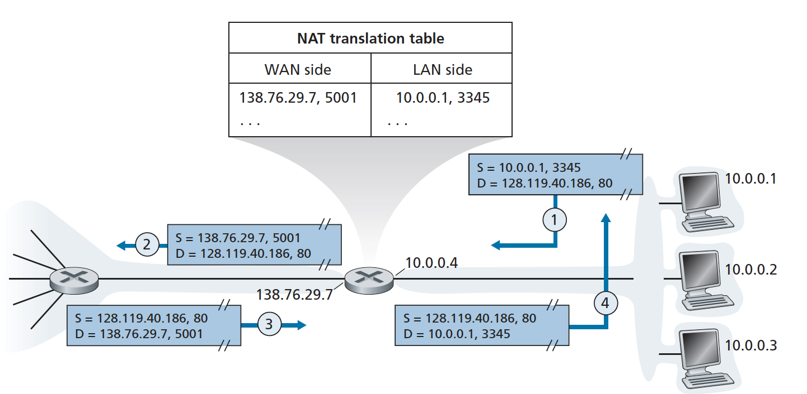

Note, IP address `10.0.0,0/24`  and `192.168.1.0/24` are reserved for home network

 // TODO review the part below in the lecture

Modem: NAT router

issues:

- Bottleneck
- port forwarding ???
- Connection-based

### IPv4

IPv4 is the major network protocol in use today. IPv6 is increasing its market share, but fairly slowly. 

An IPv4 has the following important informaiton in its header:

- src/dest IP address
- packet length
- **TTL**: the number of hops before a packet should be dropped. 

  - TTL changes at each hop, then checksum should be recomputed at each hop
- Protocol: TCP/UDP/ICMP
- header checksum: check to see if the header is corrupted or not
- fragmentation info: The link layer may not support sending large packets. If a packet is bigger than the maximum packet size (which is **Maximum Transfer Unit, MTU**) that a link layer can handle, the network layer will break it into smaller packets. This process is called fragmentation. Fragmentation is hard to implement, so transport protocols just avoid sending packets bigger than MTU.

protocol, header checksum, and fragmentation are the things we want to get rid of! (TODO why???)

### IPv6

Some improvements over IPv4:

- bigger addresses: 128bits = 16 bytes = 32 hex num. We'll never run out of IPv6 addresses
- improved header: header is fixed size and doesn't have a checksum, so we don't need to recompute checksum or deal with variable-length headers
  
- no fragmentation: packets that are too big are dropped and the sender will be notified

### IPv4 -> IPv6

Since the network layer includes every node in the internet, switching from IPv4 to IPv6 requires us to update all devices including routers. (Only endpoints in the path need to do transport things, but every router need to do network things.)

The transition has include a mix of **dual stacking** and **tunneling**: 

- Dual Stacking: routers can understand and process both IPv4 and IPv6

- Tunneling:  when an IPv6 packet hits an IPv4-only link, it puts the whole IPv6 packet in an IPv4 packet and forwards it on. When it gets to a node that understands IPv6, the IPv6 packet is unwrapped and sent onward.

Since it takes extra costs to transit from IPv4 to IPv6, and NAT kind of solves the problem of running out of IPv4 addresses, many operators have decided not to invest in supporting IPv6.

## Match and Action

Match and Action paradigm: match a feature then perform an action. 

- forwarding table (prefix -> output link) : 
  - on the "match" side, we can look at src/dest IP addresses (some src IP has higher priority, some src IP like sending spams so we can give them lower priority), port numbers
  - on the action side: forwarding
- flow table: similar to forwarding table, but looks at more fields in the header (we can think flow table is a generalized forwarding)
- NAT router:
  - Action: change src IP/port
- firewall

# 6 Network Layer 2: Control Plane

The control plane refers to the systems/algorithms that determine the forwarding table for  routers.

Many modern networks use centralized controller to collect the information from routers and come up with routing palns for the network. This is usually runnign a software program (meaning very flexible and adaptable), so this approach is called "**Software Defined Networking (SDN)**".

## Routing Algorithms

Routing algorithms are to find a good path from senders to receivers through the network of routers. Typically, a good path is the one that has the least cost.

If we think of the network as a weighted graph, we need to solve "single source shortest path" problem.

### The "Link-State" Algorithm (Dijkstra's Algorithm)

The **OSPF protocol** allows each node to send "link-state broadcasts" to share the costs of all links attached to that node. Then all nodes have identical and complete view of the whole network, so they can run Dijkstra's Algorithm locally. 

LS is a centralized algorithm. It requires each router first obtain a complete map of the network before they run Dijkstra's algorithm. 

### Distance Vector Algorithm (Bellman Ford)

**Distance Vector (DV) algorithm (Bellman-Ford algorithm)** is a decentralized algorithm and does not use global information, the only information they need is the costs to their directly attached neighbors. (only store the first edge in each path in their forwarding table.)

Bellman-Ford algorithm keeps track of the shortest distance and the neighbor that's the first hop on the route
$$
dist(x, y) = min_{n\ in\ neighbors}( cost(x, neighbor) + dist(neighbor, y))
$$
In practice, each node stores a "distance vector". If DV updates, they will send the updated DV to neighbors. Neighbors will update their DVs with the improved distances. If the DV changes, they will broadcast their updated DVs to neighbos again.

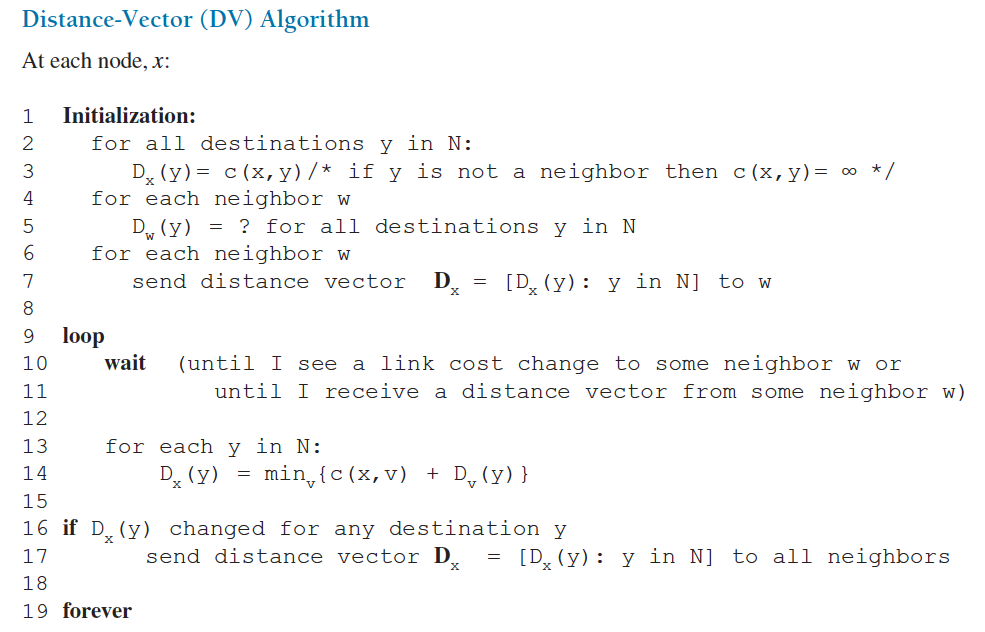

## Autonomous System

It's impractical to connect every router on the internet. Also, different network providers might have diferent routing goals. To solve this problem, we divide the internt into network of sub-networks called "**Autonomous System (AS)**", which is a group of routers that are under the same administrative control. Each AS has its own AS number. And routers under the same AS use the same routing algorithm.

With ASs, we're interested in 2 different types of routing: routing within an AS (**intra-AS routing**), and routing among ASs (**inter-AS routing**).

### Intra-AS rounting - OSPF

We use OSPF (Open Shortest Path First) protocol, which uses Dijkstra's algorithm in intra-AS routing.

### Inter-AS routing - BGP

#### BGP

"**Border Gateway Protocol (BGP)**" is the main protocol for inter-AS routing. BGP is arguably the most important of all the Internet procols, as it is the protocal that glues thousands of ISPs in the Internet together.

A node in an AS that conencts to other AS is called  a "**gateway router**" or "border node". Gateway routers talk to other connected gateways over eBGP (e for external) and communicate with routers within their own AS over iBGP (i for internal). As shown in the picture below, there are 3 ASs, and AS3 includes a subnet with prefix x.

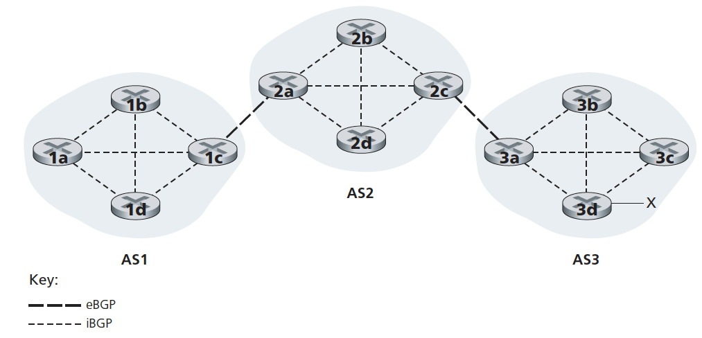

A BGP message announces a path to an IP prefix and contains: the IP prefix they route to, list of ASs on the way, and the IP of the first border router in the next hop. In the above picture, to advertise the rechability information for prefix x to all routers in AS1 and AS2, the following process will be gone through:

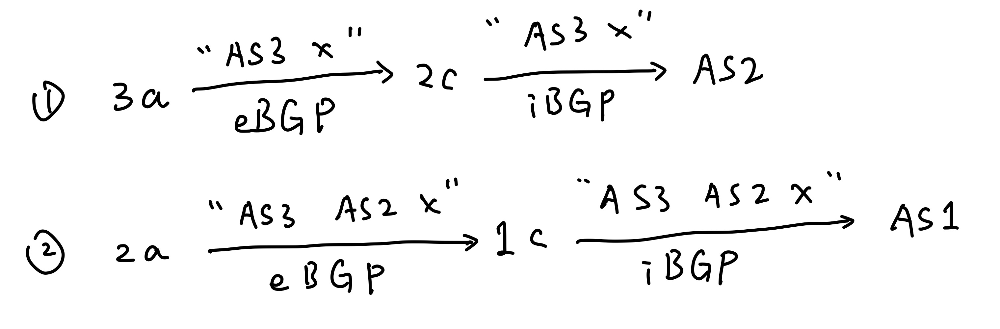

#### BGP routing

Now that nodes know about the routes to all prefixes, how do they route packets there? Within an AS, they often use **hot potato routing** algorithm, which is routing a packet out of the AS as quickly as possible. Among ASs, they choose the path cross the fewest ASs and use hot potato routing to break the tie. But they can also assign preference values to paths based on business relationships.

#### IP Anycst

Anycast is a network routing methodology in which a single destination IP address is shared by devices (generally servers) in different locations. Routers will route the packet to the nearest server with that IP address. They don't care about the packet goes to different places.

Anycast is commonly used in DNS since it uses UDP and is stateless. TCP connection doesn't use Anycast because it might route the packet to a different host.

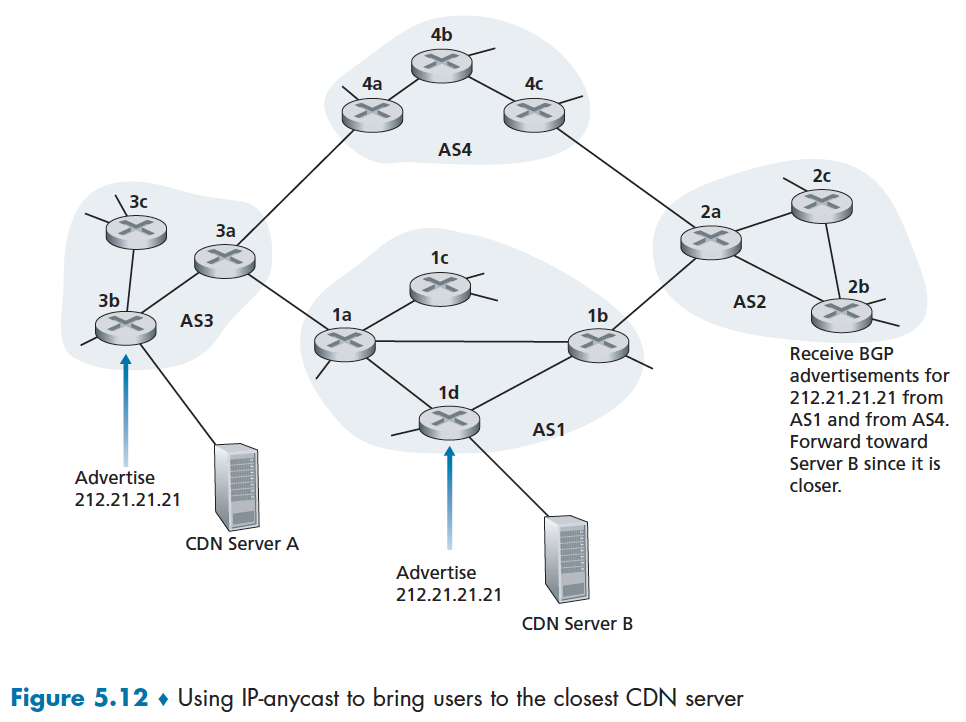

# 7 Link Layer

The lInk layer is reponsible for transmiting **frames** of data between 2 adjacent nodes in a network (**one-hop communication**). 

1. There are 2 types of link layer protocols: 

   - point to point: only two devices are in the channel, so there's no interference, e.g., ethernet (easy mode)

   - **broadcast channels**: many hosts shares the same channel and must coordinate to avoid interfering with each other, e.g., Wifi

2. frame: // reiew video - what is included in frame

## Error Detection

The frame is easier to be corrupted during routers, it's easier to handle the error in the link layer. Most link layer protocols also provide error detection, and in some cases **forward error detection**, where the error is fixed by the receiving end without retransmission!

- tradeoff: reliability & minimizing checksum size and computation

### Parity Check

1. **parity bit**: count the number of bit 1 in the message, and add a parity bit to the end, for which 1 is odd, 0 is even. So the total number of 1 bits + the parity bit is even. When the receiver checks the message and counts an even number of ones (in pratical, they just xor all bits to check if they can get an 0), there must be an even number of bit flips in the message. Hopefully, but not granted, there's 0 error!
   - disadvantage: can only detect **odd-number bit flips**
2. 2D parity bit

   - cyclic redundancy check: 4 * 4 matrix -> check parity bit for each row and column (9 parity bits). This way we can find the location of the error then fix it! This is forward error detection.
   - // TODO add a picture as an example

## Broadcast Channels

When many devices use the same physical channel for sending data, we call it "broadcast channel". All devices can receive all messages sent over that channel. Link layer need to deal with collisions when 2 devices are sending at the same time and interfere with each other.

1. Collision: there are at least 2 devices transmitting at the same time
2. Assume the sender can detect collisions. Our goals are:
   - main goals: 
     - Fairness: when multiple devices are transmitting, they should get equal resources
     - If there's only 1 device transmitting, it should get all bandwith (transmission time)
   - others:
     - robust when the program crash
     - don't add much overhead, either computational, or extra usage of the channel
     - decentralized

### Protocol 1: Taking Turns - centralized time scheduling

Each node will get a time slot once they join the network.

This method is fair but not efficient. If there's only 1 device transmiting, the device cannot use the whole bandwidth.

- super resistent to crashes (why??) // TODO review

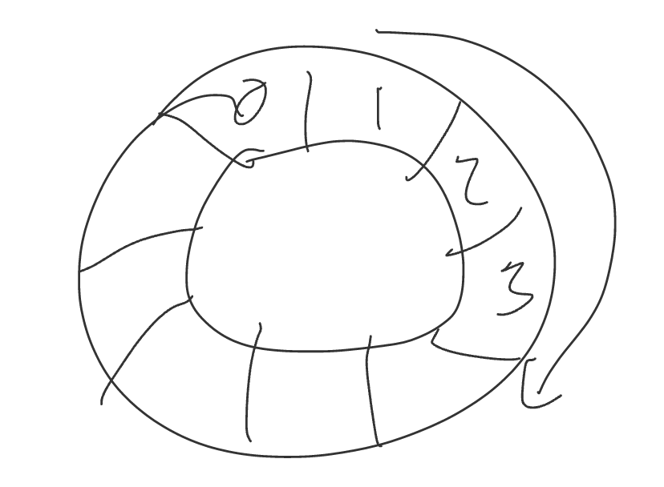

### Protocol 2: Slotted ALOHA

All devices have a synchronized clock. If a device has data to send, it will try the next time slot. If there are collisions, they will "flip a coin" to decide if they should resend the data in the next time slot. Only if there's only one device deciding to retransmitting the data, can the time slot be used.

 Cases:

- no collision: that device resend the data

- Collisions: this time slot is wasted, everyone will wait and flip a coin again

If there are multiple devices are sending the data at the same time, there's only 37% of time slots are used. (Really?? this method is so stupid, so 37% is pretty high for me)

### Protocol 3: Unslotted ALOHA

This protocol is the same as slotted ALOHA, except that devices don't have syncrhonized clocks. Now collisions can occur with 2 time slots for each node,  so only 50% time slots are used. (why 50%???)

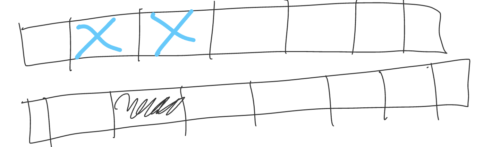

### Protocol 4: CSMA

CSMA - Carrier Sense Multiple Access

1. strategies: 
   - listen to see if there's other node transmitting and wait until they stop before we start transmitting
   - if detect a transmission in our time slots, we'll stop transmitting right away
2. This still might cause collisions (see the figure below), then we use **binary exponential backoff** to decide the time slots to wait --  Choose a random number between 1 and 2#collisions
3. The faster the collisions are detected, the better CSMA performs. If collisions detection time is 0, 100% time slots willl be used.

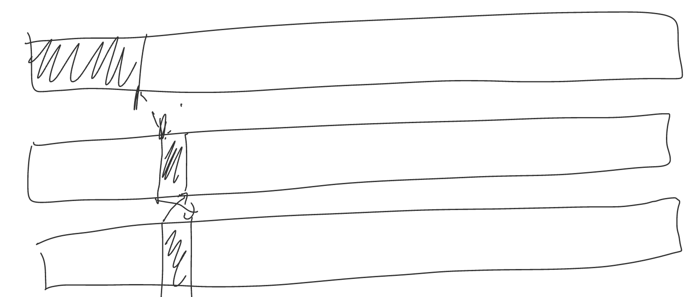

### Cable Internet: DOCSIS

DOCISIS -- Data Over Cable Service Interface Specification

CMTS -- cable modem termination system

1. Downloading: the ISP (internet service provider) **broadcast**s to all the neighbors but modem will drop packets that are not meant for them
2. Uploading: there are 2 phases:
   - request: clients send upload requests (they pick slots randomly and hope for no collisions)
   - Announcement: the CMTS assigns time slots based on the requests and annouces which customers get which time slots in the next upload cycle. If a client doesn't get an upload slot, it was probably due a collision of the request, then they need to wait for the "upload request" round.

That's why in your home network, you find that usually upload speed is much slower than the download speed. 

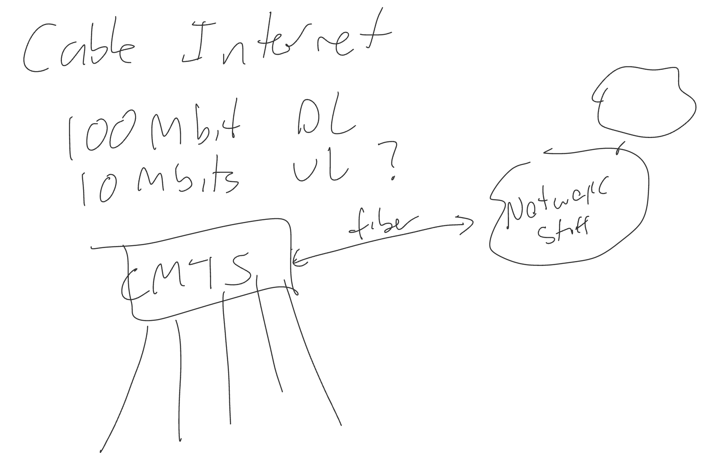

## Local Area Networks

A **local area network** (LAN) is a collection of devices connected together in one physical location, such as a building, office, or home. A LAN can be small or large, ranging from a home network with one user to an enterprise network with thousands of users and devices in an office or school.

LAN uses link-layer **switches** rather than network-layer routers to connect devices. The link layer devices are basically just "**plug and play**" and don't require administration to set up routing/flow tables.

### MAC Addresses & ARP

1. MAC addresses:
   - link layer identifiers
   - MAC address ranges are allocated to device manufactures
   - no organization

2. **Address Resolution Protocol (ARP)**: 
   - ARP is like DNS and answers queries like "what is the MAC address for the device with this IP?"
   - devices store ARP table with mappings for IP address -> MAC address 
   - "Who has this IP?" . broadcast this message to all devices, the address is FF-FF-FF-FF-FF-FF

- frames has src and dest MAC addresses

### Switch

A switch is a transparent device that forwards packets based on their destiniation MAC address. A **switch** is like a router but operates in link layer. 

- operate transparant to hosts: hosts can't tell there's a switch
- Self-configuring: you don't need to provide them with a forwarding table

If a switch gets a packet to a MAC address not in it's table, it broadcasts it to all links except the one it came from. When that host responds, then it can fill in an entry for that MAC address. For example, assume 10.0.0.1 wants to send packets to 10.0.0.3:

1. 10.0.0.1: broadcast "who has 10.0.0.3 IP address?"
2. switch doesn't know which device, so it broadcasts the message
   - Switch keeps a **switching table**: MAC -> link number
3. 10.0.0.3 sends a response to switch
4. swtich sends the respnse to 10.0.0.1

In the old days, the ethernet use hubs (like a switch but always broadcasts), which cause lots of collisions. Now we use switch, avoid colliding. 

#### Switch vs. Router

1. switches have a swtichiing table (a entry for each device), so it is not suitable for gigantic network
2. Routers: forwarding table -- big network
   - downside: forwarding table has to be manually by softwares, but switches are self-configuring
3. switch only works in a tree topology network (a loop wil crash the switches because it broadcast messages) (a switch cannot work in a cycle!!!). routers can work in any topology 
   - "top of rack switch"

### Ethernet

1. ethernet header:
   - Src/dest MAC addresses
   - checksum (use CRC algorithm)
   - Network layer type: usually IPv4
   - Preamble: an alternating sequence of 1s and 0s that basically join the link and physical layers. It provides the information about the physical signal being transmitted (MARKER)
     - 1010101010... : clock signal

### Link Layer Tricks: Virtual LANs (VLANs)

A single switch can support multiple "virtual LANs" by grouping its links together into LANs. Within one of these groups, the switch operates like a normal link layer switch. Such switches can also act as network layer routers to route packets between the VLANs.

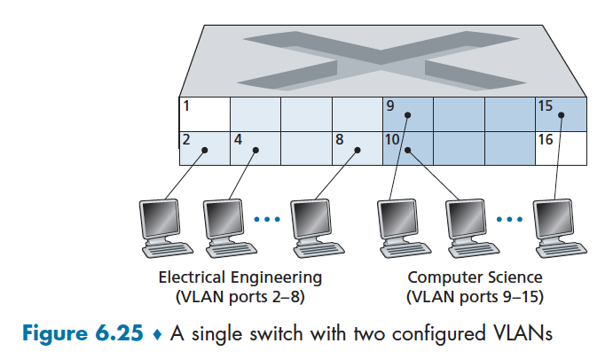
