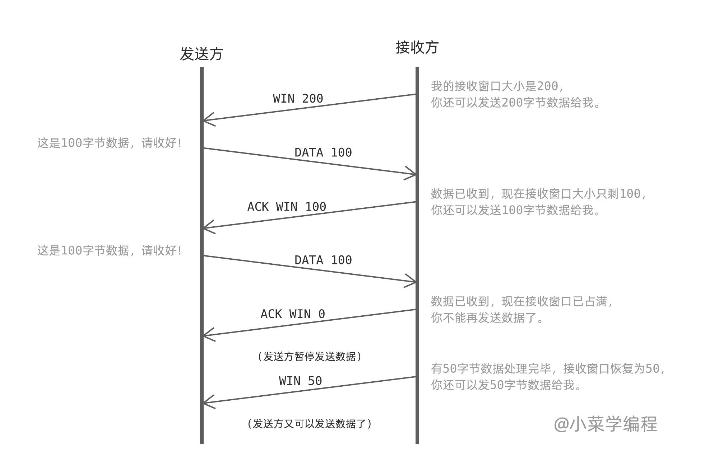
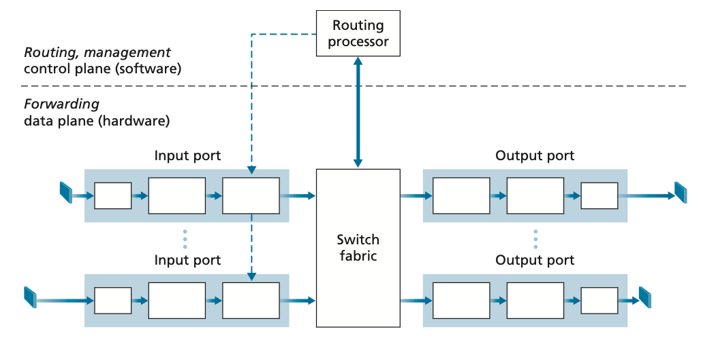
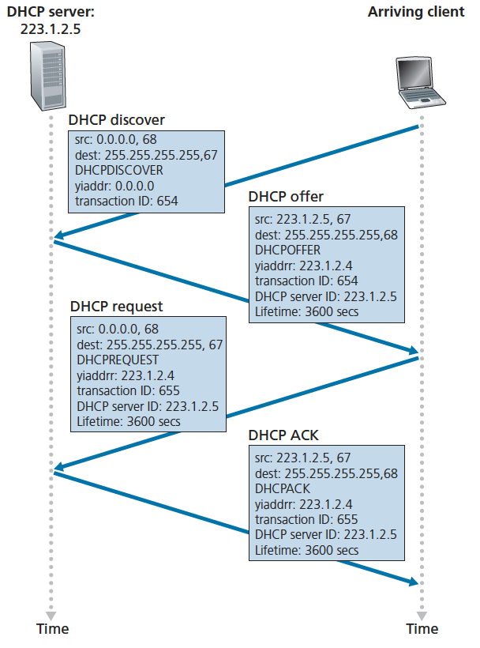

# 1 Intro

Course overview:
- Networking
- Cryptography
- Computer Security

## The Internet Topology

the Internet: 

- **hosts**: endpoint devices that want to exchange data. Clients and servers are both hosts.
  - hosts can be any physical device: phone, laptop, desktop, smart fridge, google server... 

- **access network**: a small network with many hosts. e.g., ISP (Xfinity, Google Fiber, ..), a corporate/academic network (UConnect,.. ) 
- **internet backbone**: a network with high-speed, high-capacity links, e.g., AT&T, T-mobile. Access network are connected to internet backbone

## Switching

- circuit switching: reserve a line between people who are calling. This is wasteful if you don't speak for the whole duration of the call. 

  - Computer communication is bursty, which is not suitable for circuit switching.

- **packet switching:** Data is split into packets. Instead of reserving a path from host to host, the packet is forward to the **next hop** at each hop along the path.

  - Packet: header + payload
  - voice phone calls use packet switching

  

## Network Layer Model

From top to bottom, the network layers and corresponding protocols are:

1. **Application Layer**: how applications parse the data
   - HTTP protocol: web page. a type of client-server protocol
   - SATP protocol: email
   - DNS: turn human-readable domain names to numeric numbers
2. **Transport Layer**: process to process communication (port)
   - TCP (Transmission Control Protocol): gurantees your will receive all data because it will resend lost packages
     - stream-based, reliable data transfer
   - UDP (User Datagraph Protocol): cannot gurantee you receive all data
     - IP packets + port numbers
3. **Network Layer**: host to host communication (IP) (multiple-hop communication)
   - IP protocol. IP networks are often described as "best-effort" networks because they deliver every packet as fast as they can but don't guarantee the full packets will be received.
4. **Link Layer**: one-hop communication, e.g. Wifi, Ethernet
   - breaks up packets into frames and sends them from source to destination
5. Physical Layer: mechanism for one hop communication, e.g., electrocal/optical/eletromagnetic wave stuff

"Programmers work in the application layer, have to make choices about the transport layer, and have to understand what goes wrong in the network layer."

# 2 Delays

## Four Common Delays

1. **Propogation Delay**: the time physical signal takes to travel between hops

   - depends on the distance and the speed of the connection (radio, fiber optics > electrical signal)

   - `propogation_delay = scale * distance / speed_of_light`
     - the type of the connection will influence the scale

2. **Processing Delay**: the time devices spend on examining packets (often just read the header)

   - processing delay is usually in the order of nanoseconds, which is constant and negligible

3. **Transmission Delay**: the time to convert packets from bits to physical signals. This kind of delay depends on devices.
   - Devices are rated by their transmission delay, e.g., 1 Gbps ethernet device, 54 Mbps wireless device
   - `transmission_delay = data_length / device_transmission_rate`
   
4. **Queuing Delay**: the time that packets are stored in the queue. The queue is fix-sized. If the queue is full, the packets outside of the queue will be dropped. 
   - Queueing delay depends on how busy the network is. So queueing delay is very unpredictable and variable.
   
   - `traffic_intensity (TI) = incoming_data_rate * avg_size / transmission_rate`
   - we should keep TI < 1

## Measuring Delays

1. It's hard to measure the time from host1 to host2, because we will get delays to get the timestamp. But we can measure the time on the same host -- **Round Trip Time** (RTT)
   - RTT = 2 processing delays (~0) + 2 * (4 delays for each hop)

2. Queuing delay: test RTT for the packets of the same size between the same hops; the variability should be due to queueing delay (but probably they go different paths). 

   - For example, send 5 packets of the size 500 bytes from hop A to hop B. The time is 10 ms, 2.8 ms, 2.4 ms, 4 ms, and 5.5 ms (Note that this would be a difficult measurement to actually perform!). Assuming that the samllest time has no queuing delay, then the queuing delay for each packet is: 7.6 ms, 0.4 ms, 0 ms, 1.6 ms, 3.1 ms. Then the average queuing delay is 2.54ms.

3. Propagation delay: we can estimate propagation delay based on distance, but we don't actually calculate it directly. 

4. Transmission delay: Vary packet sizes and test RTT of each size for multiple times. The difference in the smllest time should be due to transmission delay.

   - For example:

     - 500-byte packets: 10 ms, 2.8 ms, 2.4 ms, 4 ms, and 5.5 ms
     - 1000-byte packets: 11.0 ms, 10 ms, 2.8 ms, 3.0 ms, and 5.5 ms

   - the smallest time has only transmission delay and propagation delay
     $$
     2.4 = 500 / transmission\_rate + propagation\_delay\\
     2.8 = 1000 / transmission\_rate + propagation\_delay
     $$

   - we can get: 
     $$
     transmission\_rate = 1250\ bytes/ms\\
     propagation\_delay= 2\ ms
     $$

   - Therefore, the transmission delay for 600-byte packets is 600 / 1250 = 0.48 ms, propagation delay is 2 ms.

## traceroute

Each packet has a "time to lie (TTL)" packet which specifys the number of hops it is allowed to travel. Many devices send a response when TTL gets 0.

- `traceroute`: sends packet with increasing TTL values and measure the RTT of any packet that gets a response

## Throughput

- Throughput: the amount of data (bits/s) that can be transmitted etween hosts
- bottleneck node: the minimum throughput device on a path

A bottleneck node is usually the access network. For example, if I send data from my laptop through my wifi to Google server, the bottleneck node is highly propably my own wifi. The internet backbone usually has a big capacity so is rarely a bottleneck.

# 3 Application Layer

Q: TCP - stream?

## Application Layer

1. Application layer is the highest layer, but it need to interace with lower layers:

   - get IP address from network layer

   - get port number (part of TCP/UDP) from transport layer

2. Application protocol designer should decide which transport layer protocols (TCP/UDP) to use based on the following needs:

   - reliable data transfer: all sent data need to be received in order, but potentially slow
   - latency: data need to be received in a certain time window
   - data rate

   TCP is reliable, UDP is fast. Streaming applications are more likely to use UDP.

3. Application Topology:

   - client/server model (most commonly used):
     - HTTP, web socket
   - peer to peer model: programs behave as both clients and clients at various times. e.g., BitTorrent
     - Disadvantages: 
       - can be very slow if multiple computers access to the same computer
       - limited security (viruses, file security)
     - Advantages:
       - P2P networks operate without an expensive network
       - P2P networks usually have less network traffic than a client/server network

## Application Layer Protocols

### HTTP protocol

- use TCP
- **Text based**: is easier to read, write, and debug but has bigger size
- One-shot request/response model: Request -> response -> done
- Content Length header (content-length): the size of the body in bytes
- special characters: \r\n, ' ' (empty space), : (colon)

### [Protocols for Email](https://www.siteground.com/tutorials/email/protocols-pop3-smtp-imap/)

1. SMTP (Simple Mail Transfer Protocol): sending email

     - text-based, TCP-base

     - how SMTP works: laptop -> utah.edu email server (SMTP client) ->  (use SMTP to push emails to) gmail (SMTP Server) 
     
     

2. IMAP (internet message access protocol) /POP (post office protocol): receiving email

     - IMAP is text-based.
     
     -  both are TCP based
     
     - how IMAP works:
     
       

Your email server has to understand both SMTP and POP or IMAP to allow users to send and receive emails.

### BitTorrent

- a P2P protocol, used for sharing large files
- How to find peers? 
  - Originally, trackers servers track who are sharing the data via HTTP
  - Now, use a distrbuted hash table. You just need to know about one of your connected peer to bootsrap your peers list.
- originally used TCP, but now switch to UDP (uTP - UDP Torrent Protocol)

### DNS 

1. DNS (domain name system)

   - tanslate a domain name to an IP address: e.g., cs.utah.edu -> 155.22.17. 21 (iPv4)
   
   
      - binary protocol: for quick machine processing, reducing packet size
   
   
      - use UDP: because IP address is so small that both request and response can fit in one single packet
   

2. DNS system

   - a DNS server is called "**resolver**" and clients send queries to the resolver
   
   
      - How to respond to quries:
   
        - cached answer: respond the queries with answers in **cache** with the cached values
        - recursive query: ask another resolver for the answer
        - iterative query: find th answer themselves
          - e.g., for the address "shell.cs.utah.edu" (`.edu` is a top level domain)
            - ask a **root server** "where can I find DNS servers for .edu domains"
            - ask a .edu DNS server for the authorative server for `utah.edu` domains
            - keep asking the authorative servers for more specific subdomains until we get the answer
      - dig: DNS lookup utility
   
        - `dig +trace domain_name`
   - Adding the +trace option instructs dig to resolve the query from the root nameservers downwards and to report the results from each query step. Thus dig will only use the default or explicitly specified nameserver for the initial discovery of the root nameservers.
   
3. DNS query types:
   
      - Type A: “give me the IP for a hostname” - hostname
      - Type NS: “give mt the nameserver responsible for this hostname”
      - Type CNAME: “give me the 'canonical name 规范名称' of a hostname” which would tell you that google.com is really row3.rack2.lax02.westcoast.google.com
      - Type MX: “tell me the canonical name of the email server for this domain” - mail server
      
4. [DNS protocol](./DNS Protocol.md)

# 4 Transport Layer

## Transport Layer Features

1. process to process communication; use protocols TCP and UDP
2. port - process ID
   - usualy uint_16 (0 ~ 216 - 1 = 65535)
   - ports < 1024 are priviledged by the OS, so you need elevated priviledges to listen on those ports
   - the server choose its own port number
     - standard port: 80 for HTTP, 443 for HTTPS, 53 for DNS
   - clients are assigned an ephemeral port number (usually a high arbitrary number) by the OS
3. TCP/UDP connections
   - Their segment/frames both have src & dest IP, src & dest port in the header
   - UDP socket: one socket for all senders
     - a UDP listenser listens for segments destined to a specific port. Any segment from any sender is acceptable. 
   - TCP socket: one socket for one sender
     - a TCP socket is specified by 4 numbers: src & dest IP, src & dest port. Therefore, a TCP socket can only receive messages from the client who initializes the connection

## Reliable Data Transfer (RDT)

In this part, we'll learn how to build a reliable protocol (TCP, the transport layer) on top of an unreliable network channel (IP, the network layer). With a reliable data transfer channel, there are no bits corrupted (bits are flipped from 0 to 1, or vice versa), no lost packets, and packets should be delivered in order.

In the following discussin, we'll use the following API for our RDT protocol (Note, to simplify the problem, we consider only unidirectional data transfer, but actually the sender and the receiver transmit packets in both directions). And we'll use **finite state machine (FSM)** to show the states of the sender and the receiver.

### rdt 1.0: built on reliable channel

If the unreliable channel is actually reliable, then the transport layer just calls `udt_send()` or `rcv` as needed.

### rdt 2.0: bit errors (corruptions)

To handle bit errors, three additional pieces are added to the protocol:

- **error detection**: checksum
- **receiver feedback**: ACK/NAK  + sequence number
  - an ACK with a wrong sequence number will be treated as a NAK
- **retransmission**: resend the packet until it ges an ACK

The sender will not send a new packet until it is sure that the receiver has corectly received the current packet. Because of this behavior, rdt 2.0 is called stop-and-wait protocol. In this case, 1 bit (0/1) is enough for the sequence number.

### rdt 3.0: lossy channel with bit errors

Now, in addition to corrupting bits, the network layer might lose packets as well, which is not uncommon in today's computer network. Our way to solve this problem is **retransmission**. However, it's impractical for the sender to wait forever for a lost ACK, so we use **timeout** to specify the time to wait. If we don't receive ACK for a sent packet after the timeout, we treat it as NAK.

If the timeout is too small, the sender resends packets unnecessarily. If it's too big, the sender will wait for too long to resend. Therefore, we should choose a proper timeout value. Usually we use this expression to set the timeout: `scale * RTT + std(RTT)`

### rdt4.0: pipeling

The stop-and-wait protocol is too inefficient -- it will spend too much time in waiting for ACKs. Now, to solve this problem, the sender is allowed to send multiple packeted without waiting for ACKs. This technique is called **pipeling**. Pipeling has the following consequences for the RDT protocols:

- The range of sequence numbers must be increased, since each in-flight (in-transit) packet must have a unique sequence number.
- The sender and the receiver need to buffer more than one packet (ACKed packets, sent but un-ACKed packets, unsent packets)

Two basic approaches toward pipelined error recovery can be identified: **Go-Back-N** (GBN) and **Selective Repeat**.

#### Go-Back-N (GBN)

GBN protocol allows no more than N (**window size**, a fixed number) un-ACKed packets in the pipeline.

- base: the sequence number of the oldest un-ACKed packet
- nextseqnum: the sequence number of the next packet to be sent

The sequence numbers that are bigger or equal than base + N cannot be used until an un-ACKed packet has been ACKed.

In GBN protocol, an acknowledged packet wih a sequence number n will be taken to be a cumulative acknowledgement, indicating that packets with a sequence numver <= n are all receivec. However, if a packet is not ACKed after the timeout, then all the packets after its sequence number need to be retransmitted. This causes many unnecassary retransmissions. 

#### Selective Repeat (SR)

Based on GBN, SR only retransmits un-ACKed packets. The receiver will acknowledge acorrectly received packet whether or not it is in order. The out-of-order packets will be buffered until the missing packet is received, at which point these packets can be delivered to the upper layer.

(the sliding window is moved forward when the lowest un-ACKed packet bacomes ACKed)

// TODO read more analysis in the textbook

## TCP

### Overview

1. Basic features of TCP:
   - Point to point: host to host
   
   - Full **duplex**: once the connection is established, both sides can send data at any time, even simultaneously
   
     > duplex (in communication system): allowing the transmission of two signals simultaneously in opposite directions.
   
   - conenction oriented: unlike UDP which doesn’t really know or care whether the receiver gets anything, TCP needs to know that the packet was received. It finds out because the receiver sends an Acknowledgement (or ACK) packet.
   
     - stateful? https://en.wikipedia.org/wiki/Connection-oriented_communication // TODo
   
   - reliable data transmission (RDT)
   
   - throttles senders to protect receiver and network
   
2. TCP segments (packet - network layer, frame - UDP, segment - TCP. They basically are the same things.)
   - headers: (in plain text)
     - src/dest ports: 2 bytes each
     
     - sequence number & ACK number: the units are bytes (in UDP, it's packet).  // TODO draw a picture
       
       - sequence number is the last received ACK number
       - ACK number is the number of the next byte that the receiver wants
       - ACK number on one side goes up as we send data
       
       - ACK number on one side goes up as we receive **in-order** data
       - even a message with no data should contain these 2 fields. An empty ACK will have as a sequence number the sequence number for the next byte it would send (but the data will have a length of zero). If a client sends several empty ACKs in a row, they'll all have the same sequence number.
       
     - Flags: `SNC`, `ACK`, `FIN`, `RST` (reset)
     
       - Q: what is RST?
     
     - `rwnd` (receive window): the amount of free space in the receive buffer. `rwnd` limits how fast the sender can send the data
     
       - The `rwnd` increases when the application reads data out of the buffer and decreases when it receives a message.

### Setup + Teardown

1. build connection - TCP handshake - 3 way handshake (TODO 绘图)
   - client: `SYN`, randomly choose a sequence number. e.g. seq=1000, ack=0 (ack number is not set), len=0 (the length of the data)
   - server: `SYN`, `ACK`. randomly choose a sequence number. seq=5000, ack=1001, len = 0
   - client: `ACK`, seq=1001, ack=5001 (may include application data)

2. close connection: `FIN` // TODO draw the picture by myself

   

### Reliable Data Transmission

#### Fast Retransmit

what if sender gets multiple segments with the same ACK number? Indicates a "hole" in the receiver buffer because packets arrives out of order (why ACK would be duplicate? since it based on seq + Len)

fast retransmit: resend packet after 3 duplicate ACKs

https://www.isi.edu/nsnam/DIRECTED_RESEARCH/DR_HYUNAH/D-Research/fast-retransmit.html

#### Delayed ACK

Q: what's the purpose of delayed ACK?

#### Timeouts

Timeout: how long transmitted data may remain unacknowledged before a connection is forcefully closed. 

timeout interval computation:

- estimates RTT with an "**exponentially weighted moving average**", usually alpha is 1/8
  $$
  estimateRTT = (1 - alpha) * estimateRTT + alpha * latestRTT
  $$
  
- also track the variance with an exponentially weighted moving average:
  $$
  estimateVar = (1 - beta) * estimateVar + beta * |packetRTT - estimateRTT|
  $$

- compute the timeout:
  $$
  timeout = estimateRTT + 4 * estimateVar
  $$
  

### Flow Control - receiver protection

slow transmission rate to make sure the receiver buffer will never be overflowed  

if rwnd=0, the sender wil stop sending data. Or the sender can send 1-byte segment to see if the receiver can handle this, so the sender can know the rwnd of the receiver.

> It's likely that the receiver application will eventually read from the buffer, making space for new segments, but it won't send any TCP messages informing the sender!
>
> To combat this, if the rwnd is 0, the sender sends 1 byte messages when it has data to send. Hopefully it will quickly get an ACK with a larger rwnd and can send larger segments right away. If the receiver takes its time, some of these 1-byte segments might get dropped and need to be resent after a timeout.

### Congestion Control - network protection

Flow control prevents one host from overwhelming the other, but it ignores the network. If the network is congested, packets will be delayed or dropped. If hosts just send the data as fast as they can, they will overwhelm the network. Therefore, we need to control the transmission rate based on the network condition, which is called "congestion control".

General principles for congestion control:

- lost packets -> network congestion -> slow down transmission
- ACKed packets -> good network -> speed up transmission

#### Congestion Window (cwnd)

Just like `rwnd` (receive window) limiting the sender's transmission rate, the sender tracks `cwnd` (**congestion window**) to limit how much data can be **in flight** (bytes in flight: the number of bytes that are sent but un-ACKed. Bytes in flight = LastByteSent - LastByteACKed) . 
$$
max(bytes\ in\ flight) = min (rwnd, cwnd)
$$

#### Congestion Control Protocol

A lost packet is detected either when the sender gets 3 duplicate ACKs, or when its timeout fires.

CCP switches among 3 different states based on packets being acknowledge / lost. (This is mechanism implemented in OS kernels.)

 // TODO review the lecture video or the corresponding charpters in the book

1. Slow Start mode
   - in the begining `cwnd`= 1 MSS (max segement size) 
   - Every time we get an ACK, cwnd += MSS // TODO actually it's cwnd * 2?
   - 1, 2, 4, 8, ... (exponentially increace, doubling)
   - but it can't grow forever. Slow start threshold: when `cwnd` > `ssthresh`, transition to congestion avoidance mode
2. Congestion Avoidance mode
   - we are close to the network limit, do no more doubling now
   - `cwnd += 1 MSS`
3. fast recovery: we don't need to dramatically reduce our sending data
   - `cwnd /= 2`
   - get new ACK: swich back to congestion avoidance mode

#### AIMD

AIMD: additive increase, multiplicative decrease

- fair: multiple TCP connections will send at the same rate on average

## TCP problems

1. Ossification: hard to change
2. middle boxes: snoop on TCP ???
3. Streaming: the content of multiiple files are in the same stream. the application need to split them
   - drawbacks: TCP only send full data to the application. So even the received data is fine, the application cannot use it until TCP received all data （我的理解对吗？
4. When I change wifi, my IP and port will change. TCP need to associate with that. The implementation is complicated.
5. handshake hell: tcp handshake -> tls handshake

### QUIC - quick UDP Internet Connections

Google invent QUIC, which  is built on UDP but has TCP's reliable data transfer and flow/congestion control features.

- connection is based on 64-bit connection ID -> no parking-lot problem
- Stream-based
- Handshake is slightly shortened and **reconnection don't need handshake**

# 5 Network Layer 1: Data Plane

The network layer is responsible for moving packets from a sending host to a receiving host. To do so, every router in the network layer should **forward** and **route** packets to their destinations.

- **fowarding**: move a packet from its input link to an appropriate output link, which is network's **data plane** function.
  - traditional IP forwarding: use destination IP address
  - generalized forwarding: using several different fileds in the header
- **routing**: determine the route or path taken by packets as they flow from a send to a receiver (use routing algorithm), which is network's **control plane** function.

## What's inside a router?

### Router Components

1. Hardware part - forwarding

     - **Input link** (port): input port performs several key functions:
       - network layer function: translate physical layer signals to bits (shown in the first box)
       - link layer function: interoporate with the link layer at the other side of the incoming link (shown in the second box and the dots)
       - lookup & forwarding: determine which output port this packet will be forwarded to
         - Note, forwarding decision is made in the input port!!!

     - **Switching fabrics**: connect the router's input ports to output ports. Switching fabric is like a network inside a network router!

     - Output link (port): (a home router usually have 4-6 input & output ports)
       - Store packet received from the switch fabric
       - Transmit packets over the outgoing link (transmit means turn bits to physical layer signal)

2. Software part- routing

   - **Routing processor**: performs control-panel function -- executing routing protocols, maintaining routing tables, and network management

### Destination Based Forwarding

A router uses a **forwarding table** to decide which output port a packet should be sent to. Forwarding table is a hash table with IP prefix as key and output port number as value. If a packet's destination IP matches the prefix stored in the forwarding table, the packet will be switched to the corresponding output port. If there're multiple matches, the router uses **longest prefix matching rule**.

For example, a router uses the folowing forwarding table. For the prefixes in the table, the number after the slash means the number of bits of the prefix, "0" after the prefix means any number. For example, "1.2.3.0/24" matches any IP address starts with "1.2.3". The packet with destination IP "1.2.3.5" will be swtiched to interface 0 (not 1!!), and "127.0.28.5" will be switched to default interface 3.

| Prefix     | Output Link Interface |
| ---------- | --------------------- |
| 1.2.3.0/24 | 0                     |
| 1.0.0.0/8  | 1                     |
| 1.3.0.0/16 | 2                     |
| Otherwise  | 3                     |

### Switching 

Switching means switching a packet from an input port to a output port. There are a number of ways to accomplish this:

- shared memory: the routing processor read from the input port then write to the output port
- a bus: a packet is written to all output ports through the bus, but only the port that should output the packet receive the packet, other ports just ignore it. Only a packet can be written to the bus at a time, so other ports have to wait their turn to forward their packets.
- an interconnection network: capable of forwarding multiple packets in parallel

These techniques can be combines/layered to maximize throughput and minimize delays.

### Queuing

A router contains several queues that can cause packet delays or packet loss:

- input queueing: waiting for the switching fabric to send them to the output port
- output queueing: waiting for transmission at the outgoing links

If we want to forward packets besed on their priorities, we can use several normal queues with different priorities (the queue with higher priority will send packets first) or a priority queue. This could compeletely block lower-priority queue.

## IPv4

IPv4 is the major network protocol in use today. IPv6 is increasing its market share, but fairly slowly. 

An IPv4 has the following important informaiton in its header:

- src/dest IP address
- packet length
- TTL: the number of hops before a packet should be dropped. 
  - TTL changes at each hop, then checksum should be recomputed at each hop
- Protocol: TCP/UDP/ICMP
- header checksum: check to see if the header is corrupted or not
- fragmentation info: The link layer may not support sending large packets. If a packet is bigger than the maximum packet size (which is Maximum Transfer Unit, MTU) that a link layer can handle, the network layer will break it into smaller packets. This process is called fragmentation. Fragmentation is hard to implement, so transport protocols just avoid sending packets bigger than MTU.

protocol, header checksum, and fragmentation are the things we want to get rid of!

### IP Address Assignment

IANA assigns big IP ranges for entities like universities and governments, and these entities will manually assign IPs to its routers. 

In small scale, each router needs to assign IPs to the connected devices (hosts). But devices come and go, it's impratical to assign IPs manually. Usually those network use use **Dynamic Host Configuration Protocol (DHCP)** to assign IPs automatically.

#### subnet

A subnet is a segmented piece of a larger network. The devices in a subnet are connected without a router, and they all share the same IP prefixes. For example, in the picture below, there are 3 routers and 6 subnets.  

- an IP address is technically associated with an **interface** (the boundary between the host and the physical link), rather than a host or a router that containing the interface. 

#### DHCP

DHCP is used for small-scale IP addresses assignment. Server tracks allocated IP addresses or which IP addresses are available.

DHCP is a client-server protocol. When a client just enters a subnet, they doesn't have an IP. They need to ask for the server for it. There are 4 steps:

1. client sends a **broadcast** message "DHCP Discover" to `255.255.255.255` 

2. server broadcasts DHCP OFFER

3. client broadcasts DHCP ACKNOWLEDGE

4. server broadcasts ACK

Then the client can use the allocated IP address.

DHCP potential issue: doesn't have anything like "bye" handshake, cannot track if a device has already left the network

### NAT

There are only 232 IPv4 = 4 billion addresses, but there are more than 4 billion connected devices in the world. How do they each get an IP? One trick used by ISPs is **Network Address Translation (NAT)**.

NAT: share 1 public IP address with many devices. use extra port number info to tell connections apart

my homerouter IP address: `10.0.0,1`, `197.186.1.1`

each device in the network has a port number

Modem: NAT router. will change the src IP. e.g. `10.0.0.1 : 11111` -> public IP address + an arbitrary port

issues:

- Bottleneck
- port forwarding ???
- Connection-based

## IPv6

Some improvements over IPv4:

- bigger addresses: 128bits = 16 bytes = 32 hex num. We'll never run out of IPv6 addresses
- improved header: header is fixed size and doesn't have a checksum, so we don't need to recompute checksum or deal with variable-length headers
  
- no fragmentation: packets that are too big are dropped and the sender will be notified

## IPv4 -> IPv6

Only endpoints in the path need to do transport things, but every router need to do network things. So, switching from IPv4 to IPv6 requires we to update all devices including routers. 

- Dual Stacking: routers can understand both 4 and 6

- Tunneling:  

  > when an IPv6 packet hits an IPv4 only link, it puts the whole IPv6 packet in an IPv4 packet and forwards it on. When it gets to a node that understands IPv6, the IPv6 packet is unwrapped and sent onward.

Since it takes extra costs to transit from IPv4 to IPv6, and NAT kind of solves the problem of running out of IPv4 addresses, many operators have decided not to invest in supporting IPv6.

## Match and Action

Match and Action: 

- forwarding table (prefix -> output link) : 
  - on the "match" side, we can look at src/dest IP addresses (some src IP has higher priority, some src IP like sendign spams, so we can give them lower priority), port numbers
  - on the action side: forwarding
- flow table: similar to forwarding table, but looks at more fields in the header (we can think flow table is a generalized version of forwarding table)
- NAT router:
  - Action: change src IP/port
- firewall

# 6 Network Layer 2: Control Plane

Modern networks use "Software Defined Networking" (SDN) to come up with the routing plans.

## Routing Algorithms

1. use Dijkstra's algorithm to find the shortest path to each IP address - "single source shortest path"

   - only store first edge in each path in my forwarding table
   - OSPF: 

2. Bellman-Ford algorithm: keep track of the shortest distance and the neighbor that's the first hop on the route
   $$
   dist(x, y) = min_{n in neighbors}( cost(x, neighbor) + dist(neighbor, y))
   $$
   each node store "distance vector". 

   send DV to neighbors, and they will update DV with improved distances.

   If table changes, send updated DB to neighbors.

   each node only need to know their distance to neighbors.

## Autonomous System

An **Autonomous system** is a group of routers + hosts that manages itself and has some connection points to other ASs. Each As has its AS number. With ASs, we're interested in 2 different types of routing: routing within an AS (intra-AS routing), and routing among ASs (inter-AS routing).

### Intra-AS rounting

OSPF - use Dijkstra's algorithm

### Inter-AS routing

**border routers/gateway routers/edge routers**: connect a AS with another AS, talk with each other using protocol **BGP (Border Gateway Protocol)** - protocol for sharing AS paths

1. BGP manages paths to a IP prefix and contains: 
   - IP prefix
   - list of AS's on the way
   - the IP address of the first border router in the first AS on the route (next hop)
2. Hot potato routing: 
   - Definition:
   - Solution: 
     - choose fastest path that gets me to the next hop
     - can also assign preference to different path
3. IP Anycast: multiple machiens use the same IP address, then the router can find the shortest path to the machine. They don't care about the packet goes to different places.
   - this works great for DNS since there's only a packet and a response
   - for TCP, if packets got routed to different devices, this wouldn't work
4. BGP Hijack: ???

# 7 Link Layer

The lInk layer is reponsible for transmiting **frames** of data between 2 adjacent nodes in a network (**one-hop communication**). 

1. There are 2 types of link layer protocols: 

   - point to point: only two devices are in the channel, so there's no interference (easy mode)

   - broadcast channels: many hosts shares the same channel and must coordinate to avoid interfering with each other

2. frame: // reiew video - what is included in frame

## Error Detection

The frame is easier to be corrupted during routers, it's easier to handle the error in the link layer. Most link layer protocols also provide error detection, and in some cases **forward error detection**, where the error is fixed by the receiving end without retransmission!

- tradeoff: reliability & minimizing checksum size and computation

### Parity Checking

1. **parity bit**: count the number of bit 1 in the message, and add a parity bit to the end, for which 1 is odd, 0 is even. So the total number of 1 bits + the parity bit is even. When the receiver checks the message and counts an even number of ones (in pratical, they just xor all bits to check if they can get an 0), there must be an even number of bit flips in the message. Hopefully, but not granted, there's 0 error!
   - disadvantage: can only detect odd-number bit flips
2. 2D parity bit

   - cyclic redundancy check: 4 * 4 matrix -> check parity bit for each row and column (9 parity bits). This way we can find the location of the error then fix it! This is forward error detection.
   - // TODO add a picture as an example

## Broadcast Channels

1. Collision: there are at least 2 devices transmitting at the same time
2. Assume the sender can detect collisions. Our goals are:
   - main goals: 
     - Fairness: when multiple devices are transmitting, they should get equal recourses
     - If there's only 1 device transmitting, it should get all bandwith (transmission time)
   - others:
     - robust when the program crash
     - don't add much overhead
     - decentralized (???)

### Protocol 1: Taking Turns - centralized time scheduling

Each node will get a time slot once they join the network.

This method is fair but not efficient. If there's only 1 device transmiting, the device cannot use the whole bandwidth.

- super resistent to crashes (why??) // TODO review

### Protocol 2: Slotted ALOHA

All devices have a synchronized clock. If a device has data to send, it will tries the next time slot. If there are collisions, they will "flip a coin" to decide if they should resend the data in the next time slot. Only if there's only one device deciding to retransmitting the data, can the time slot be used.

 Cases:

- not collision: that device resend the data

- Collisions: this time slot is wasted, everyone will wait and flip a coin again

  

  If there are multiple devices are sending the data at the same time, there's only 37% of time slots are used. (Really?? this method is so stupid, so 37% is pretty high for me)

### Protocol 3: Unslotted ALOHA

This protocol is the same as slotted ALOHA, except that devices don't have syncrhonized clocks. Now collisions can occur with 2 time slots for each node (why???), so only 50% time slots are used. (why 50%???)

### Protocol 4: CSMA

CSMA - Carrier Sense Multiple Access

1. strategies: 
   - listen to see if there's other node transmitting and wait until they stop before we start transmitting
   - if detect a transmission in our time slots, we'll stop transmitting right away
2. This still might cause collisions (see the figure below), then we use **binary exponential backoff** to decide the time slots to wait --  Choose a random number between 1 and 2#collisions
3. The faster the collisions are detected, the better CSMA performs. If collisions detection time is 0, 100% time slots willl be used.

### Cable Internet: DOCSIS

what does DOCSIS stands for???

CMTS, cable modem termination system

1. Downloading: the ISP (internet service provider) **broadcast** to all the neighbors but modem will drop packets that are not meant for them
2. Uploading: there are 2 phases:
   - request: clients send upload requests (they pick slots randomly and hope for no collisions)
   - Announcement: the CMTS assigns time slots based on the requests and annouces which customers get which time slots in the next upload cycle

That's why in your home network, you find that usually upload speed is much slower than the download speed. 

## Local Area Networks

LAN uses link-layer **switches** rather than network-layer routers to connect devices. The link layer devices are basically just "plug and play" and don't require administration to set up routing/flow tables.

### MAC Addresses

MAC:

- link layer identifiers
- no organization
- Address Resolution Protocol (ARP): 
  - ARP table: IP address -> MAC address mapping. 
  - "Who has this IP?" . broadcast this message to all devices, the address is FF-FF-FF-FF-FF-FF

- frames has src and dest MAC addresses

### Switch

A link layer switch is a **transparent**, automatically self-configuing device. Hosts basically don't realize that switches are there!

Q: what is transparent???

assume 10.0.0.1 want to send packets to 10.0.0.3

1. 10.0.0.1: broadcast "who has 10.0.0.3 IP address?"
2. switch doesn't know which device, so it broadcast the message
   - Switch keeps a switching table: MAC -> link number
3. 10.0.0.3 sends a response to switch
4. swtich sends the respnse to 10.0.0.1

In the old days, the ethernet use hubs (like a switch but always broadcasts), which cause lots of collisions. Now we use switch, avoid colliding. 

#### Switch vs. Router

1. switches have a swtichiing tbale (a entry for each device), so it is not suitable for gigantic network
2. Routers: forwarding table -- big network
   - downside: forwarding table has to be manually by softwares, but switches are self-configuring
3. switch only works in a tree topology network (a loop wil crash the switches because it broadcast messages) (a switch cannot work in a cycle!!!). routers can work in any topology 
   - "top of rack switch"

### Ethernet

1. ethernet header:
   - Src/dest MAC
   - CRC checksum
   - Network layer type: usually IPv4
   - Preamble: an alternating sequence of 1s and 0s that basically join the link and physical layers. It provides information about the physical signal being transmitted (MARKER)
     - 1010101010... : clock signal
   - 

### Link Layer Tricks: Virtual LANs (VLANs)

I don't understand this part. need to review this part of vedio. 
