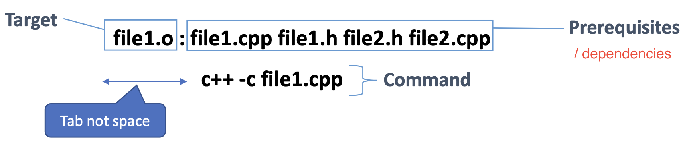
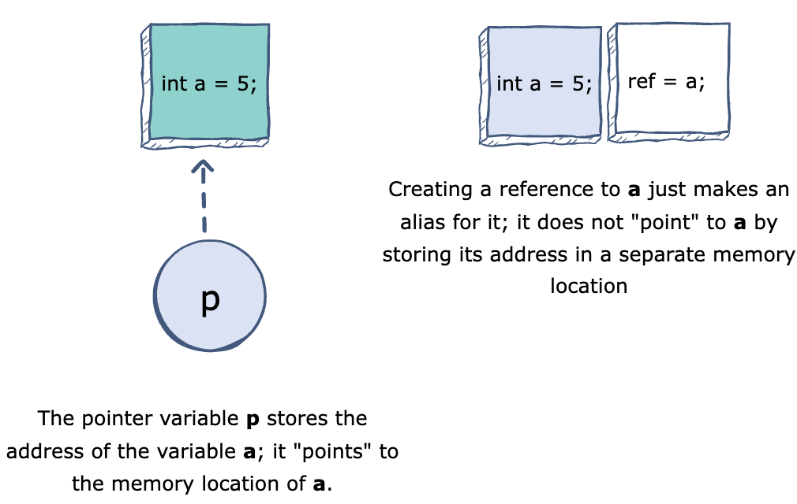
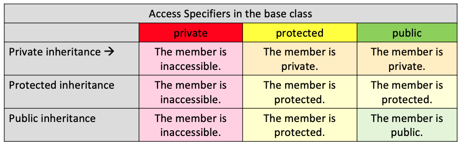

# 1 Makefiles

## 1.1 Compile & Link

1. compilers: g++, c++, clang, clang++

2. Commands:

   ```bash
   # compile all .cpp files to .o files
   c++ -std=c++11 -c *.cpp  
   # link all .o files to a program named myProgram
   c++ -o myProgram *.o
   # run the program
   ./myProgram
   ```

## 1.2 Makefile

The command `make` can check if the target file (executable) is newer than its dependencies. If not, it will recompile the changed files and the target file. By using `make`, we need not to recompile the whole program or manually find and recompile the changed files, which are time-consuming for big projects.

Software tools for automatic build:

- gmake: Linux, Mac OS
- nmake: Windows

#### General Structure

Write the following things in the file named `Makefile`:

1. Header: comments start with `#` that describe the makefile

2. Rules: describe the targets and their dependencies, and the commands to execute

   

   - implicit rules / built-in generic rules: `%.o : %.c` is an implicit rule, we don't need to specify this.

3. Macros: varibales used in Makefile

   ```makefile
   CXX=c++
   CFLAGS= -std=c++11
   CCSOURCE=${wildcard *.cpp}
   OBJS=$(patsubst %.cpp, %.o, $(CCSOURCE))
   ```

4. automatic variables: 

   - `$@`: target filename of the current rule
   - `$^`: the filenames of all the prerequisites, seperated by spaces
   - `$<`: first prerequisite filename in the list
   - `$?`: the names of all the prerequisites that are newer than the target, seperated by spaces

#### Example

```makefile
# Targets:
# clean deletes program and all .o files
# runProg runs the executable program
# printM prints the values of all macros

CXX=c++
CFLAGS= -std=c++11
CXXSOURCE=$(wildcard *.cpp)
HEADERS=$(wildcard *.h)
OBJS=$(patsubst %.cpp, %.o, $(CXXSOURCE))

.PHONY: clean runProg printM # .PHONY(not real) means these targets are not associated with files
program: $(OBJS)
	$(CXX) $(CFLAGS) $(OBJS) -o $@
runProg: program
	./$^
%.o: %.cpp # implicit rule
	$(CXX) $(CFLAGS) -c $<
%.o: %.h
clean:
	rm -rf *.o program
printM:
	@echo $(CXX) $(CFLAGS) $(CXXSOURCE) $(HEADERS) $(OBJS)
```


# 2 C++ classes

## 2.1 C++ refresh

### cerr

`cerr`: output error messages. `cerr` is unbuffered

- `std::cerr` vs. `std::cout`:
  - `cerr` is for error messages, `cout` is for normal output
  - `cerr` is unbuffered, which means it write out the error message immediately and it cannot store the error message to display it later. This way, we can know the problem of the program immediately.
  - `cout` is buffered. Although it cannot write out messages immediately, it can make the program have better performance
  
- redirect output to a file: `./myProgram > filename` [(ref)](https://askubuntu.com/questions/420981/how-do-i-save-terminal-output-to-a-file)
  - `> filename`: save stdout to a file

  - `2> filename`: save stderr to a file

  - `&> filename`: save stdout & stderr to a file

  - `./myProgram > cout.txt 2> cerr.txt`: run prog, save cout messages in `cout.txt` and error messages in `cerr.txt`

### strcmp

use `==` to compare `string`, use `strcmp` to compare `char*`

- `strcmp(a, b)` reutrns 0 if a equals b, a positive value if a > b, else a negative value

```c++
char string_a[] = "foo";
char string_b[] = "foo";
char *string_c = string_a;
std::cout << strcmp(string_a, string_b) << std::endl; // 0 - equal
std::cout << (string_a == string_b) << std::endl; // 0 - not equal (comparing the address of two pointers)
std::cout << (string_c == string_a) << std::endl; // 1 - equal
```

### extern

 `extern` keyword extends the function's visibility to the whole **program**

- `sum.h`: 

  ```c++
  int sum(int n);
  extern int array[];
  ```

- `sum.cpp`:

  ```c++
  #include "sum.h"
  int sum(int n) {
      int res = 0;
      for (int i = 0; i < n; i++) {
          res += array[i];
      }
      return res;
  }
  ```
  
- `main.cpp`: you don't need to include `sum.cpp` in this file

  ```c++
  #include "sum.h"
  int array[] = {1, 2, 3};
  int main(int argc, const char * argv[]) {
      std::cout << sum(3) << std::endl;
      return 0;
  }
  ```

If you don't use a headerfile. You want to include everything in `main.cpp`:

```c++
#include <iostream>

int array[] = {1, 2, 3};
int sum(int n);

int main(int argc, const char * argv[]) {
    std::cout << sum(3) << std::endl;
    return 0;
}

int sum(int n) {
    int res = 0;
    for (int i = 0; i < n; i++) {
        res += array[i];
    }
    return res;
}
```

Note, if you use `using namespace` before, the variable name `array` will be ambiguous, because there's a library named `std::array`.

### pointers & references

A **pointer** in C++ is a variable that holds the memory address of another variable.

A **reference** is an alias for an already existing variable. Once a reference is initialized to a variable, it cannot be changed to refer to another variable.



## 2.2 Inheritance

1. syntax:`class derived-class: access-specifier base-class`

   - access-specifier: `public`, `protected`, or `private`. This specifies the type of inheritance.

   

   - if acess-specifier is not specified, then its private inheritance by default.

2. Multiple Inheritance: In C++, a class can inherit multiple base classes. But this is not allowed in Java. Syntax: 

   ```
   class derived-class: access-specifier baseA, access-specifier baseB....
   ```

3. A derived class inherits all base class methods with the following exceptions:

   - Constructors, destructors and copy constructors of the base class.
   - Overloaded operators of the base class.
   - The friend functions of the base class.

## 2.3 Abstract Class

An **abstract class** is the class designed to be specifically used as a base class (like an interface in Java). An abstract class contains at least one **pure virtual function** (function with `virtual` and  `=0`). 

- A class derived from an abstract class is still abstract unless you implement every pure virtual function in the derived class.

1. `virtual`: `virtual` keyword specifies the member functions in the base class that need to be overriden by subclasses [[ref]](https://www.geeksforgeeks.org/virtual-function-cpp/)

   - virtual functions can be implemented in the base class

   - only virtual functions can be overriden by subclasses


   ```c++
   class Base {
   public:
       virtual void print() {
           cout << "print base class.\n";
       }
       
       void show() {
           cout << "show base class.\n";
       }
   };
   
   class Derived : public Base {
   public:
       void print() {
           cout << "print derived class.\n";
       }
       
       void show() {
           cout << "show derived class.\n";
       }
   };
   
   int main(int argc, const char * argv[]) {
       Base *base;
       Derived *derived = new Derived();
     	base = derived;
      	
       base->print(); // print derived class. (virtual function is binded at run time)
       base->show(); // show base class. (non-virtual function is binded at compile time)
       return 0;
   }
   ```

2. `=0`: a virtual function with `=0` in the end of its declaration is called **pure virtual function**. A pure virtual function has no implementation and should be implemented by its subclasses. For example, `virtual bool equal(Object* other) = 0`

   - `=0` should appear with `virtual`, but `virtual` might not appear with `=0`

3. It is not allowed to declare an object of an abstract class. But you can declare references or pointers to an abstract class. For example, for the base class `Shape` and subclass `Circle`:

   ```c++
   class Shape {
   public:
       virtual float getArea()=0;
   };
   ```

   ```c++
   Shape shape1; // error: Variable type "Shape" is an abstract class
   
   Shape *shape2; // works
   shape2 = new Circle(5);
   ```

## 2.4 Type Conversion & Casting

### Type Conversion

In type conversion (also called **implicit type conversion**), a data type is automatically converted to another type at the **compiler time**. (See detailed explanation in the part 2.3 of my C++ Notes)

### Type Casting

In type casting (also called **explicit type conversion**): a date type is converted to another type by the **programmer**. In C++, this can be done in two ways:

1. Assignment:  `(type) expression`

1. casting operator:

   - `dynamic_cast<new_type>(expression)`: safe **downcasting** at run time. To work on [dynamic_cast](https://en.cppreference.com/w/cpp/language/dynamic_cast), there must be at aleast one virtual function in the base class.

     - If the cast is successful, `dynamic_cast` returns a value of type *new-type*. If the cast fails and *new-type* is a pointer type, it returns a null pointer of that type. If the cast fails and *new-type* is a reference type, it throws an exception that matches a handler of type [std::bad_cast](https://en.cppreference.com/w/cpp/types/bad_cast).
     - downcasting: casting a base class pointer to a derived class pointer. 

     ```c++
     Shape shape;
     Circle *circle = dynamic_cast<Shape*>(shape);
     ```

     

   - [static_cast](https://www.geeksforgeeks.org/static_cast-in-c-type-casting-operators/): a compile-time cast // TODO

   - const_cast // TODO

   - reinterpret_cast / TODO

# 3 Version Control

git book: https://git-scm.com/book/en/v2/

master chapter 1-6 if you want to be a software developer

## Concepts

- working area
- staging area

## Basic Commands

- `tree - a`: 
- `git checkout <commit_id>`
- `git reset --hard`
- HEAD detached ???: https://www.cloudbees.com/blog/git-detached-head

1. Git HEAD detached from XXX 解决办法

   HEAD相当于一个指针，指向当前所在分支。使用`git checkout <branch name>`, HEAD会移动到指定分支；但如果使用`git checkout <commit ID>`，HEAD就会处于detached状态（游离状态）。

   HEAD处于游离状态，好处是便于在历史版本之间切换，如果要回到某次提交，直接`git checkout <commit ID> <filename>`；但坏处是，此时的提交无法可见保存，一旦我们切到别的分支，游离状态的提交就不可追溯了。

   解决办法：新建一个临时分支保存游离状态时的提交

   ```
   git branch -v // 查看当前分支领先多少次提交
   git checkout temp //新建分支temp
   git checkout <branch name> // 切换到我们要回去的分支，比如这门课的分支是“master”
   git merge temp // 合并分支
   git status //查看合并结果，有冲突就解决
   git push origin <branch name> //提交远端，这里是master
   git branch -d temp // 删除刚才创建的临时分支
   ```

## Branch

- `git branch`：查看分支列表
- `git branch <branch_name>`：创建新分支
- `git checkout <branch_name>`：切换分支

- `git checkout -b <branch_name>`：创建并切换分支
- `git merge <branch_name>`：合并当前分支和别的分支
- `git branch -d <branch_name>`：删除分支
- `git rebase master`：采用rebase的方式将当前分支合并到master分支后
- `git push origin <branch_name>`: push local changes to the corresponding branch of the remote repo 
- `git merge --squash bugfix`: takes all commits from the `bugfix` branch and groups it for a 1 commit with your current branch.
- `git pull --rebase`: if someone (suppose A) pushes a changes to the master branch, then you cannot push your changes to the repo. You can use this command to update your local repo and apply your commit after A's commit. 
  - Use this command when your changes do not deserve a separate branch

## Git Branch Workflow

1. create a work branch:
   - `git branch`：查看分支列表
   - `git branch <branch_name>`：创建新分支
   - `git checkout <branch_name>`：切换分支
2. make changes and periodically save work
   - `git add .`
   - `git commit -m "..."`
   - `git push origin <branch_name>`
3. merge branch with main
   - `git checkout main`
   - `git merge --squash <branch_name>` : stage all work changes in main
   - `git commit -m "..."`

# 4 Program Design

1. Determine the representation: Chose how to represent data for your problem by selecting or defining a type.
2. Write a purpose statement
3. Write examples
4. Create a template for the implementation
5. Finish body implementation case by case
6. Run tests

# 5 C++ Unit Testing

## Catch2

https://github.com/catchorg/Catch2/blob/v2.x/docs/tutorial.md

1. main.cpp

   ```c++
   #define CATCH_CONFIG_RUNNER //before include 
   #include "catch.h" // the unit test library
   int main(int argc, char **argv) {
     Catch::Session().run(argc, argv);
   	return 0; 
   }
   ```

2. Tests:

   - Assertion **Macros**:

     - `CHECK`: tests an expression and continue even if the assertion fails
     - `REQUIRE`: tests an expression and aborts if it fails
     - `CHECK_FALSE`
     - `REQUIRE_FALSE`
     - `CHECK_THROWS`: ensure that an expression throws an exception

   - syntax:

     ```c++
     #include "catch.h"
     TEST_CASE("Search Element in an Array") {
       int a[8] = {4, 9, 21, 33, 35, 50, 55, 60}; // like junit setUp() @BeforeEach
       SECTION("element anywhere in the array") {
         CHECK(<expression> == <value>);
         REQUIRE(<expression> == <value>);
       }
       SECTION("edge cases") {
         CHECK_FALSE(<expression>);
       }
     }
     ```

3. Testing with I/O

   - ```c++
     static void 
     ```

Q: Macros vs. Functions?

https://www.geeksforgeeks.org/macros-vs-functions/

- A macro（宏） in C is a fragment of code that is given a name. You can use the `#define` preprocessor to define a macro.

  ```c
  #define EXIT_SUCCESS 0 // from stdlib.h
  ```

- A macro can be a function, and its arguments do not have types

  ```c
  #define SQUARE(x) x * x
  ```

  **macro expansion**: SQUARE(z-y) = z-y*z-y.

# 6 Program Design

Best approach for writing programs:

1. write a description about the program: purpose, input, return
2. provide some tests
3. create a template for the implementation
4. finish body implemenration
5. run tests (fix if tests fail)

# 7 Debugging

## Error Types

1. syntax or type errors
2. typos
3. logical error: the algorithm has logical error
4. implementation errors: the algorithm is correct, but it is not correctly implemented

## Debugging Strategies

1. incremental & bottom-up program development
2. backtracking
3. binary search
   - `git bisect`: use binary search to find the commit that introduced a bug
     - enter the toplevel of the working directory: `git bisect start`
     - read through the `git log`, find the good commit and bad commit
       - `git bisect good <commit_id>`
       - `git bisect bad <commit_id>`
     - git will go back to the version in the middle of the good commit and bad commit, then we can check the code and decide if it's good or bad
       - `git bisect good`: mark this commit is good
       - `git bisect bad`: mark this commit is bad
     - the last step will repeated until we find the first bad commit
     - // TODO: what is "create mode 100644 git_bisect/file1.cpp.bak"???
   - `git diff`: show differences between commits

## LLDB

In this cours, wee use `LLDB` to debug, which is the default debugger in Xcode.

- `clang++ -g -O0 <all .cpp files> -o <executable_name>`
  - `-g`: build the executable with debugging symbols
- `lldb <executable_name>`

Commands:

1. compile and run the debug executable
2. Breakpoints
3. run the debug executable:
   - run
   - c
   - exit
   - bt: print the stack trace of the current thread

# 8 Defensive Programming

## Assertions

1. `assert(<expression>)`: make assertions at run-time

   - `#define NDEBUG`: we don't want to use assert in production code because we want to go through all tests. Use this macro can disable assert.

   ```c++
   void printNumber(int* myNum) {
       assert (myNum!=nullptr); // if a nullptr is passed, then a bug.
       cout << "myInt contains value" << " = " << *myNum << endl;
   }
   ```

2. `static_assert(<constant_expression>, <message>)`: check if a condition is true when the code is compiled. If it isn’t, the compiler is required to issue an error message and stop the compiling process. The condition that needs to be checked is a constant expression.

   ```c++
   void testStaticAssertion() {
       int arr[] = {1, 2, 3};
       static_assert((sizeof(arr) / sizeof(arr[0])) > 3, "Array size is too small!"); // this will fail at compile time
   }
   ```


## Error Handling

1. Error types:
   - `std::exception`: parent class of all standard exceptions
   - `logic_error`
   - `runtime_error`
   - ...

2. Throw an exception: An exception won't crash the program

   ```c++
   float devide(int denominator, int divisor) {
       if (divisor == 0) {
           throw runtime_error("Divisor couldn't be 0!");
       }
       return (denominator + 0.0) / divisor;
   }
   
   int main(int argc, const char * argv[]) {
       try {
           devide(100, 0);
       } catch(exception const& e) {
           cout << "Exception: " << e.what() << endl;
       }
       return 0;
   }
   ```

   Output:

   ```c++
   Exception: Divisor couldn't be 0!
   Program ended with exit code: 0
   ```

3. multiple catches:

   ```c++
   int main(int argc, const char * argv[]) {
       while (true) {
           int x;
           cin >> x;
           try {
               if (x > 10) {
                   throw x;
               } else if (x < 0){
                   throw to_string(x);
               } else if (x == 0) {
                   throw runtime_error("x couldn't be 0!");
               } else {
                   throw "whatever";
               }
           }
           catch(int i) {
               cout << "Caught int: " << x << endl;
           }
           catch(string s) {
               cout << "Caught negative int: " << s << endl;
           }
           catch(runtime_error e) {
               cout << "Caught runtime error: " << e.what() << endl;
           }
           catch(...) { // catch-all block
               cout << "Default caught.\n";
           }
       }
       return 0;
   }
   ```

   output:

   ```c++
   11
   Caught int: 11
   0
   Caught runtime error: x couldn't be 0!
   -1
   Caught negative int: -1
   5
   Default caught.
   ```

# 9 Code Coverage

## Code Coverage

Describe how much of your code is executed while testing.

- Statement/line coverage: how many lines/statements have been executed while testing
- Branch coverage: how many branches of conditional statements have been executed while testing. For example, an if statement have 2 branches (true or false), each of them should be executed at least once. If we only hit the true condition, then the branch coverage is 50%.
- Path coverage: how many possible paths have been taken while testing. For example, 2 if statements result in 4 paths. If we only test one path, then the path coverage is 25%.

// TODO given a example and show their differences.

From the top to the bottom, the difficulty to achieve 100% coverage is increasing.

## Test Coverage

1. Code coverage: verified the extent to which the program has been tested
   - quantitive measure

2. Test coverage: measures how much of the feature set is covered.
   - qualitive measure

# 10 Documentation

## Doxygen

1. Create a configuration file: `doxygen -g <config-file-name>`
2. document your code
3. Run Doxygen: `doxygen <config-file-name>`
4. generate a pdf file:
   - Install ghostscript interpreter: `brew install ghostscript`
   - Enter `latex` foler: `make pdf`

# 11 Test Generation

## Fuzz Testing

Fuzz testing or fuzzing provides random generated input to a program. And our goal is to make sure that the program won't crash due to these tests.

# 12 Design Patterns

## Singleton Pattern

A class that has only a single instance.


## Builder Pattern

This part is interesting. I should study this.

## Facade Pattern

## Interpreter Pattern

This part is related to MSDScript project. I should study this.

# 13 Library

1. create all object files
2. create a library: `ar -ru libmsdscript_library.a expr.o parser.o tests.o cmdline.o`
3. mv the library to the directory
4. linke main.cpp with the library: `$(CC) $(CFLAGS) main.cpp -L $(LIB_DIR) -lmsdscript_library -o $@`


# 14 Smart Pointers

regular expressions:

| Search       | Replace       | Search-reg                 | Replace-reg |
| ------------ | ------------- | -------------------------- | ----------- |
| Expr\*/Val\* | PTR(Expr/Val) | ([a-zA-Z]*(Expr\|Val))\*\s | PTR($1)     |
|              |               |                            |             |
|              |               |                            |             |
|              |               |                            |             |
|              |               |                            |             |

# 15 Profiling

1. Intention:
2. Types:
   - instrumentation profiler
   - Sampling profiler
3. Profiling tools
   - manual instrumentation: print, logging calls, checking time
   - static instrumentation: gprof, instruments/time profiler
     - the GNU profiler, `gprof`, can determine which parts of a program are taking most of the execution time.
   - dynamic instrumentation: 
     - valgrind tools
   - performance counters: perf
   - heap profiling: massif, google-perftools

## gprof

1. steps:
   - compile and link the program with profiling flag: `-pg`
   - Execute the program to generate a profile data file
   - run `gprof` to analyze the profiled data
2. Output:
   - flat profile
   - call graph

# 23 Optimization

```assembly
imul %rcx,%rdx
xor %eax,%eax
lea (%rdi,%rdx,8),%rdx
nop
movsd (%rsi,%rax,8),%xmm0
movsd %xmm0,(%rdx,%rax,8)
add $0x1,%rax
cmp %rax,%rcx
jne 401160 <set_row(double*, double*, long, long)+0x10>
```

1. code motion
2. strength reduction
3. Aliasing
4. sharing common results (Common subexpression elimination)
5. initialize at compile time
